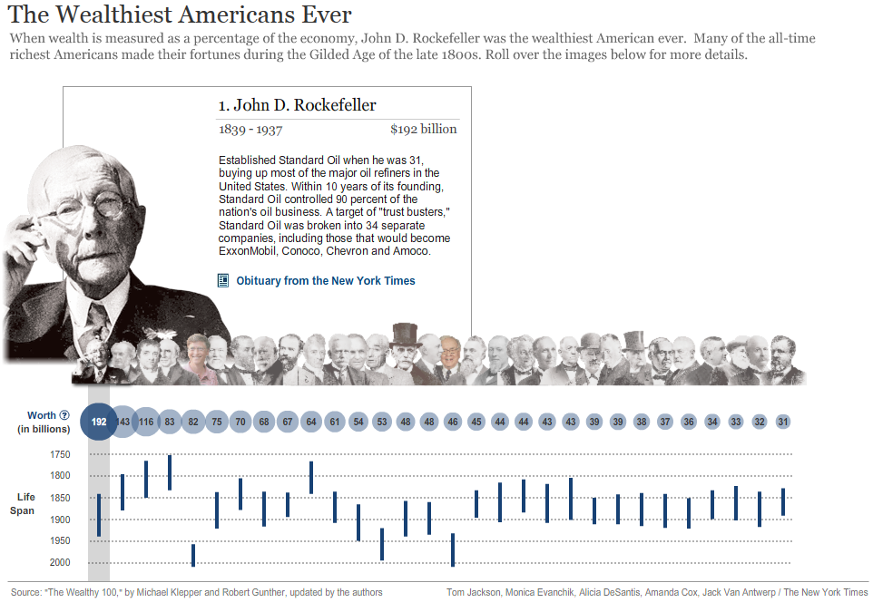
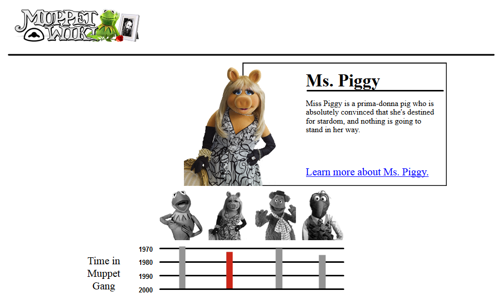

As often as possible, I like to take the time to emulate some of the interaction designs that I like most. This time, I chose the interactive timeline ["The Wealthiest Americans Ever" from the New York Times.](http://www.nytimes.com/ref/business/20070715_GILDED_GRAPHIC.html "The Wealthiest Americans Ever NYT")

<figure>
  
  <figcaption> A cool and informative interactive timeline that uses rollover effects</figcaption>
</figure>

I created mine using Lectora Inspire and some images and info from [the Muppet Wiki](http://muppet.wikia.com/wiki/Muppet_Wiki "Muppet Wiki")

<figure>
  
  <figcaption>Take a look at the demo</figcaption>
</figure>

This could be a great template for a timeline interaction (of course!) but also for introducing other things like dramatis personae, types of instruments, etc. Instead of the individual popups, I could also see this design being used to roll over individual parts of a larger image, like highlighting the members of the Muppet gang in a group shot.
