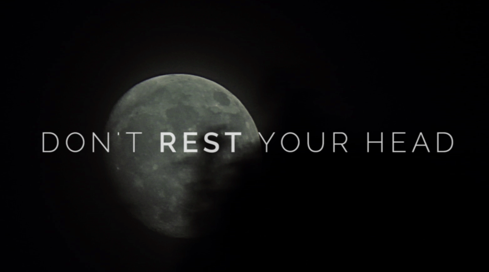

I like to spend the weekends figuring out neat tricks, learning new skills, and creating cool projects. Yes, I have no life. So, I stumbled on this recut of Mary Poppins as a horror film several years ago and I loved it. It's really good and funny, too.

`youtube: 2T5_0AGdFic`

And, much more recently, I stumbled upon this great tutorial on [creating an opening title sequence using CSS animations from CodeDrops.](http://tympanus.net/codrops/2013/04/30/text-opening-sequence-with-css-animations/ "Text Opening Sequence") I bookmarked it and forgot about it. But when I rediscovered it, I really wanted to do something with it. So I did! I created a trailer using the CSS animations, based on the Scary Mary video (plus I created a GIF from [this Moon and Clouds timelapse](https://archive.org/details/MoonAndCloudsTimeLapse2 "Moon and Clouds Timelapse") and added music: [Awkward Meeting from Kevin McLeod](http://incompetech.com/music/royalty-free/index.html?isrc=USUAN1100574 "Incomptech Royalty Free Music"))

<figure>
  
  <figcaption>Check out the final trailer here.</figcaption>
</figure>
