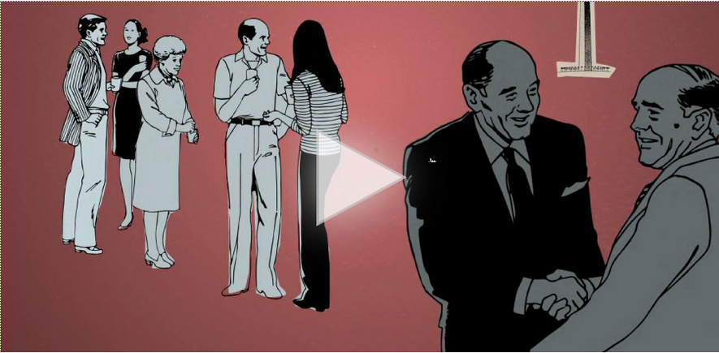

Though I haven't done audio for elearning in a while, and though I'd agree with [Cathy Moore's exhortation to think about the function of audio in your elearning courses before just jumping into it](http://blog.cathy-moore.com/2010/09/do-we-really-need-narration/ "Cathy Moore - Do We Really Need Narration?"), I gotta admit, when it's done right, it can really add a new dimension to an interaction. The folks at JellyVision definitely know how to do it right.

<figure>
  
  <figcaption>Could you Survive and Old-Timey Duel?</figcaption>
</figure>

Even as inspiration for text interactions, I love to return to the portfolio of JellyVision. For me, takeaways include:

*   **Use a conversational style.** Though quirk and humor can be hard to pull off, the conversational tone is the most important thing. Whenever I feel content degenerating into robo-speak, I like to listen to the JellyVision interactions. They've managed to craft conversations that strike one as being genuine and human, with likeable audio avatars. Instead of reading (or sounding like they're reading) a script, the narration comes off as natural. The voice talent always has depth, interest, and a little quirkiness.
*   **Visual representation.** JellyVision doesn't read the text on the screen. They make excellent use of graphics (including text as graphics), timing, and motion design to illustrate their concepts. Now, motion design can get pretty complicated and it's easy to brush it off as the peculiar domain of AfterEffects gurus but I love to see examples. I'm a firm believer that motion design can really help make graphics and story more effective. I'm challenging myself to figure out ways to use it.

There's definitely more great stuff to see on [the JellyVision Work page](http://www.jellyvision.com/work/ "JellyVision: Our Work"), so I encourage you to go and visit. What instructional design concepts do you takeaway from their examples?
