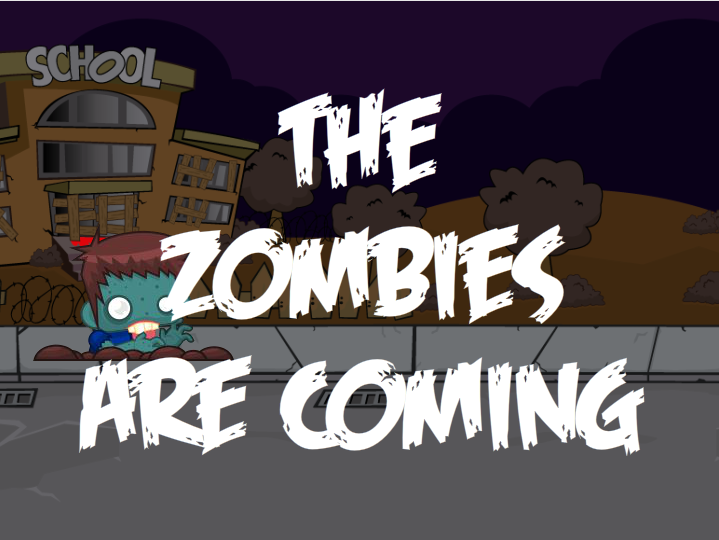

This week's Elearning Heroes Challenge was to create a a guide for the zombie apocalypse. Zombies being outside of my particular set of strengths, I did a little browsing on the interwebs and ended up a very interesting article on [Boing Boing](http://boingboing.net/2013/10/14/zombiesvsanimals.html "Zombies Vs Animals") about how, assuming the zombies we're talking about are actually undead, rotting creatures as opposed to sick or mutated but still very much alive people, Mother Nature would deal with the menace "brutally and without quarter" (I love that line). I thought this was a great take on that old theater game of ending a play in two minutes by simply doing something reasonable and logical. I mean, think about it... Machetes, guns. We're talking about reanimated corpses. How about decomposing them? That ought to take care of it! I originally wanted to create more of a game aspect my entry where users could chose a class of Mother Nature's zombie destroyers and then attack with them, Pokemon style. That's still possible but I'm not super happy with the ability to animate things in the way I want to in my head using Storyline 2 alone. That's no attack on Storyline; it's just not for making video games. Also, I couldn't spend all weekend on the thing. I think part of my learning in these ELH challenges is to develop rapidly. So I compromised. But I'm pretty happy with the results. With music by Incomptech, sound effects from SoundBible and FreeSFX, and images purchased from Creative Market, [enjoy Zombpocalyse Now](http://knanthony.com/showcase/Zombpocalypse/story.html "Zombpocalyse Now"). Oh, another note before I forget: In the learning section, I used vids that show these brutal decomposers doing their jobs (eating dead things). So if that bothers you, be prepared to look away.

<figure>
  
</figure>
