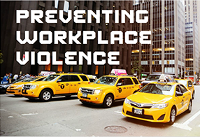

This week's Elearning Heroes Challenge was to create a scenario designed to prevent or address workplace violence. Taking a page from my fellow instructional designers and trying to implement CCAF, I'll discuss this challenge using that format.

## Context

An active taxi taking on customers

## Challenge

The challenge was to help taxi drivers identify and take proper steps to diffuse agitated or angry customers.

## Activity

The first activity users are dropped into is to identify dangerous fares. The second activity is to try to diffuse a dangerous fare using active listening and remaining calm and non-aggressive. There is a short intro for this scenario but, other than that, users move straight into activity. The feedback provides content to guide the user's decision-making. If this were for real fleet taxi drivers (and if I had access to some real cab drivers!), you would want to allow the drivers to follow their instincts and make mistakes in that safe environment so that they could learn from them without actually being exposed to danger.

## Feedback

The feedback centers on tips that guide the employee towards the methods that would diffuse an angry customer and to learn to identify possibly dangerous fare.

## Discussion

When I first looked at this challenge, my mind went immediately to the office work environment and disgruntled workers. But as I dove into the OSHA information on preventing violence, I was most interested in the definition of workplace violence to include violence from clients and customers. I also noticed that taxi drivers were one of the riskiest professions, way up there with law enforcement! So I changed tracks and set to work creating a scenario for taxi drivers using the CCAF model. As I've stated previously, I really appreciate the opportunity to develop rapidly for these challenges. I created the taxi cab illustrations in PowerPoint and worked out the whole thing over the course of two days. Not bad for a short amount of time. In a larger, more fleshed out course, I would definitely include more mistakes, scenarios, and stories taken from real drivers.

<figure>
  
  <figcaption>Take a look at the demo.</figcaption>
</figure>
