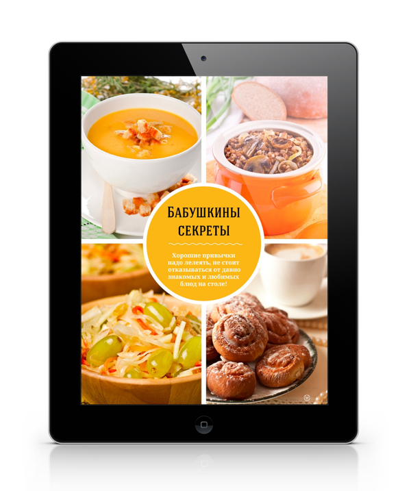
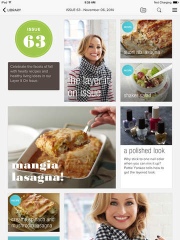
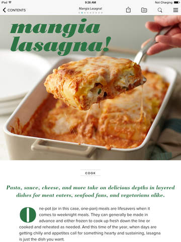
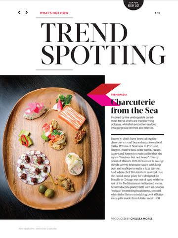
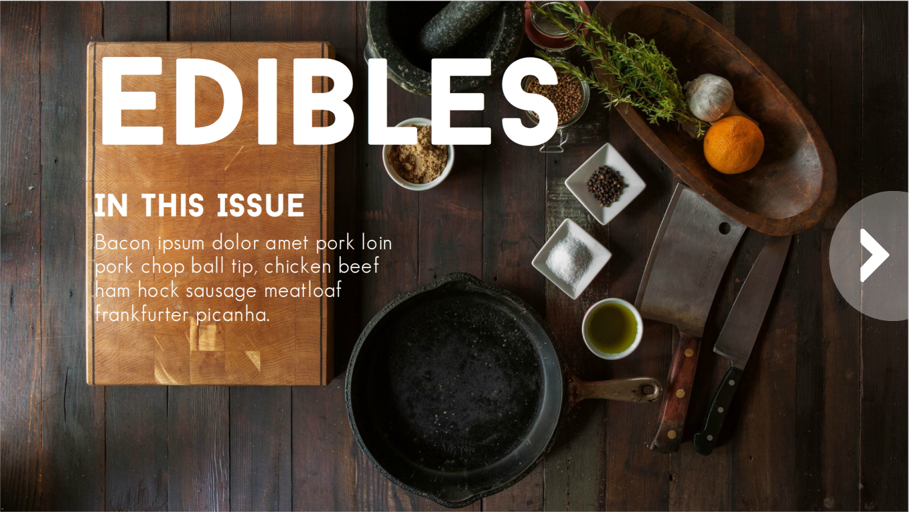

This week's Elearning Heroes Challenge was to create a digital magazine mockup. I loved this challenge because it intersects with some things I've been discovering about consulting on projects. In some cases, take the dreaded "awareness" course, it can be helpful, if at all possible, to steer the conversation towards information design. That includes job aids, infographics, videos, interactive reports, and, in this case, a digital magazine. With information design, we focus on making the information easy to find, understand, and digest. The UI design on many digital magazines has a lot to teach us as we design information for use. Time in Development: Around 6 hours.

## Inspiration

I spent about a two days procrastinating on this particular challenge, until I settled to doing something with food and looked to Google for inspiration.

<figure>
  
</figure>

My first stop was [Inspiration Hut](http://inspirationhut.net/inspiration/51-beautiful-and-interactive-examples-of-digital-magazine-design/ "51 Interactive Examples of Digital Magazine Design"). This article shows iPad mockups of several different digital magazines. I focused on the food one, which was nice and bright and image heavy. After that, I dug into the newsstand offerings of the iPad. I was drawn mostly to Giada and Food and Wine. Giada had a great layout and I liked the way the text for the articles was designed. I also liked the way the Contents screen was photo-centric.

<figure>
  
</figure>

<figure>
  
</figure>

Food and Wine had some great UI elements to allow users to easily get straight to the recipes or to different articles.

<figure>
  
</figure>

<figure>
  
</figure>

## Resources

I used several different resources to make my digital mag. Images were, of course, super important. I used [StockUp](http://www.sitebuilderreport.com/stock-up/http:// "Stock Up Free Stock Photos") to search for royalty-free foodie images. Trust me, it's an amazing site. Dummy text was the next concern. I could have used the normal Lorem Ipsum text, but since I was designing around food, I wanted something a little more special. Here are the ones I used:

*   [Bacon Ipsum](http://baconipsum.com/ "Bacon Ipsum")
*   [Cupcake Ipsum](http://www.cupcakeipsum.com/# "Cupcake Ipsum")
*   [Veggie Ipsum](http://veggieipsum.com/ "Veggie Ipsum")
*   [Pasta Ipsum](http://www.pastaipsum.com/ "Pasta Ipsum")

I also wanted to really explore all of the different interactions that could be built into a digital magazine so I inserted this video from [Youtube Expert Laura In the Kitchen](https://www.youtube.com/watch?v=gxSJjioS-k4 "How to Make Red Velvet Cupcakes w/ Cream Cheese Frosting") and a simple [step-by-step on how to make a BLT](http://www.wikihow.com/Make-a-BLT-Sandwich "4 ways to Make a BLT") from WikiHow.

## Demo

I'm really proud of how it turned out. [Take a look at the demo](http://knanthony.com/showcase/digimag/story.html "Edibles").

<figure>
  
</figure>
