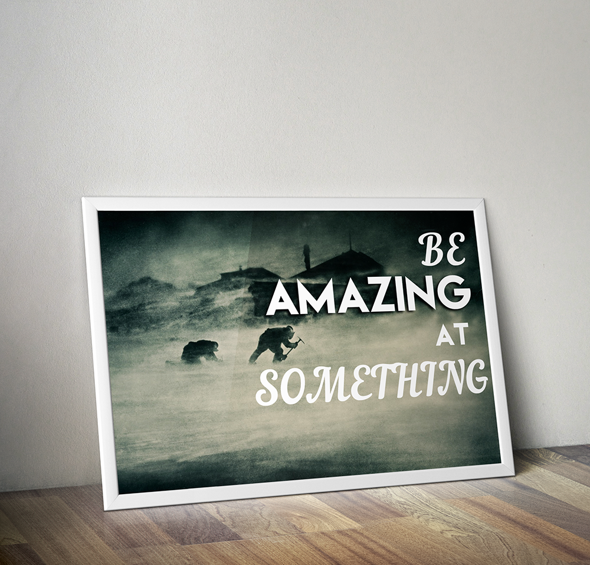

I am not a freelancer. But I've thought about it a lot; what it would mean and how it might fit into my life now. I'm really happy with my current position but I do often take work home so the whole thought of keeping time to recharge along with regular work and freelancing work is overwhelming. Besides which, though I don't believe I'm a perfectionist, I do really appreciate the time and space to practice on all the aspects of design because I'm always looking to get better. So that's why the first tip from [CreativeBloq's 20 Pro Tips for Web Design Freelancers](http://www.creativebloq.com/netmag/20-pro-tips-web-design-freelancers-4145555 "20 Pro Tips for Web Design Freelancers") really struck me:

> Be amazing at something.

Though I may never be the best at anything, that never stops me from trying. I really like to be able to know, whenever I go into an interview situation, that I'm not just some mediocre instructional designer. I'm damn good and I'm working to get better. So for this week's Elearning Heroes Challenge, I posterized this great tip using a free Photoshop poster mockup. 'Cause, hey, I don't do boring.

<figure>
  
</figure>
