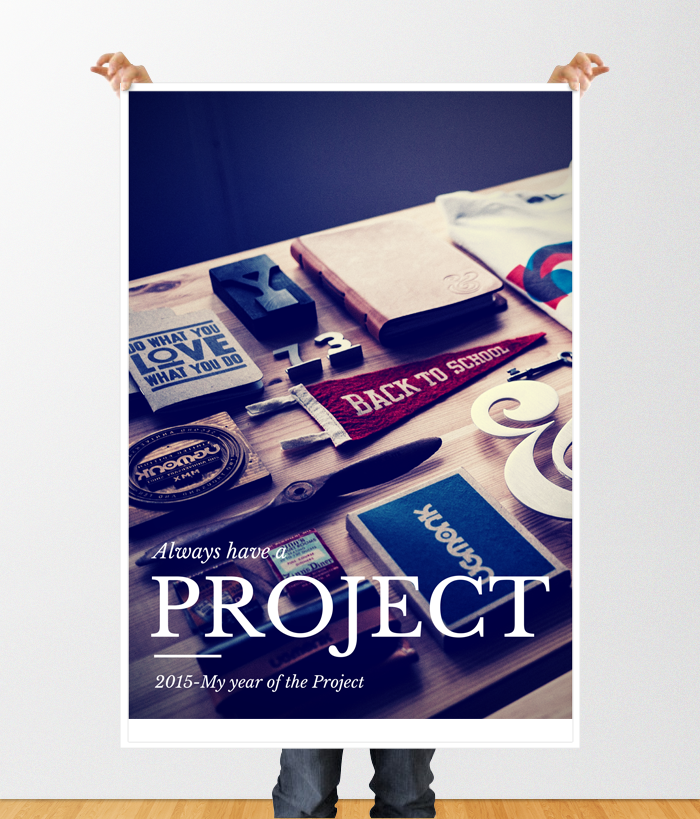

These last couple of months, there have been [a whole slew of (usually small) articles](http://99u.com/workbook/37515/always-be-creating "Always Be Creating") (and [even links to some TED talks](http://www.ted.com/playlists/170/kickstart_your_creativity "5 TED Talks to Kickstart Your Creativity")) debunking the mystique of creativity: you know, that whole idea of the dark tortured artist subject to the whims of inspiration and creative block. Creative types are coming together to insist on things that they've known for a while:

> "You can't wait for inspiration. You have to go after it with a club.”
>
> -- Jack London

The idea is that creativity isn't some magical substance available to only a select few; it's in all of us. And to release our creative potential, consistency (showing up) matters a heck of a lot more than a flash of inspiration. The adoption of a growth mindset coupled with consistent practice is key. I've been thinking about this as I reflect on this past year and a half as an instructional designer. Before my introduction to some basic design principles and projects in grad school, I would have never thought myself capable of designing anything visual. I never thought of myself as someone with that sort of talent. But as I continue down this path and, admittedly, learn how much I don't know, I am also learning that I can still learn. There are things that I'm not a natural at, but I can become competent, even good. I can learn to create better looking graphics. I can learn to write better. I can learn to create more interesting courses. And, as I'm involving myself in the learning, I can practice. Even when the output seems crappy, the continual practice has value. This essential mindset can be difficult to maintain when there are so many other demands on time or when I think that no one else cares about what I have to say or what I create. But I have borne out in my own practice that it's important. I'm going to do more of it. I don't do New Years Resolutions but I will commit to setting small goals for myself in the upcoming days, weeks, and months to practice my crafts more consistently and to always have a project. 2015 will be my #Year of the Project. Looking forward to it!

<figure>
  
</figure>
