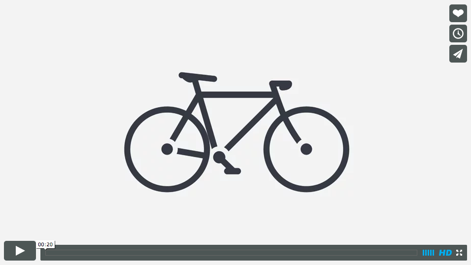
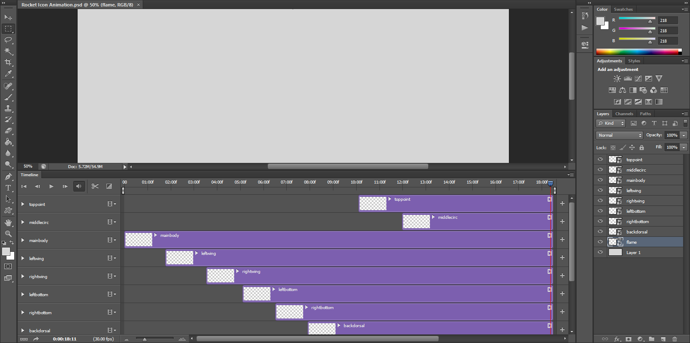

I'm a subscriber to the Noun Project's every once in a while newsletter and, in the latest issue, there was a [great icon animation from StudioReiko](https://vimeo.com/96163930 "Iconimation Short || Fiets") that got my wheels turning (no pun intended...okay, maybe a little). [

<figure>
  
  <figcaption>Iconimation video by Studio Reiko</figcaption>
</figure>

I wanted to give animation a go and, though I have access to After Effects, it's a little intimidating. I'd read somewhere that it was possible to animate, simply at least, using the latest Photoshop and that was what I decided to experiment with. The entire process was surprisingly painless. I used an icon from the Noun Project and separated it into bits using Illustrator. Next, I imported all of those bits into Photoshop as discrete layers. From there, all that was left to do was to open the Timeline window and go to town. My shapes were all imported as Smart Objects, which was a good thing because it gave me access to the transform animation, which I needed to be able to scale ([see this short Adobe vid on that process](http://tv.adobe.com/watch/the-complete-picture-with-julieanne-kost/transforming-layers-over-time-in-photoshop-cs6/ "Transforming Layers Over Time")). Opacity and position are the other two animation options. Just add keyframes and the tweening is done for you. All in all, pretty simple but then, so was the animation.

<figure>
  
  <figcaption>My animation in Photoshop</figcaption>
</figure>

Without further ado, my first Photoshop animation!

`vimeo: 117703682`
