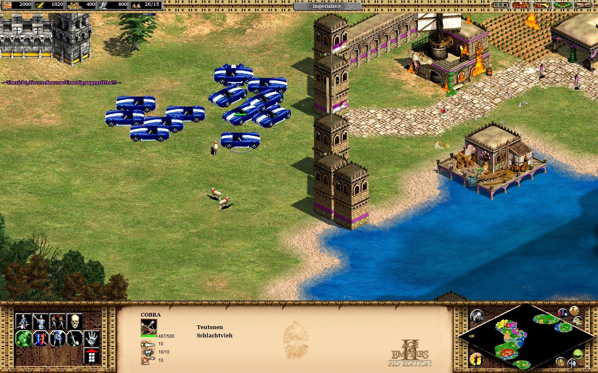
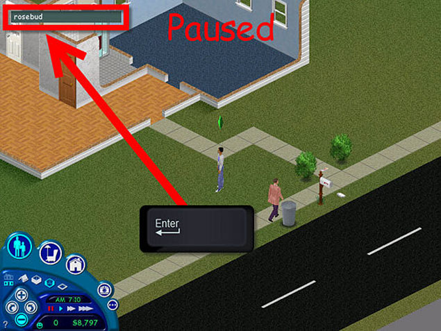
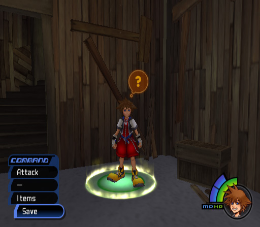
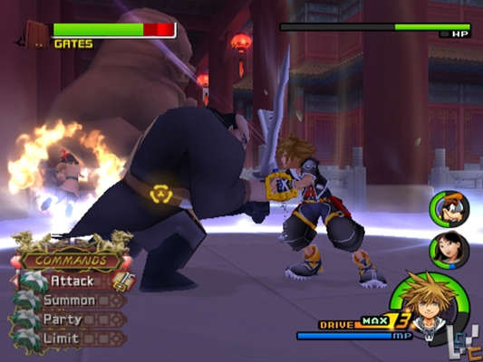
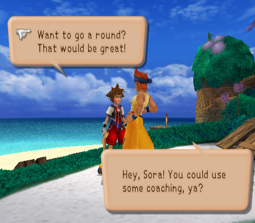

I like to cheat at video games. And I'm not the only one. (You know who you are.) Sometimes game cheats are a really fun way of discovering easter eggs (hidden features; usually in-jokes) or of doing absurd things, like using a Shelby Cobra with Machine guns alongside your army of war elephants to protect your kingdom in Age of Empires III.

<figure>
  
  <figcaption>Image from Games-blog.de</figcaption>
</figure>

Sometimes, cheats let you get to the stuff you want to do faster and easier, like giving yourself a ton of money with the rosebud cheat in the Sims so you could buy all the things!!!

<figure>
  
  <figcaption>Image from Fora.MTV.ca</figcaption>
</figure>

But there are other times when I cheated just because I was frustrated. Because I was having a difficult time leveling up, kept dying, or was having a all-around not fun time. These are the times when game design really comes to the forefront. If I'm trying to cheat the system because I'm flailing and need help, then I have to reconsider whether the game is really for me. And then there's Kingdom Hearts. The Kingdom Hearts series from Disney is one of the handful of video games that I love so much, that is so well designed, that has such a wonderful balance of challenge and assistance that I have never once wanted to cheat. There are definitely some take always when it comes to designing eLearning.

## Save Early, Save Often: Give Time to Rest, Reflect, and Celebrate

Probably the biggest factor in my Kingdom Hearts love affair is the fact that, although things get progressively harder, although you will most certainly die several times during the game (I'm looking at you, Sephiroth!), you are never, ever so frustrated that you want to quit. The reason for this is that there are plenty of save points throughout the game. More than enough. Unlike some other games where you have to wait half a level before you can save again, risking all of your hard-earned progress, Kingdom Hearts doesn't make you despair. If I level up my skills, I can save before tackling the next big challenge. And, if I've put in several hours on the game, I can take a break with confidence. I'm never forced to start all over from the beginning.

<figure>
  
  <figcaption>Image via Super Adventures in Gaming Blogspot</figcaption>
</figure>

**eLearning Takeaway:** Give plenty of opportunity for "saving," including shorter modules or chapters. Allow users to pause and celebrate their new knowledge and skills without fear that they'll somehow be forced to start all over. This includes module design

## Challenges: Practicing for the Boss for as Long as You Need

Kingdom Hearts is, as you may expect, made up of several levels that you explore and help the denizens of the particular world and, at the end of each, you face a boss. But consider that design choice for a moment. What does it really mean? It means that before I tackle a huge problem, I'm given every advantage. I have the opportunity to level up, buy new potions and items, learn new skills, get new teammates, and practice everything I'll need to beat the boss at the end. Does that automatically mean that I'll ace it the first time? Nope! But I don't mind because I got a fair shake and I know that the skills I gained in losing will help me to win (eventually).

<figure>
  
  <figcaption>Image from GiantBomb.com</figcaption>
</figure>

**eLearning Takeaway:** Failing isn't the end of the world. It can even be fun, as long as the user is encouraged by learning, by growing, and by being able to finally get it right.

## Throw 'Em In: Integrated Tutorials Are Awesome

The third and final point I'll bring up is the tutorial at the beginning of the game. Okay, there's that whole pick the keyblade thing, but I'm talking about after that. In this seemingly unrelated part of the game, you learn how to explore the Kingdom Hearts world through play. You learn how to fight by using a stick and sparring with fellow lost kids. You learn how to find, collect, and manipulate items in the environment. You learn all of the game basics, all while trying to finally beat Riku (that silver-haired so-and-so) in all of the competitions. You don't require a forced march through all of the controls and possible interactions. You learn them by doing. And the world doesn't fall apart. Imagine that.

<figure>
  
  <figcaption>Image via Super Adventures in Gaming</figcaption>
</figure>

**eLearning Takeaway**: Be brave and throw your users in without a forced tutorial. Offer them help along the ways, sure, of course. But if you design the experience well, using known patterns and positioning, I think you'll find that your users can skip the overview of the eLearning player. And the world won't fall apart. How about you? What lessons have you learned about design or eLearning from your favorite games, analog or digital? Let me know in the comments.
