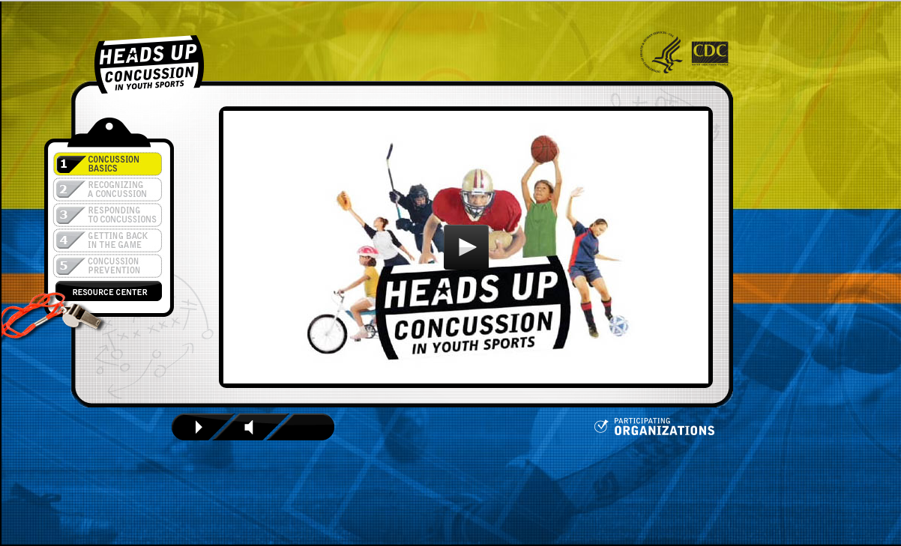
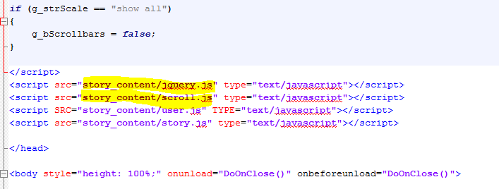
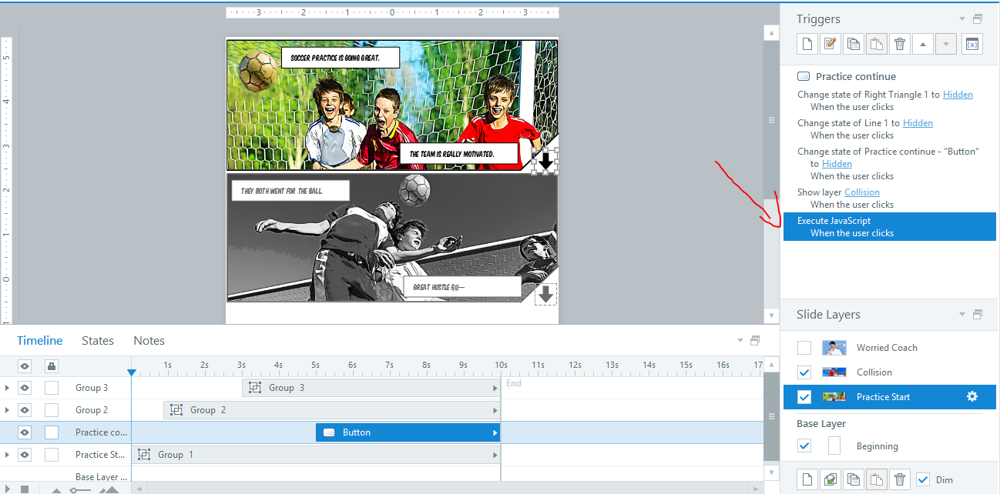
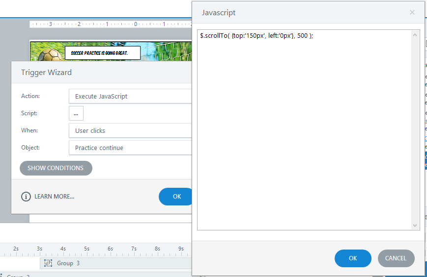
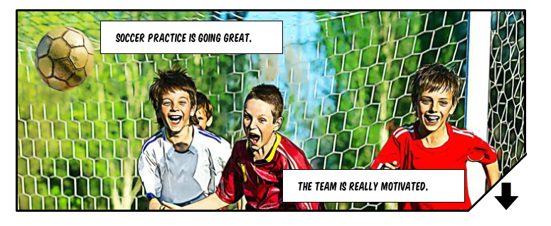

This one was an ordeal! But only because I'm super new at JavaScript and JQuery.  Read on. This weekend, I spent some time (a lot of time) developing my entry for [Elearning Heroes Challenge #69: Medical Template Challenge](https://community.articulate.com/articles/medical-training-templates "Elearning Heroes Challenge: Medical Template Challenge"). As I continue to challenge myself to always have a project, and to develop fuller portfolio pieces, I've been pressed for time but I really wanted to do this challenge because I think that David has an excellent point in that one's portfolio should include targeted demos to appeal to potential customers. This was a really good one.

Time in development: **About 6 hours**

Time searching for a way to autoscroll the page: **About 7 hours**.

More on that below.

## Inspiration

In retrospect, what I developed isn't quite as medical as it could be... There aren't any direct images of organs, etc. [that's a potential update for me] but I was thinking about sports-related training and client-facing training when I stumbled on the [CDC Head's Up series](http://www.cdc.gov/concussion/HeadsUp/youth.html "CDC Heads Up Youth Sports Concussion"). I was intrigued particularly by the coach training and used that as the basis for my demo. The CDC training already has a really awesome graphic design. They also make good use of video to show some coaches in action doing the right thing and expressing the appropriate concern for young players that experience bumps and jolts to the head.

<figure>
  
  <figcaption>CDC Heads Up: Concussion in Youth Sports</figcaption>
</figure>

But I thought, this could stand to be a little more interactive. Articulate Supastar Linda Lorenzetti had already demoed a great short comic-book style entry inspired by a Cathy Moore article. The demo reminded my of the [Broken Co-Worker course](http://brokencoworker.com/ "Broken Co-Worker") (I'm sure you've seen that stellar piece before) and I decided to blend all of these together into my demo.

## Development

Prototyping went fairly quickly. I had a specific idea and I prototyped on paper before beginning. Probably the most difficult bit was finding the images. I wanted some specific poses to build the drama and I wanted to use free resources. But that proved impossible. So, I settled and went to Shutterstock. From there I cobbled together a few different images.

<figure>
  
  <figcaption>My paper prototype. It's so ugly.</figcaption>
</figure>

I love the comic-book theme. There's something so familiar and nostalgic about it. Furthermore, the frame layout is great for creating suspense and drama. So, once I got the images, I used an Ozono Studio Cartoonize photoshop action that I downloaded for free from Creative Market (now $4) to stylize them.

## JavaScript

I'm already fairly savvy in HTML and CSS but one of my daily goals this year is to really delve into JavaScript and front-end development. So, I'm still learning. At that's why this bit was so difficult. But perseverance paid off! My task for myself was to emulate the way Broken Co-Worker used the buttons on the panels to autoscroll down the page. I agree with that development team's reasoning that, in this case of an interactive comic book (as opposed to say, reading manga or comics online), it was better to have the page scroll and not have to make the user scroll down with the mouse. I examined their interaction closely and found that they had integrated a [JQuery plugin from Ariel Flesler called ScrollTo](https://github.com/flesler/jquery.scrollTo "ScrollTo at GitHub"). As with all other scripts, these can be linked to in the head section of your story file. I copied the Broken Co-worker method of renaming the ScrollTo file to scroll.js. I also hosted jQuery myself. However, probably the best thing to do for both of these is to put in the CDN link so that the scripts remail up-to-date. If you're a n00b like me, note that the order is important. Jquery must come first. Then, the ScrollTo script. These links, along with the JavaScript files have to be pasted into the publish folder after every publish.

<figure>
  
  <figcaption>Adding scripts in story.html</figcaption>
</figure>

Pre-publishing, I had the buttons that went down or to the next page execute some jQuery from ScrollTo so that they moved the browser window.

<figure>
  
  <figcaption>Execute Javascript trigger on button</figcaption>
</figure>

The code has three parts:

*   `top:'150px'` tells the browser how far to go down. Calculate from the height of the first panel (or a little less, which is what I did).
*   `left:'0px'` tells the browser how far left to go. I didn't use this because I didn't need the window to go sideways.
*   `500` is the speed at which the animation will happen.

<figure>
  
  <figcaption>The jQuery code</figcaption>
</figure>

## Demo

And that's it. Check the demo below!

<figure>
  
  <figcaption>Click to view the Demo</figcaption>
</figure>
