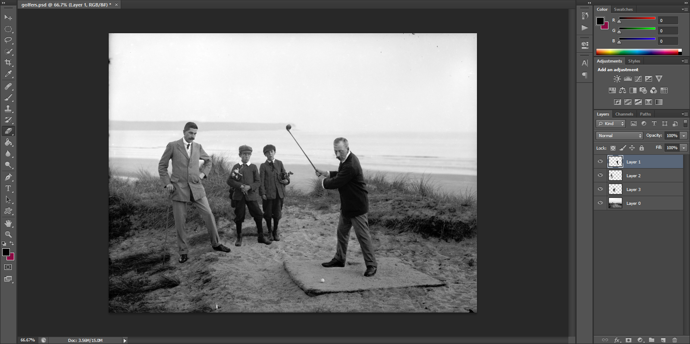
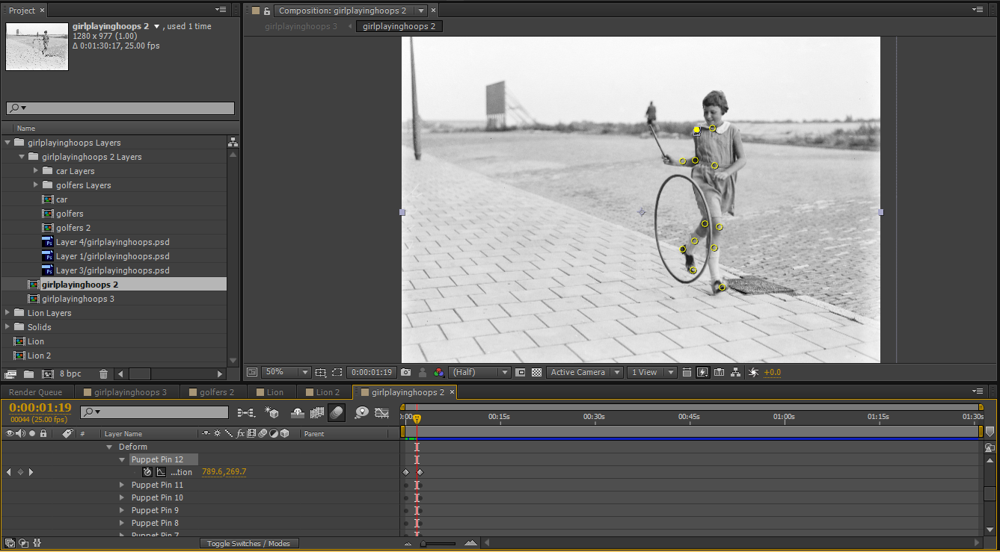
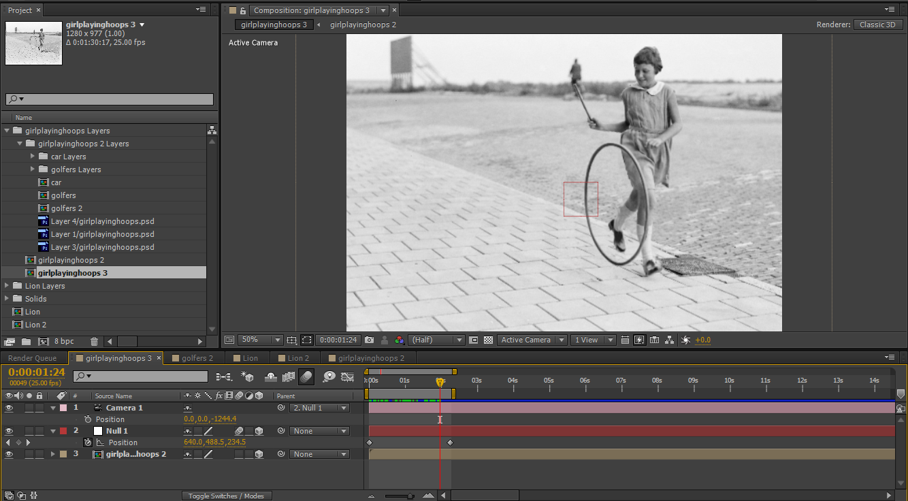

About a week ago, I came across an article showing an amazing video for the World Wildlife Fund made entirely of still images that had been brought to life with subtle movement. I loved the effect and decided that I wanted to experiment with this myself.

## Inspiration

The Creators Project got in contact with the motion designer and he put together a couple of quick videos to show his work.

### The original

`youtube: VQfgtUw4Vtc`

### Showing his work

`youtube: ZVrYyX3bHI8`

I think the biggest reason that I got so fired up by these examples is because I began making course trailers to enhance course marketing in my current organization. The first video I made, to be fair, was meant to be more of a proof of concept and I'd hoped that it would be cleaned up by our media folks. It was put out as-was, however, and, ever since, I've been on the lookout for ways to provide that essential sense of movement even when I may only have photographs. This 2.5D or parallax effect is a perfect solution.

## My Attempt and the Freebies

Before we get too far, here's my attempt at 2.5D and the resulting video clips that you can download. They're a little rough. I'm considering investing in a Wacom tablet in order to get some cleaner results next try.

`vimeo: 120921022`

The videos:

*   [The girl playing hoops](https://www.dropbox.com/s/e4rh33denkngp2o/girlplayinghoops%203.avi?dl=0 "Girl Playing Hoops video")
*   [The golfers](https://www.dropbox.com/s/sizln9i53080wm4/golfers%202.avi?dl=0 "The Golfers video")
*   (Unfortunately, the lion is to big for any of my current cloud storage)

## Why Would You Use This?

As I mentioned, for me, one of the uses would be to create better course trailers and videos in general. I could also imagine using this type of effect as a background for a presentation or course intro (assuming that it moved to the next slide automatically as these are not loopable). Anyplace where bringing images to life with movement or depth would help, this effect would be appropriate.

## The Process

Images I used:

*   New Old Stock Photos: [September 18, 1907](http://flic.kr/p/aoaATi "Golfers")
*   New Old Stock Photos: [Playing hoops](http://flic.kr/p/5KuKTg "Playing Hoops")
*   Skitter Photo: [Lion](http://skitterphoto.com/?portfolio=lion "Lion")

### Step 1: Image Editing

The first thing that you need to do, is to separate the foreground and background in the images. Think about the things that you want to animate. For example, in the image of the girl, I separated the hoop and the girl from the background. However, in the golf photo, I separated the boys, the man in the background, and the main golfer. After doing this, I used the clone tool to fill in the background as best as I could. As I said, some of them are a bit rough on close inspection. This bit is time consuming but absolutely essential.

**Pro Tip:** If you are setting up a shot for this kind of thing, you should take an image of the background by itself. That would make things much easier. I also imagine that if you are combining a character with a background as we so often do in elearning, this would also be an easier process.

<figure>
  
  <figcaption>Notice the separate layers in the Photoshop file.</figcaption>
</figure>

### Step 2: Importing into After Effects

I imported my Photoshop file, layers and all, into After Effects as a composition. After watching the vids above and some late night practice, I finally got the hang of it. 2 out of the 3 animations I created used both a simple zoom effect with the camera and the puppet pins. We'll tackle the puppet pins first.

#### Puppets

The puppet pins in After Effects allow you to deform parts of an image. I found that this is a bit of a trial-and-error process. You place pins both in the places that you will want to cause the deforming and in the places that you want to stay still. It will take a few tries before you come up with something that looks natural. It's important to make sure that you have a keyframe for each of the pins both at the beginning of the composition and at the point of your movement (for me, I only created simple movements so there were only two keyframes).

<figure>
  
</figure>

Notice the puppet pins in the girl composition.[/image] Once you've made the movements you want with the pins, then create a new comp from your current one so that you can use the camera more easily.

#### Zoom

Once I was happy with the movement, I created a new comp in order to smush everything together. I then added a null object and a camera and with another two keyframes, I created a simple zoom.

<figure>
  
  <figcaption>Zooming in After Effects</figcaption>
</figure>

## The End?

I hope to continue to experiment with this wonderful technique. What about you? What sorts of projects do you think you could use this for? Let me know in the comments.
