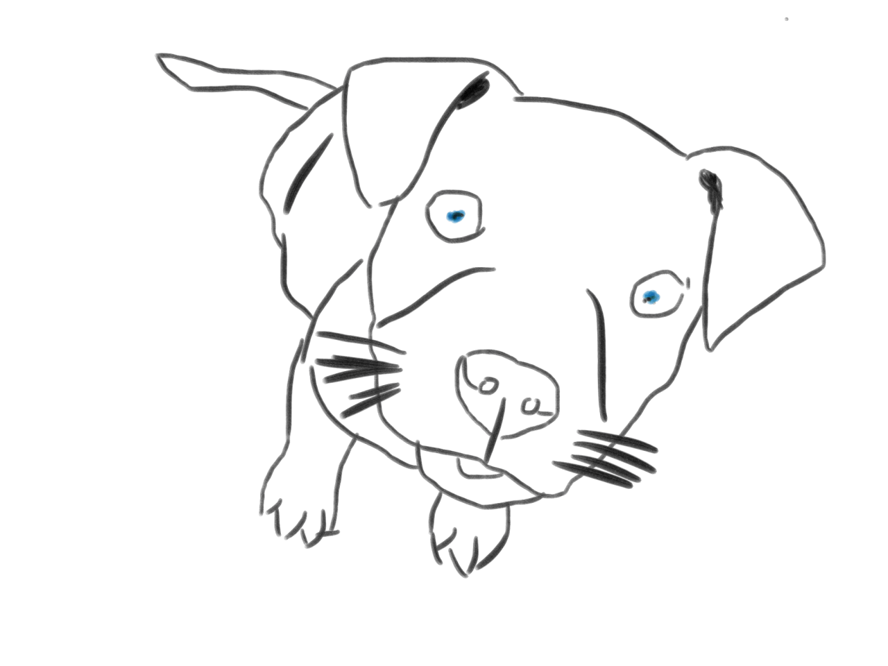

I oftentimes find myself interested in exploring a million different things. There are books I want to read, stories I want to write, and things I want to learn. About 50 each on a given day. But if working out loud has taught me anything, it's that I need time to decompress, relax, and rest. These two urges have been pulling against each other a lot for this past year so I'm trying a new approach: just a little every day. And I'm using the [Wonderful Day App](http://www.wonderfuldayapp.com/ "Wonderful Day App") to help me.

## New Endeavors

### Visual Language Practice

I began participating in [Blair Rorani's Twitter Draw-a-Thon](http://blair.rorani.com/twitter-drawathon/ "Twitter Draw-a-Thon") last week and I'm loving it. It's also sparked a new desire to explore visual language. I've been interested in sketchnoting before and just plain visual thinking and so I've decided that, even after the draw-a-thon is over, I want to continue practicing my visual language skills by drawing something, anything 5 days a week. To that end, I started a [Tumblr called Visilang](http://visilang.tumblr.com/ "Visilang"). Check it out!

<figure>
  
  <figcaption>My Favorite Draw-a-Thon drawing so far: Day 4 Dog</figcaption>
</figure>

### Writing

I've always been a fiction lover. When I was younger, I would write all the time... and never finish anything. LAst week, I stumbled across this [great article by Julie Zhou](https://medium.com/the-year-of-the-looking-glass/the-idea-person-e08e36f9024d "The Idea Person") that really resonated with me. We (I) fall especially hard for the cult of ideas and don't always do what it takes to take an idea to completion, even when it's hard; especially when it's hard. I haven't written in ages but I want to begin again and I'm starting with another bite-sized practice: one sentence every day.

## Old Endeavors

### Coding

As you may know, coding is definitely something I want to improve at and I'd like to get my beginner level JavaScript/jQuery skills down pat by the end of the year. I'm a TreeHouse member and I also recently discovered FreeCodeCamp which has put together some great problem-based tutorials. I often find myself falling off the wagon, though, when things get tough. So I'm going for one lesson a day until I reach completion.

<figure>
  
  <figcaption>One of the projects FreeCodeCamp links to on Dash</figcaption>
</figure>

### Personal Projects

As I'm sure all of you do, I have a long list of personal projects I want to complete to experiment with concepts, tools, and techniques. I've come to terms with the fact that they aren't all going to get done tomorrow, but sometimes, when work piles up, it seems like they won't get done at all. I'm still working on accomplishing this one. I believe it's a matter of priorities. It may be that I have to focus on my projects instead of other, smaller things.

## Striking the Balance

How do you balance life, rest, paid work, and personal learning? Let me know in the comments.
