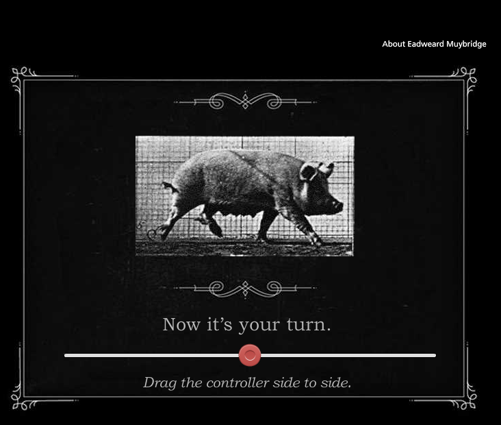
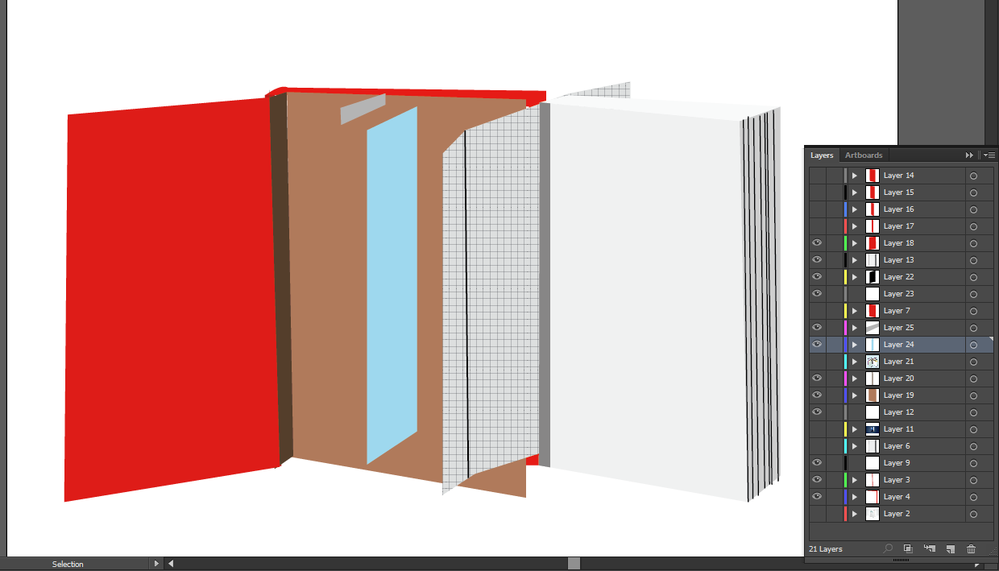

Fresh off the heels of building my [March AWSM Prompt submission](https://awsmprompts.wordpress.com/2015/03/09/march-prompt-create-some-game-based-learning/ "March AWSM Prompt"), [Fit.o.poly](http://www.knanthony.com/portfolio/fit-o-poly-wearable-serious-game/ "Fit.o.poly Wearable Serious Game"), I saw the newest ELH Challenge and knew I needed to jump back in. I've been really impressed with the breadth of submissions for this one. It's been great to see animation in After Effects (which have inspired me to go back and update Rae in Fit.o.poly when I have some downtime), earth sciences, and math because it really stretched my ideas about where animations can be useful. Even if you aren't participating, I'd say that this was one of those challenges to bookmark for inspiration later.

**Time in development:** About 4 hours

## Inspiration

My own entry into this one was inspired by [Charles Hamper's stop-motion pig animation](https://community.articulate.com/articles/interactive-sliders-elearning-examples "ELH Challenge 52"), submitted for an earlier slider-related ELH Challenge. Immediately after seeing this cool use of sliders, I wanted to emulate it, but I hadn't had a chance up until now.

<figure>
  
  <figcaption>Stop-motion pig animation by Charles Hamper</figcaption>
</figure>

## Process

It was a bit difficult coming up with a topic for this one but I settled on some inspiration from my days in library school: book restoration, one of the more interesting and hands-on classes I took during my master's degree. I love to read and I also really just love books: the size, the shape, the smell of decaying paper. In this class, we were able to tear books apart and learn about how they are restored, not only for the purpose of historical restoration (for example, restoring an important first edition or restoring a book for collector) but also just as a librarian who might need to repair a worn book in the stacks. Riffing off of Charles's technique, I created a book vector in Adobe Illustrator and then made slight changes to it to replicate a stop-motion opening and separating effect. 11 images later, I had a passable stop-motion animation.

<figure>
  
  <figcaption>Many, many layers... so many</figcaption>
</figure>

## Expansion?

So finished is better than perfect and I wanted to get something out before it was too late. But, if I have some extra time, I'd love to add to this project by taking a cue from a [great TutsPlus article on adding appeal to animation](http://webdesign.tutsplus.com/tutorials/adding-appeal-to-your-animations-on-the-web--cms-23649 "Adding Appeal to your animations"). Ideally, I could create some small pop-ups with definitions of each book part.

## See it in Action

With special thanks to Sea Lemon for giving me permission to use her video, try the demo!

<figure>
  
  <figcaption>Play the Demo</figcaption>
</figure>
