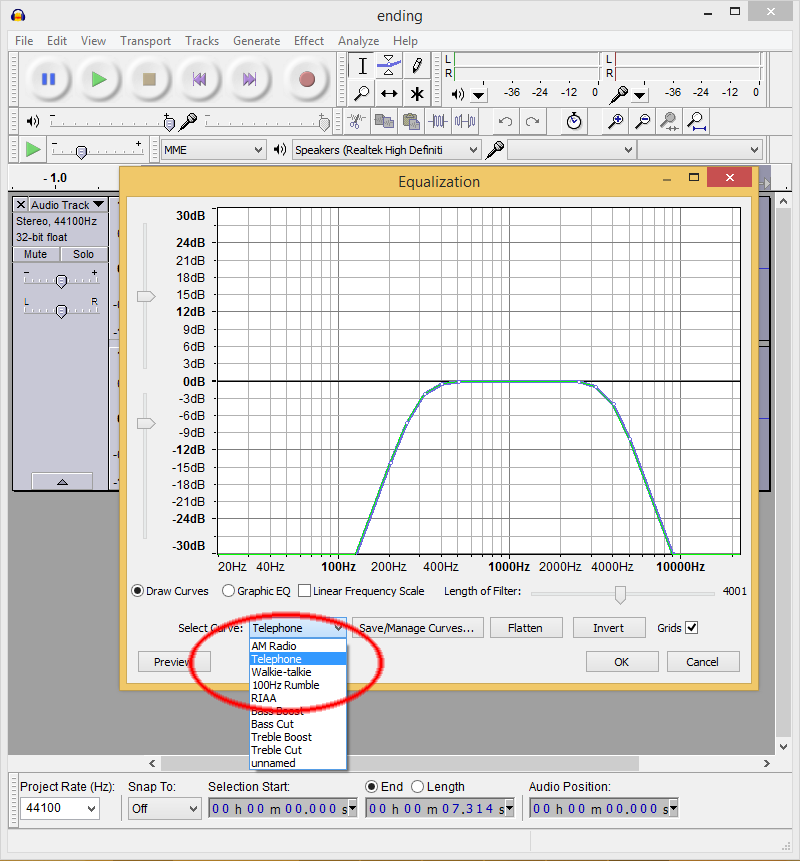
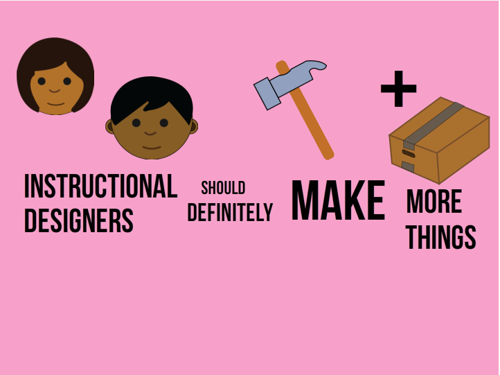

Full disclosure: this was another challenge I wasn't sure I was going to participate in. But then I saw the great Emoji Dick conversation video that David put up as an example and once again, I thought, "I'm in." I've been listening to the [Build and Launch](http://buildandlaunch.net/ "Build and Launch") podcast a lot lately (check it out if you get a chance) and I've been super excited about creating and shipping (in the product people lingo) a new site I'm calling Go Design Something. I want to create another space where instructional designers of all stripes can be challenged to make things. I plan to begin podcasting as well as creating some elearning of my own with lessons on integrating coding and elearning authoring tools. Sign up to be notified once I launch the site: [http://godesignsomething.co/](http://godesignsomething.co/ "Go Design Something") [Shameless plug over.] Anywhoodle, I started to see this as an opportunity to extend last week's animation challenge and to talk a bit about why I think making is so important for instructional designers.

## Emoji...

I'm one of those weirdo's who often still uses full, grammatical English when I text so I'm not very familiar with the variety of different emoji and their meanings. I started by writing out some short sentences that I wanted to say and then looking up emoji that might help me say those things. I used [Emojipedia](http://emojipedia.org/ "Emojipedia") as my reference of choice. Emoji is quite limited as far as language goes so it was a great exercise to think about an image I might use to illustrate "Out there," for instance.

## Doin' it For Myself

I often spend a lot of time crawling Creative Market to find just the right image. This time, urged on by my recent drawing mania (more on that on Thursday), I decided to create my own. I used the real emoji as a reference and went to town in Adobe Illustrator. See video for documentary evidence.

`vimeo: 124115624`

## You Want 'Em?

I realized that a lot of the great folks in the Articulate community are big on offering things for free, which I haven't done in the past because I always purchased my images, but I thought I'd give these away. So if you need a few emoji or flat icons, here ya go. Take, use: do so in remembrance of me.

*   [Emoji png](https://www.amazon.com/clouddrive/share/zrHlN2Sj3Z32b1ldu3_Gtk2S5aW8EtHd2CHogYYqzh0?ref_=cd_share_link_copy_flash "Emoji PNG")
*   [Emoji Illustrator files](https://www.amazon.com/clouddrive/share/2nIam7vGtc0Aznzgkq1MZrhSjlM_KIrpzDILjq9iQHg?ref_=cd_share_link_copy_flash "Emoji Illustrator Files")

## The Audio

Like I wrote above, I wanted to tell a little story and I loved that Emoji Dick inspiration. I also really loved that intimate telephone call sound quality. It makes it feel as though we're a part of a private conversation. So I wanted to emulate that. I recorded my audio using Audacity and then I used the telephone equalization effect to simulate that same audio quality.

<figure>
  
  <figcaption>Using Audacity</figcaption>
</figure>

## The Story

Last but not least, here's the emoji story. Enjoy!

<figure>
  < a href="http://knanthony.com/showcase/emoji/story.html" target="blank">
    
  </a>
  <figcaption>Click on the Screenshot to View the Demo</figcaption>
</figure>
