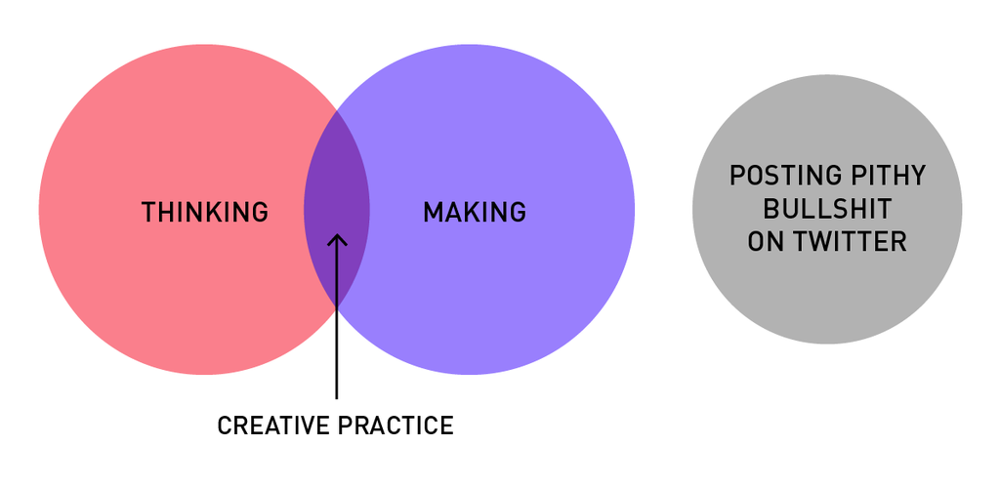

As you may have noticed, here on the blog I like to really break down my motivations for doing things. It's certainly been a helpful way to gain insight into myself as an instructional designer, and I sincerely hope it's helpful to others who are newbies like myself and trying to figure out where they stand and how to move forward. One of the things I've become really passionate about is making, and making as an instructional designer.

## Do you even make, bros?

> The bottom line is that it's the practice of consistently making and releasing projects that makes all the difference in your ability to deliver on the job.

I didn't go to school for instructional design but I did go to school for library and information science and, from discussions with others, it seems like the experiences are the same on a lot of levels. There's a lot of emphasis on background and theory and learning. And even out here, connecting with thought leaders and listening in on conversations, there's a lot to be discovered about all the theory and background and science your degree got wrong. This is all super valuable and I love to listen and learn and participate in these conversations. But it's struck me that there isn't as much emphasis on the value of actually making things. Oh, there are no shortages of technical tutorials (how to do x in a given authoring tool) and design tutorials (10 design trends to follow in 2015), but once you've watched the tutorials and followed the design trends, the bottom line is that it's the practice of consistently making and releasing projects that makes all the difference in your ability to deliver on the job. With that in mind, here's the top 5 reasons I take making as an instructional designer so seriously.

**1\. Because there's no time to practice at work** Think about it: you learn about all of these cool design trends or effective scenario techniques. But the fact of the matter is, these things take time and practice to master. You don't just learn about how to create a branching scenario and then suddenly create a masterpiece. You have to have time to experiment, create story, figure out what works. Part of this is learning the right questions to ask your subject matter expert. And for many of us, who do our own development work, the other part of making the vision in our heads a reality is practice. And let's face it, at work you have project after project. How much time do you have to experiment with designing an interactive infographic or planning your first branching scenario?

**2\. You can broaden your Toolbox and Skillset** One of the best parts of practice and experimentation is that it can lead you outside of your limited skillset or toolbox. At work, you have your authoring tool and that's what you use because that's what everybody uses. Outside of work, things can get a little more interesting. Maybe you can't afford a personal copy of your authoring tool. What else can you use? Thinking outside the tool can majorly open up your viewpoint. Maybe you can't create or purchase rich graphics on your own. Will flat design work? How much can you accomplish with text only? Case in point, I was recently developing a course where the ideal would have been for students to be able to mark on the screen to point out significant patterns in fingerprints. For over a month, I rejected this as a possibility because I was only thinking about innate possibilities in the authoring tool I had to use. A few days doing some coding practice outside of work and outside of the tool and my mind opened up to the possibility of using Javascript.

**3\. You can Fail** You don't need me to rehash all the stuff you know about being able to fail in a safe environment. It's something we value being able to offer our users as instructional designers. But are we allowed to fail when we design things? Spending time on trying out an approach only to have it fail miserably is not an option for most of us. It can be, though, if you spend some outside of work time making for yourself.

**4\. Practice = Creativity** For a long time, I was caught up in the myth of inspiration and the idea person. I thought that inspiration was akin to a shooting star: you went a long time without it and you just had to wait for it to show up in order to get anything done. Well, it turns out that was dead wrong. Creativity, inspiration, even innovation is a function of showing up and making things consistently. Look, I know you have lives outside of work, but if being more creative or getting design or development inspiration is your goal, there's no way around the fact that you have to be willing to experiment and make things on a regular basis. And I don't mean just think about things you can do. You have to actually produce an artifact. It's the work that does the trick.

<figure>
  
  <figcaption>The Creative Process, via Mitch Goldstein</figcaption>
</figure>

**5\. Work is Instructive** Perhaps a few of you have time to conduct a post-mortem on a project and think about, or even discuss with colleagues or your supervisor: what went well, what didn't work, what you'd like to do better. I try to make it a point to do that after each course I launch at work. But while I think about it, it's not an active discussion I'm able to have because once one launches, it's on to the next one. Working on personal projects, though, gives me the time and the room I need to reflect. Sharing them with others and asking for feedback and critique is even better.  The act of making and releasing things can be a bit scary but it's how we get better. Period.

## What are you making lately?

I recommended him in a previous post, but I thought it was work mentioning again. Justin Jackson has a great podcast called Build and Launch, focused on making and releasing things every 7 days. His mantra is "Start small, start now." And I love it! I'm currently doing something scary myself: I'm redesigning AWSM Prompts based on some great feedback from Rachel Barnum and Cathy Moore in the instructional design sub-Reddit ([check it out here](http://www.reddit.com/r/instructionaldesign/)) and updating it as Go Design Something. It might fail, it might not. But I'm giving it the old college try. Do you practice instructional design outside of work? Do you make personal projects? Why or why not? I'd love to hear from you in the comments.
