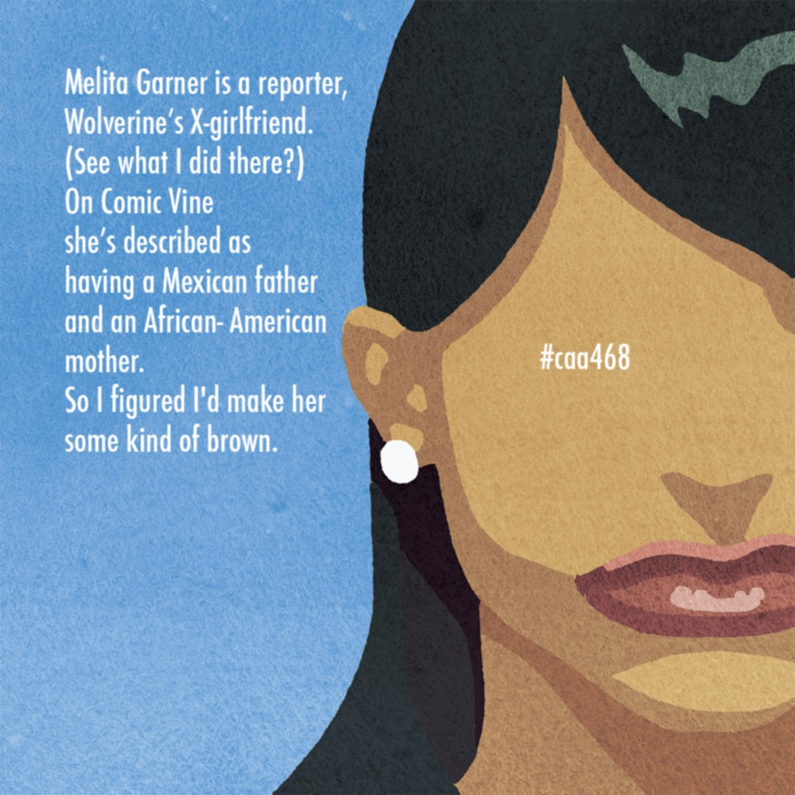
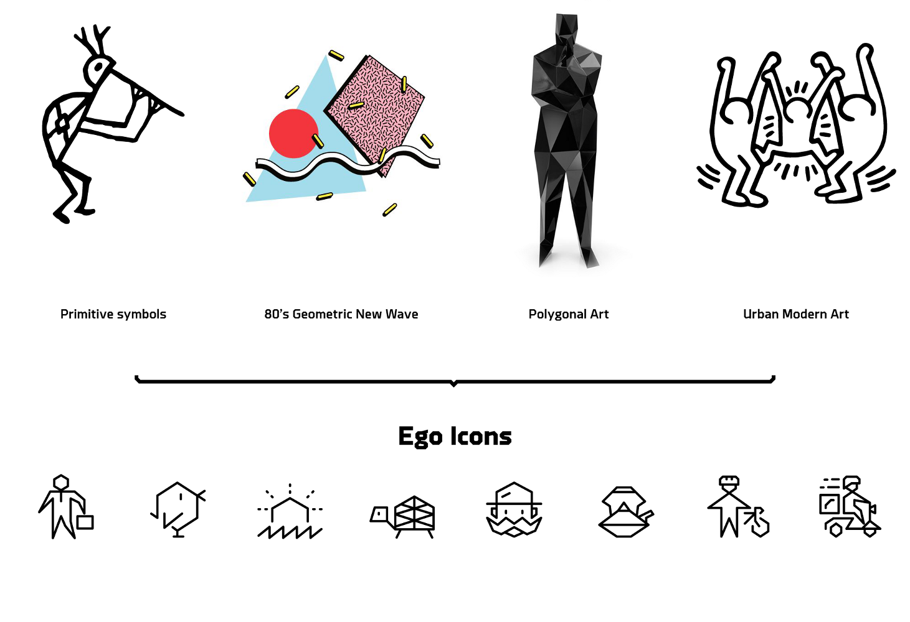
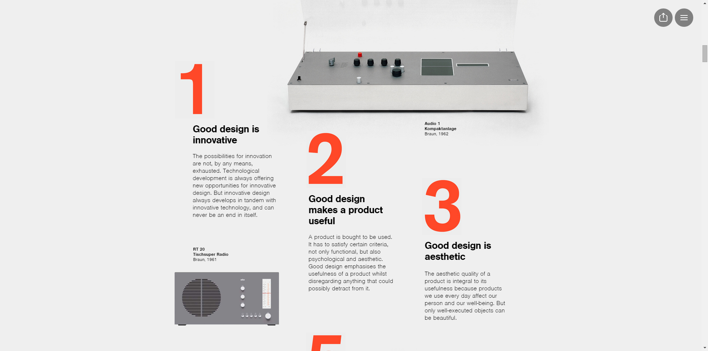

I love design. And I love practicing design. And as an elearning devleoper that often translates into visuals, either graphics or video. So when I get talking about design, I think I sometimes give the impression that visuals are all I care about, that I hate text, that text is an evil, demonic nightmare (or at least something to be avoided). But that's just not true. I love words. I love language. So I thought it was high time that I explored how I approach text as an instructional designer.

## Words Matter

So what's with all of the anti-text rhetoric in the ID sphere ? I think that the main desires for anyone designing elearning (or any screen experience) are to create experiences that have plain, understandable language, that are presented in easily digested chunks and, most importantly, that engage. So I think that we tend to discuss words with our SMEs or clients in a way that steers them away from dumping piles of words (as though that will help a user perform better) simply to get them to think about, "How can I say this more plainly or more simply? How can I break this down into its most essential parts? How can we help users do what we need them to be able to do?" It's about choosing the right words—the essential words—giving them context, and encouraging practice.

## And Design Matters, Too

> The takeaway for me from these three articles is that the way we design our text is just as important in providing a readable, engaging, and enlightening experience as the words themselves.

But sometimes, we are called on to engage in information design, instead ([something that I've explored previously](/blog/information-design-and-digital-magazines/ "Information Design and Digital Magazines")). When that's the case, we aren't designing performance-changing exercises so much as we're trying to bring clarity to information. This often involves a mixture of text and visuals. One of the cool things that has influence me is the increased (to me, anyway) emphasis on typography and creating a beautiful reading experience online. Take the Medium platform, for example. People write long, wonderful essays on Medium. But they are designed such that they are both effective pieces of communication and a pleasure to read.

## Examples

<figure>
  
  <figcaption>Ronald Wimberly wrote a wonderful essay using words and drawings.</figcaption>
</figure>

<figure>
  
  <figcaption>Vincent LeMoign made described his icon creation process</figcaption>
</figure>

<figure>
  
  <figcaption> This piece from Shuffle Magazine on Dieter Rams 10 Principles of Design combines a full-screen experience of text with parallax scrolling and other media.</figcaption>
</figure>

The takeaway for me from these three articles is that the way we design our text is just as important in providing a readable, engaging, and enlightening experience as the words themselves. These articles used images, they used color, they used size and proximity and weight. All of these things made the articles easily scannable and highlighted the most important bits. They made the text beautiful. They gave it movement. They communicated. That's what the right words in the right design can accomplish.

## And, You Know What, Story Matters Most

Every time I play a Twine game,or another piece of interactive fiction, I'm reminded of how powerful and engaging words can be when they make a story, particularly when they make a story that puts the user smackdab in the center of that story. [Try playing this piece of IF by Emily Short](http://emshort.home.mindspring.com/Alabaster/ "Alabaster") and tell me how boring text is. (Bet you can't!)

<figure>
  
</figure>

## Respect the Text

Used correctly and designed beautifully, words are as powerful as they ever were. So when we seek to use less of them, it's always in a desire to distill what is essential. We respect the text.
