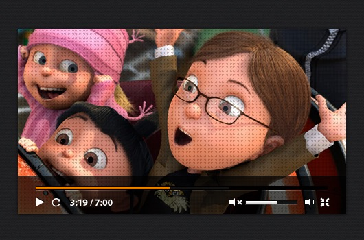
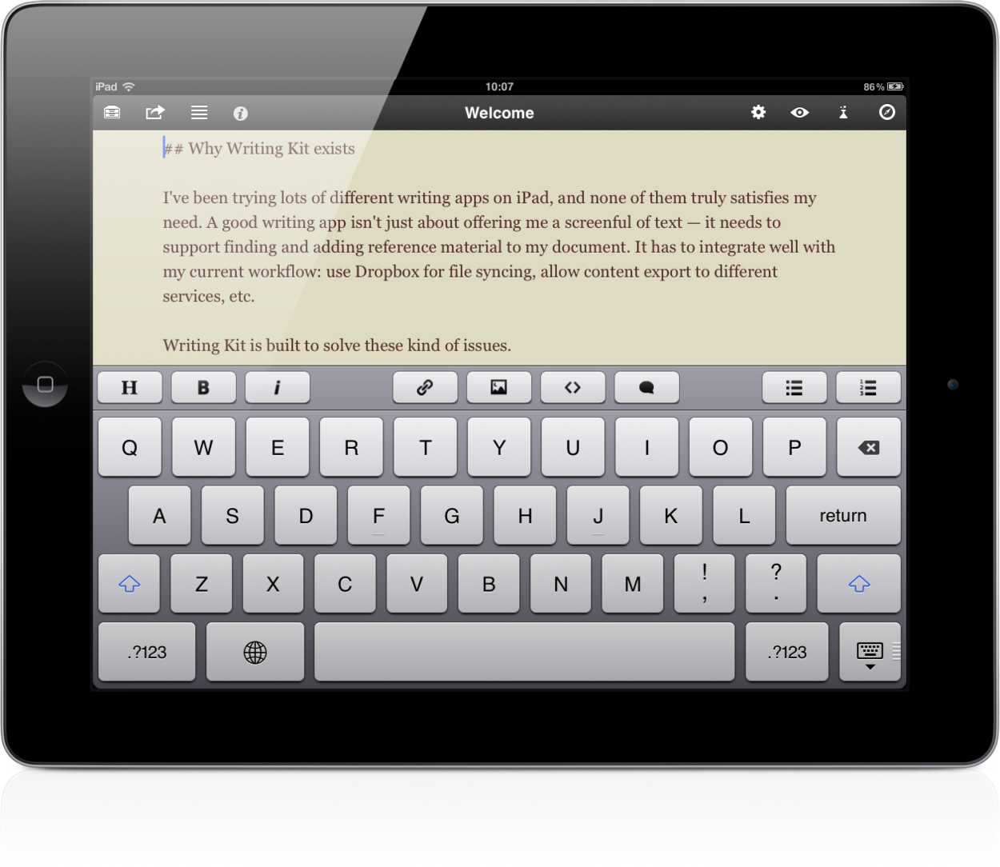

I was talking with a co-worker a while back and I remember her main concern about her design was that it should be new, unique, and not use the same design concepts we'd used before. This struck me at the time and I've been thinking about it since.  When we seek to create a look and feel for a course or think up an interaction or an illustration, there's often this desire to do something new or different. The thing is, though we should refrain from designing the same course over and over (by which I mean using a bland, boring template and failing to create relevant interactions), we should never forget that our ultimate goal is not to create something new or unique or never-seen-before.

> Instead, we're meant to create something that engages, something that works.

## There's Nothing New, Seriously

> There is nothing new except what has been forgotten.
>
> -- Marie Antoinette

We have to get used to it. True innovation doesn't happen very often. And in terms of learning, a lot of the "new" trends are simply us articulating and learning to use many things that folks have known for a while. Gamification and game-based learning are not really new. Branching scenarios are not really new. Asking questions to engage users in their learning? Not really new. Now that's not an accusation because none of that is really a problem. For example, think about the navigation on many of your favorite apps. The icons, the placement, the sum total of the design choices of a well-designed app seem transparent and intuitive. That's completely on purpose. When we design an experience, we rely on the comfort of familiar things to help our users get to want they want quickly and easily. That's great design. Design and even at a higher level, creativity, at its heart, is about solving problems, not about creating something "new." We need to get comfortable with "stealing like artists:" taking designs, stories, and tropes that work and making them our own.

<figure>
  
  <figcaption>Most video players look about the same, yes?</figcaption>
</figure>

<figure>
  
  <figcaption>The same with many writing apps. Similar interface.</figcaption>
</figure>

## But You're Always Going on About Experimentation

You're right, I am. For me, experimentation involves using tools, techniques, and designs that I haven't used before or haven't used in a certain situation before. Experimentation is stretching my skills and resources to tackle a problem in a different way. It's about breaking out of "this is the way we've always done it" or "this is the only way we can think of to do it." That's incredibly valuable to me as an instructional designer because it opens my mind to different ways of solving a problem. It's also valuable to my organization because the ideas that I experiment with can change our designs for the better, solve some user experience obstacle that our old designs weren't able to, and help our users perform better. But it could be said just as easily that my work isn't unique. I'm okay with that. Yes, it's a struggle. Sometimes, I want to make something completely different. But the ultimate goal must always be to make something that solves the problem in the best way possible.

## Do You Struggle with Wanting to Be Unique?

Do you ever get hung up on wanting to create a unique design or a new story? Have you learned to steal like an artist? Let me know in the comments.
