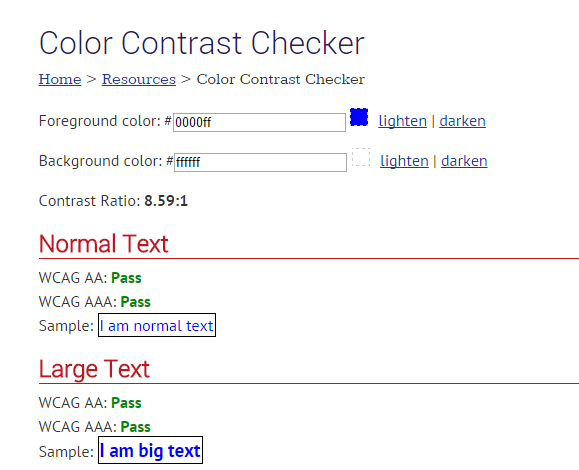
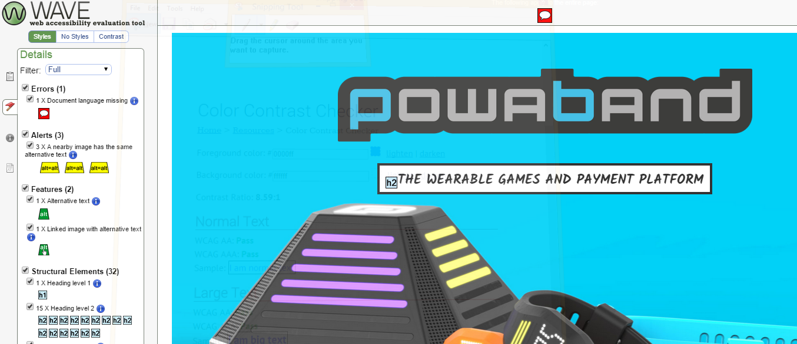
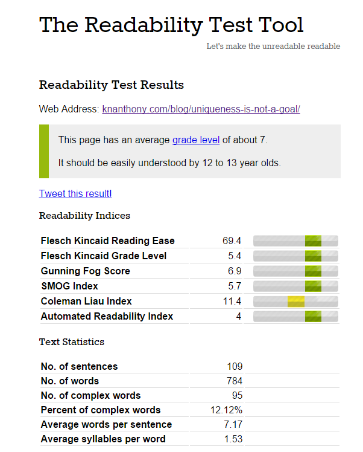
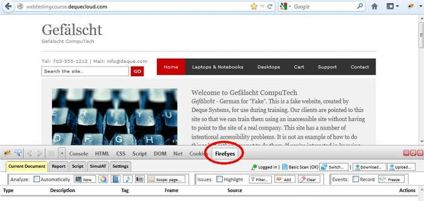
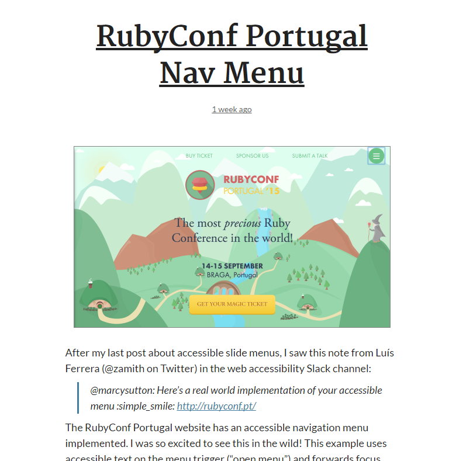

In my previous post on accessibility, [I shared some lessons I learned about implementing accessible designs](/blog/accessible-elearning-lessons-learned-part-1/ "Accessible eLearning: Lessons Learned Part 1"). In this post, I wanted to take that sharing a step further and offer you some tools and resources that you can use in your own work. I'll separate them into lists and try to offer a bit of insight into each.

## Some Basic Tests

Before you ever install anything, there are several basic things you can do to test for accessibility in your online course:

*   Tabbing through your content to make sure that the tab order makes sense
*   Making sure that you've tagged headings appropriately and in the right order (for example, that h2s appear on the page only if there's an h1 first-this can be an issue in Wordpress themes)
*   Making sure that you provide alternate text for images (and tables, where possible), or, for more complex images, graphs, or infographics, provide descriptions
*   Making sure that you provide transcripts for audio content and captions for video/audio content.

## Free Tools

### WebAIM Color Contrast Checker

**URL:** [http://webaim.org/resources/contrastchecker/](http://webaim.org/resources/contrastchecker/)

**About:** Color contrast is a particularly important issue for color blind folks but is also a general usability concern. Users should be able to easily distinguish between foreground and background, or from different items in a group. (Add parking sign pic) WebAIM's color contrast checker allows you to paste in your color codes to see whether the combination meets accessibility standards.

**Pro Tip:** Consider creating style guides with fonts, colors, and other stylistic considerations early before diving into development. This will let you check color contrast and legibility before you go too far.

<figure>
  
</figure>

### WebAIM WAVE Toolbar

**URL:** [https://wave.webaim.org/toolbar/](https://wave.webaim.org/toolbar/)

**About:** The WAVE toolbar is a browser add on that helps to identify accessibility issues in your content and can even generate a report. It has nice, clear identifiers and good feedback. There may still be a few bugs but overall a great tool.

**Note:** With rapid elearning tools, we are, in many ways, bound to the limitations of our tools, so you may not be able to squash every accessibility problem identified with your output. That said, you should still try really hard.

<figure>
  
</figure>

### The Readability Test Tool

**URL:** [http://read-able.com/](http://read-able.com/)

**About:** One population that isn't always considered are people with cognitive disabilities. Making sure that your content is mentally accessible (understandable) is another important accessibility must that also greatly increases usability for all members of your audience.

<figure>
  
</figure>

### FireEyes Firefox extension

**URL:** [http://www.deque.com/products/fireeyes/](http://www.deque.com/products/fireeyes/)

**About:** The FireEyes extension works with the Firebug developer extension in Firefox (whew! that's a lot of fire!) and is yet another tool you can use to spot accessibility issues and create a report. It's available for free but requires a signup.

<figure>
  
</figure>

### NVDA Screen Reader

**URL:** [http://www.paciellogroup.com/blog/2008/01/nvda-a-free-and-open-source-screen-reader-for-windows/](http://www.paciellogroup.com/blog/2008/01/nvda-a-free-and-open-source-screen-reader-for-windows/)

**About:** JAWS Reader may be industry standard, but it's also an expensive specialized program. If your team is on a tight budget, you might try testing your content using NVDA, a free and open-source screen reader.

`youtube: qOQ7zELFmLE`

### Amara.org

**URL:** [http://amara.org/en/](http://amara.org/en/)

**About:** I've been using Amara.org for a while now. It's my go-to online program for easily creating captions and exporting them to various web formats. Yes, Camtasia allows you to create captions but they are only usable if you host the video yourself with the Camtasia player. If you want to go with YouTube or Vimeo, for instance, you will want to use a web-standard for captioning like WebVTT. Amara has a pretty easy process. Even if you have scripts, like I often do, it's simply a matter of pasting in your script in small chunks and then syncing it up with the video.

`youtube: aQ-xe-GSjdA`

## Checklists

#### WebAIM 508 Checklist

**URL:** [http://webaim.org/standards/508/checklist](http://webaim.org/standards/508/checklist)

**About:** WCAG 2.0 and Section 508 are big, complex documents and for most of us are TL;DR (too long; didn't read). So WebAIM created a handy checklist to put the "what's in it for you" front and center.

### WCAG Checklist

**URL:** [http://webaim.org/standards/wcag/checklist](http://webaim.org/standards/wcag/checklist)

**About:** Similarly, WebAIM has also created a pared down WCAG 2.0 checklist to help you to easily check for things that you can do to make your content more accessible.

## Accessibility in Elearning Tools

### Articulate Storyline Accessibility Features

**URL:** [https://www.articulate.com/products/storyline-section-508.php](https://www.articulate.com/products/storyline-section-508.php)

**About:** Information on accessibility features in Articulate Storyline

### Building Accessible Courses in Lectora

**URL:** [http://lectora.com/blog/thursdays-trending-e-learning-topic-accessibility/](http://lectora.com/blog/thursdays-trending-e-learning-topic-accessibility/)

**About:** A curation post from the Lectora team with links to different articles they've created on making accessible courses in Lectora.

### Adobe Captivate Accessibility Features

**URL:** [http://www.adobe.com/accessibility/products/captivate.html](http://www.adobe.com/accessibility/products/captivate.html)

**About:** This page specifies Captivate 7, but hopefully it's still useful information for Captivate users.

## Inspiration

### Accessibility Wins

**URL:** [http://a11ywins.tumblr.com/](http://a11ywins.tumblr.com/)

**About:** Accessibility Wins is a recent find of mine. It's a Tumblr dedicated to cataloging accessible design "in the wild" (implemented in live web pages). Best of all, the curators also provide commentary on the specific accessibility win on the page, what they love and what could be improved. It's a great source of inspiration whenever it seems like designing accessible content might prevent a certain design concept.

<figure>
  
</figure>

## I'm No Expert

Obviously, I'm not an expert and I'm still learning myself, which is why I wanted to share these tools with you. Given the audience for the content in my organization, we usually have to balance our attention to accessibility with development time and creating interactive crime scenes, for example. So it can be a struggle. Are there any tools or tests that you use? Any specific issues you've found implementing accessibility in your authoring tool? Let me know in the comments.
