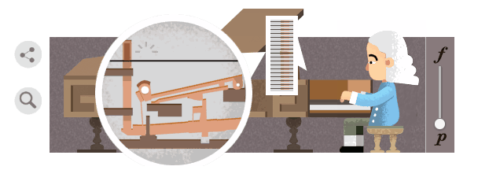
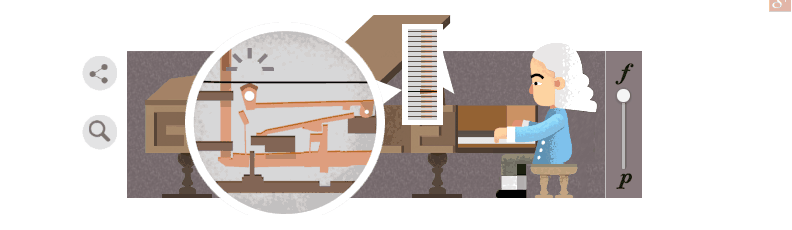

Earlier this week, [Google released an interactive doodle celebrating the inventor of the piano, Bartolomeo Cristoforo](http://www.google.com/doodles/bartolomeo-cristoforis-360th-birthday). I loved this doodle as soon as a I saw it. Though it's a pretty simple interaction, there's quite a bit of subtlety to it.

## Forte to Piano Slider

The Forte-Piano slider caught my eye immediately because it's something that I can be easily implemented in several elearning authoring tools, and is perhaps especially easy in Storyline 2\. The slider is also interesting because it's the only interaction you have with the piece: making it loud or soft.

## Animation

But don't be fooled by the simple interface. The animation that it controls is super interesting. So on piano, little animated Bartolomeo sits in his seat, quietly playing his piano.

We are also treated to a top-down view of the keyboard that shows which keys he plays, and an inside view of the piano, showing the hammer (relatively) softly hitting the wire.

<figure>
  
</figure>

As we move towards forte, Bartolomeo gets more active in his playing (did you notice the subtle gradations between the two extremes?) and we can see that the hammer hits the keys harder.

<figure>
  
</figure>

How do we know? The size and shape of the sound lines emanating from the hammer and wire. I loved the subtlety there. We can hear the notes getting louder, but we're also given fantastic visual cues that Bartolomeo is hitting the keys harder (at forte he is actually bouncing up and down in the seat in a whole body movement, as opposed to piano where his eyebrows move to the beat) and that the hammer is hitting the wire harder. All of this without a single line of text or a voice over. It makes me thing about how often we justify instruction text and voice over with the idea that our users just won't get it otherwise. Here's a doodle with truly international reach that illustrated a concept without either of those things. If nothing else, we should file it as inspiration that it can be done!

## Future Project?

The clever use of animation may be difficult to duplicate but, on the whole, this is fairly simple. I'd like to try an emulate the design in Storyline in the near future and I've love to see what you all come up with. Any takers? Let me see you're design in the comments.
