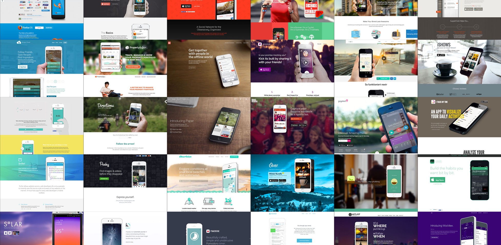

I read an article from Blair Rorani this week, called [Push Button Creativity](http://blair.rorani.com/push-button-creativity/). It's a good read and I recommend it. It definitely got me thinking about creativity and how we design and how we think about ourselves as instructional designers.

## Pushing the Button can be Bad

If I understood Blair correctly, he is lamenting the state of all kinds of design, including instructional design, where people rely on templates and stock photos and vectors and it results in designs that look mind-numbingly the same. And, on the one hand, I agree with him. One of the reasons I avoid using templates (though I often look at templates for design inspiration) is that they actively invite us to just dump in content, hit Publish, and call it a night. The problem with that is that design is meant to solve problems. It's not meant to just be a pretty container  for stuff. And when you simply dump content into a template, that's when you begin to lose the meaning, the function, and the motivation. You end up with a pretty, ineffective mess. Another issue is that templates invite us to simply make the same course (or website) over and over again. Honestly, the courses I design for law enforcement should not look like the courses someone else designs for restaurants. Our audiences are different; their needs are different; the way in which we deliver training should be different.

<figure>
  
  <figcaption>Consider this! Different websites, different products, same design. Image from WebdesignerDepot via Medium</figcaption>
</figure>

Templates can tempt us to start with a "cool" design first. After all, template providers sell them in just that way: it's the easy way to create X; just drop in your content! Again, the baseline problem comes down to the fact that whatever, design (or design pattern) you employ is meant to solve a problem, not just serve as decoration.  That means starting with your own rough and tumble, sometimes ugly ideas sketched out, discussed, and tested for completeness and usability. As good instructional designers, we wouldn't say "Wouldn't it be great if I could find a use for that jeopardy template?" and then force it into a course, no matter how silly or inappropriate. (We wouldn't, would we?)

## But...

However, as I've written before, [I don't believe that uniqueness is a design goal](/blog/uniqueness-is-not-a-goal/). There's not necessarily anything wrong with using familiar design patterns or using stock photos or vectors. The point is not for us (especially as instructional designers) to become award-winning graphic designers AND illustrators. Our purpose is to create meaningful, memorable, and motivational learning experiences, to curate resources, and to ensure that our users have what they need, when they need it. For many of us, that also means designing and publishing courses on our own. Though we are often jacks and jills of many things, it's not reasonable to expect us to be experts in all of them. Our first job is creating the right learning experience. And I say, if stock video, stock photos, stock vectors, and yes, even templates help us do that, then so be it. One of Blair's largest points is that, with this push button attitude also comes the desire for everything to be free. He's an artist and sells services, so I can understand his concern. Piracy of software and assets (e.g. music, photos, illustrations) has been and continues to be an issue. However, there is also a growing body of high-quality no and low cost assets. I don't feel the need to apologize or feel bad for looking to those sources first. I'm willing to [put in the credits](/blog/credit-where-its-due/). I buy assets when it's necessary and when I have the funds; otherwise, I might have to go without. Still, there's no guarantee that a perfect no-piracy world would mean more sales or more business for instructional designers or any other kind of designer. The plethora of user-friendly tools means that I might just decide to go out and do a photo shoot myself, instead of buying someone else's stock photos. Or I might decide to build the website myself with Squarespace.

## What About Our Jobs?

I believe that one of the unspoken fears that Blair's article might bring up is that this democratization of design and tools might mean that we as instructional designers are not valued. Why hire an instructional designer if you can plop a subject matter expert in front of Captivate (Storyline, Lectora, you name it) and expect him or her to churn out an online course? There will certainly be some organizations that think this way. There have always been organizations that have thought this way. The truth is, there is no stopping this. That's progress. Democratization of tools, processes, and software is not unique to us. It's happened to publishing (yet, books still aren't dead, in spite of predictions to the contrary). It's happened to print journalism. It's happened to librarians (they also still exist). It's happened to web design and graphic design. There are now more tools than ever to empower individuals to create, style, and publish their own content. That's the way the cookie crumbles. Bottom line is that all this means is that we pivot a bit. We have to rethink how we market our services. What do we offer our organization? How do we align with their bottom line? That's our job to figure out and several L&D folks have discussed this pivot in the past. It does no good to try and blame free stuff.

## What do you Think?

Do you think instructional designers are guilty of wanting push button creativity? Is it a bad thing? By the way, that featured image was created with Canva and a free image from Pixabay.
