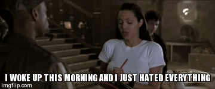
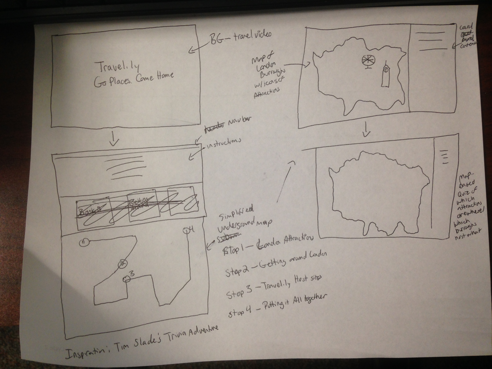
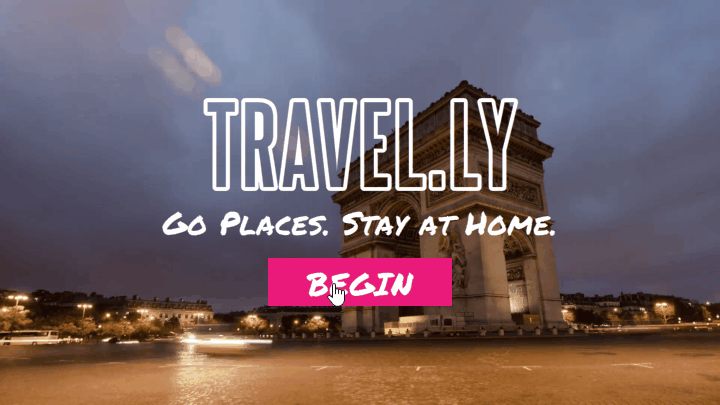

There are times when I reach design enlightenment: I have a clear vision of exactly what I want to do and I'm fully capable of realizing that vision. There are other times when I really don't know what to do and I have to struggle with an idea for a while before I find something that I love. And then there are times like this one, where I thought I knew where I was going but, after struggling with the idea for the better part of the week, I realize that I hate everything.

<figure>
  
  <figcaption>I hate everything and so does Laura Croft</figcaption>
</figure>

## What do You Do?

At time like this, the best thing to do is to throw it all away and start over. That can be exceedingly difficult, especially if you liked your original idea but just can't seem to make it work. But whether the project is personal, like this one, or something you're doing for work, the bottom line is, you'll waste a ton more time and end up with something you'll never feel truly satisfied with if you persist in trying to plow through with an idea you can see isn't working instead of being willing to chuck it. So, this weekend, I went back to the storyboard.

## The Change

When I say I chucked it, I mean I chucked everything, except the idea of a video in the intro. See for yourself.

### Original Sketch

<figure>
  
  <figcaption>The original prototype sketch</figcaption>
</figure>

### Try 1

I was all set to go with an underground thing. You might notice that the vid here shows the Arc de Triomphe. I always intended to change that. It's no good showing a Parisian landmark in a London-themed course. But that wasn't what was bothering me. One of the things I didn't like was the dark theme I had going on here. Somehow I just couldn't keep going with that. Bright and fresh seemed more appropriate, perhaps because I was basing my idea on AirBNB. Still, the main problem though was that I wasn't 100 percent on the way the activities themselves should look and work. I had maps on the brain. I was thinking London underground map for the main them, and then a map of London boroughs would form the base for the initial interactions (you can see them in my original sketch). But the more I tried to make this work, the more it struck me as the wrong direction. I mean, who cares which borough the London eye is in. That isn't really how most travelers navigate things. The important bit was focusing the interaction on finding the right attractions for the customers, not locating the attractions.

<figure>
  
</figure>

### Redesign

This weekend, I finally allowed myself to chuck everything out and start over. I took major  inspiration from the Allen Interactions Expedia case study, AirBNB, Twitter, and Pinterest. Importantly (for me. at least) I took a step back from Storyline and made some time to create a storyboard in PowerPoint. I know that some people are okay jumping right into the development tool, but I've always found that to be a problem when I don't have a clear vision. By removing my work to a more throw-away workspace like PowerPoint or paper, it's easier for me to think big and let go. I definitely recommend it if you ever have trouble pinning down a good design.

<figure>
  
</figure>

## What Are You Designing?

Any one else working on this month's GDS Challenge? What are you designing?
