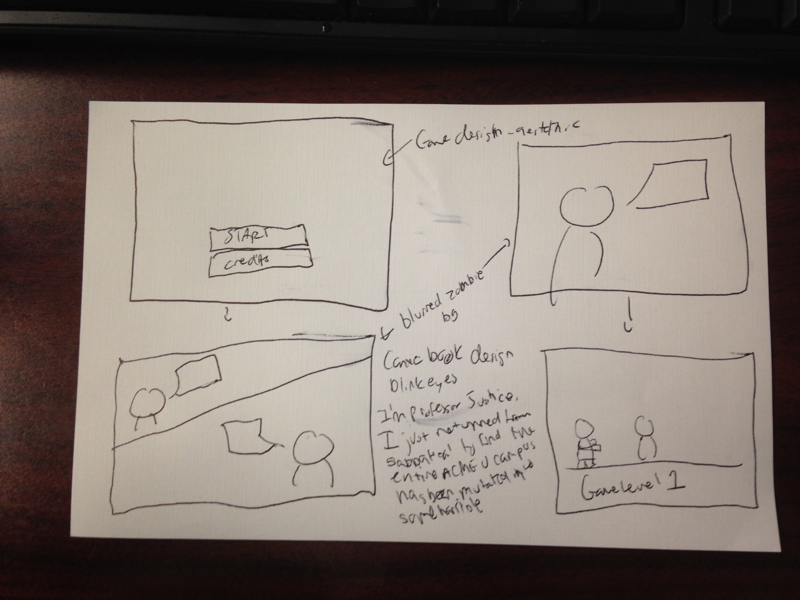

Let me begin by saying that, on my honor, I had no intention of including zombies or undead of any description in my [GDS Challenge](http://godesignsomething.co/gds-challenge-no-2-college-lab-safety/) demo this month. In fact, I had a completely different concept in mind (think 1940's style educational film. Yes, it would have been awesome, but I'm saving it for another day). However, when I stumbled upon this [interesting idea by Articulate power user Zsolt Olah](http://rabbitoreg.com/2015/03/23/c2s2/), I thought it would be a great <del>excuse</del> opportunity to actually use one of those game design programs I'd downloaded and try to embed a game in a Storyline course. And as I already had some great zombie-themed game art from a [previous ELH Challenge](http://www.knanthony.com/blog/zombpocalyse-i-dont-think-so/), one thing led to another and... zombies.

## Design Idea

My idea is to begin with a game-like/comic-book type aesthetic, giving some context and story. I'd then transition to level one of zombie bashing to get to the college laboratory, starting off strong and getting participants used to the back and forth, before going back into Storyline and introducing the first piece of content on dressing appropriately. June is shaping up to be an incredibly busy month. So I'm scaling back my ambitions for this GDS Challenge a bit, and may have to begin with with, at least, a proof of concept, instead of a fully realized mini-course. Especially since I'll be learning to use the game design program as well, If I can produce this one transition from Storyline to game and back to Storyline, that will be a really good start. The long-game (pun intended) would be to introduce a quiz which would somehow affect points or powerups in the game, so, if I have time, I'd like to demo that, as well.

<figure>
  
  <figcaption>My basic prototype</figcaption>
</figure>

## Game Design

The gold standard of learning game design would actually be if the leaner had to actually use what they were learning within the game. I wanted to point that out because I know that that's what I should be doing and what I want to get to, but for this demo, it's not likely to be incorporated. Again, since I'll be learning on the fly, I'm thinking a very simple kill-zombie platformer will be the output. I'm vacillating between Stencyl and Construct 2\. I haven't really used either so I'm trying to see which one is easier for me. Stencyl requires a download and the subscription fee is costly, though you can use the full version for free and even publish for web (just not mobile), whereas Construct 2 is a one-time upfront free can be installed on a portable device (meaning I can bring my game design to work since I don't have a hectic schedule right now, which is awesome! ) but many people say you need to purchase it before you can do anything meaningful, which is okay by me. So we'll see which one I end up going with. Hoping to have something done by Monday!
