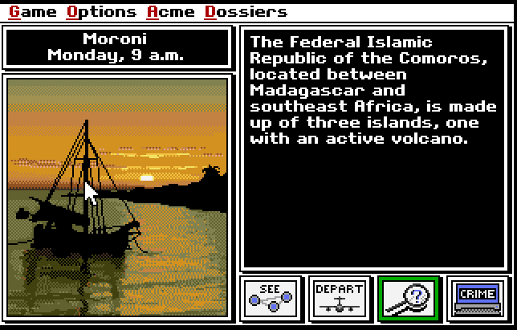
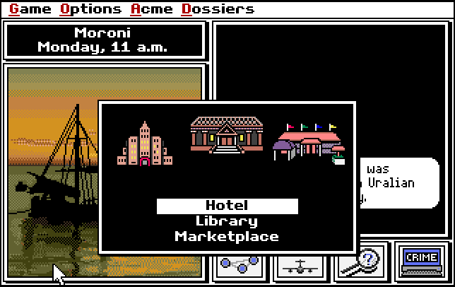
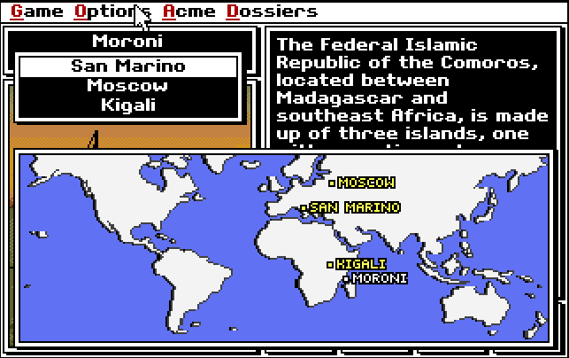

Seriously, where is she? Anyway, being all game-minded as I have been for the past couple of weeks, I was searching through my TweetDeck list of interactions to try when I re-stumbled upon this [list article from The Verge](http://www.theverge.com/2015/1/5/7496855/internet-archive-ms-dos-emulator) about all of the great games Archive.org has archived and made available to play in the browser via an MS-DOS emulator. I saw the Where in the World is Carmen Sandiego game and went to town, absolutely fascinated by the engagement power this game retained, 25 years after it was created, and light-years away from the richly 3D rendered games we have now. Let me break it down with the elearning lessons I took away from this great throwback game.

## Jump In

Probably what struck me first about the game is that there are no instructions. There's no walkthrough, no demo. Just jump in and figure out what you're supposed to do. It's interesting to note how that's become a bold concept these days. While there's certainly a lot to be said for offering (possibly optional) quick instructions to a user and having help available, Carmen Sandiego's main assumption that the user is capable of figuring it out is definitely food for thought. What if we didn't go through all of the beginning fluff in our courses? What if we just let the user jump in? Try it.

## Simplicity Itself

Here's how the game goes down: you get some background information on the crime. You question folks at local hotspots in the city. You gather enough evidence to narrow down your suspects and issue a warrant for arrest. You track the suspect down to his or her hideout within 7 in-game days. Boring, right? WRONG!!! Wrong, wrong, wrong. I spent nearly two hours playing this game and was engaged every minute. I was reminded of how fancy graphics and animations aren't the keys to engagement. Give your users a story and put them in the driver's seat. Give them agency. Sure a fully-developed game design theory is a little more complicated than that but I marvel at what this game accomplished with a split window, some text, a couple of menus, and a few sprites. It definitely fuels my more modest game development dreams but again, also beautifully illustrates how we can move forward creating engaging interactions without a ton of flashy graphics. Don't get me wrong, I love flashy graphics (Skyrim, for example) but they aren't necessary for good game (or elearning) play.

<figure>
  
</figure>

<figure>
  
</figure>

## Using what you Know

Here's a learning game that really knows what it's doing. [In a recent article, Slate contrasted](http://www.slate.com/articles/technology/future_tense/2015/04/mit_s_education_arcade_promotes_games_not_gamification_in_schools.html?wpsrc=sh_all_dt_tw_top) a game like Math Blaster, that essentially gamifies math problems by letting you shoot at the correct answer to an on-screen math problem with what the MIT Education Arcade is trying to do, which is to create games that integrate what they are trying to teach with the actual game design (e.g. actually using physics to solve an in-game problem, like needing to build a catapult that appropriately defends a castle). I think that Carmen Sandiego (even the live version) is situated in the latter category.

<figure>
  
</figure>

In this game, you need to use what you know (and what you'll come to learn through in-game repetition) about countries' flora, fauna, languages, cultures, currency, and more to correctly identify the next stop on the bad guy's get-away and eventually hound him or her down to their hideout city. While you don't start out knowing where to look for the thin-spined porcupine or the Taureg people, you come to learn that, over time. Nowadays, with the ability to open a browser and search, you can identify things pretty quickly (which wouldn't have differed too much from the game's contemporary atmosphere, except that you might have had to go to an encyclopedia--remember those?), but, in my first play through, I simply went on instinct, traveled to a lot of unnecessary places and eventually, the perp got away. From then on, I learned to look things up, too; another useful geography lesson, eh?

## My Next Move

I loved re-discovering this game. What I'd like to do is to make an updated version of it either using Construct 2 or Storyline. Have you every played it or another game that gave you elearning inspiration? Let me know if the comments.
