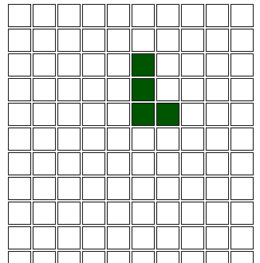
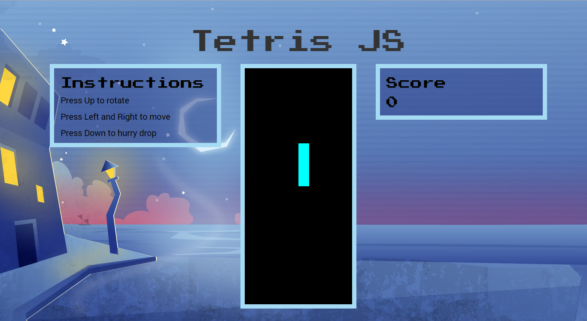
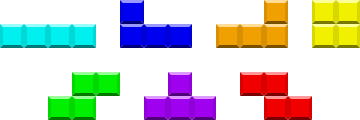

[Last post, I showed off my first JavaScript side project, rebuilding Tetris](/blog/tetris-js-my-first-javascript-side-project/). I noted several updates that I wanted to accomplish and, to my astonishment, after about 6 hours of work, I was able to accomplish them all!

## Tetris JS Updates

You can see the code in my [Tetris-JS github repo](https://github.com/anthkris/Tetris-JS).

<figure>
  <a href="http://knanthony.com/showcase/TetrisJS/old/index.html" target="blank">
    
  </a>
  <figcaption>Check out the original version</figcaption>
</figure>


<figure>
  <a href="http://www.knanthony.com/showcase/TetrisJS/updated/index.html" target="blank">
    
  </a>
  <figcaption>Check out the updated version</figcaption>
</figure>

### Creating Colors for the Tetrominos

If you look at most of the versions of Tetris, each piece has a unique color and I wanted to replicate this.

<figure>
  
  <figcaption>Tetrominos each have a specific color</figcaption>
</figure>

This was actually one of the more difficult challenges and took up the majority of my morning coding. My original code used a handy-dandy random number generator I learned from my projects on Treehouse. I generated a number from 0 to 255, inclusive. I then created another function with local red, green, and blue variables and returned a string that was a CSS rgb value. That worked a treat. Then I tried to refactor that code so that I defined a specific red, green, and blue for each tetromino shape return the rgb string. But that didn't work (and I'm still not sure why). So I finally ditched the red, green, and blue variables and defined a color value in hexidecimal for each shape (and that includes each of the rotation shapes). And that did the trick!

```javascript
tetris.hexColor = function(shape){

 if (shape === 'I' || shape === 'I90'){
 return '#00FFFF';
 } else if (shape === 'J' || shape === 'J90' || shape === 'J180' || shape === 'J270'){
 return '#0000FF';
 } else if (shape === 'L' || shape === 'L90' || shape === 'L180' || shape === 'L270'){
 return '#FF8000';
 } else if (shape === 'O'){
 return '#FFFF00';
 } else if (shape === 'Z' || shape === 'Z90'){
 return '#FF0000';
 } else if (shape === 'S' || shape === 'S90'){
 return '#00FF00';
 } else if (shape === 'T' || shape === 'T90' || shape === 'T180' || shape === 'T270'){
 return '#FF00FF';
 }

};
```

### Ending the Game

Ending the game was also surprisingly difficult. The main reason being that I was trying (and failed, in the end) to set a dead block cue, if you will, other than color. The first prototype (and the tutorial) sets the colors for dead blocks (that is, blocks that have to be reversed to stay on the grid (using an ifReverse function) and uses that color to test whether a row is full and should be emptied (per the Tetris rules). I wanted to be able to allow the tetrominos to stay their original color and cue that a block was dead some other way. In the end, however, I just had to continue using the color method. To end the game, I test whether or not any cell on the top row (row 0) has the dead block color (in this case, silver). If so, I began by popping up an alert window, just to test it. The problem was that spawning continued until an I tetromino appeared. I discovered that this was due to the origin point for spawning being at row 5\. I changed that to row 1 and that fixed the problem. It had to be row 1 because, otherwise the I tetromino was off screen, triggering the ifReverse function and making it seem like the game was over, even though it had just begun.

```javascript
//spawn new shape when prev shape reaches bottom or end the game
for (var j = 0, i = 0; j < 10; j++){
//if any cell in the top row is silver, reachedTop is true and game should end
var $coor = $('.' + i).find('#' + j);
if ($coor.attr('bgcolor') === 'silver'){
var reachedTop = true;
this.end();
} else {
this.spawn();
this.emptyFullRow();
}
}
```

I put this code in the tetris.drop function because it then allows for end to be a conditional. The program with either end or spawn a new tetromino and check for rows to empty.

### Enhancing the UI

After figuring out how to end the game, I wanted to switch out the alert window I used as an end game cue with a modal window that would allow the user to restart the game. To do that, I implemented Bootstrap and built a modal window in the index.html. After a little digging, I figured out how to use jQuery to get a modal window to show and use the buttons to reload the window. I put this as the tetris.end function.

```javascript
tetris.end = function(){
 $('#restart_game').modal('show');
 //clear interval to stop drop and, therefore, spawning
 clearInterval(gravity);
 $('#restart').click(function(){
 location.reload();
 });
 $('#no_restart').click(function(){
 $('#restart_game').modal('hide');
 });
}
```

The one thing that continues to be a bit of a problem is that, even though I clear the interval to stop dropping and, therefore, stop spawning (see the gravity section below), the game still seems to continue to spawn sometimes after the modal window appears.

### Score

Printing the score was pretty easy, again using another code snippet I learned at Treehouse.

```javascript
function printScore(score){
 var scoreOutput = document.getElementById('score');
 scoreOutput.innerHTML = parseInt(score);
}
```

I also updated the tetris.score value I created whenever the row is full.

```javascript
if (rowIsFull){
 drops++;
 this.score += 10;
 printScore(this.score);
 }
```

This was tricky because, it first, the print function seemed to be coercing the score into a string and the score was updated at a crazy rate. To fix this, I had to fix the print function to use parseInt(score), so that it treated it like a number.

### Gravity

Gravity was also incredibly tricky. The biggest problem, I think, (after figuring out the right way to implement it) was that I kept trying to test it while the score was wacky. Though the onscreen score said 100 (one of my test points) the real score was much lower. I didn't realize this until I played around with the console and actually viewed what was in tetris.score and set it myself. Otherwise, it's just a series of if/else statements. Implementing it was a problem because there was something about setInterval that I didn't know. At first, I figured that I should be able to create some kind of new function that would hold all of the statements and call it in the document.ready function. However, even after multiple refactoring attempts, that didn't work. After looking up setInterval (the function used to repeat the tetris.drop function at regular intervals- thus creating the gravity), I learned that setInterval has to be cleared before you can set it to something new. So I created a global gravity variable. In the initial game state (rendered in the document.ready function, I set it to 500 ms. Then, in the tetris.spawn function, I test what the score is and set the gravity variable accordingly:

```javascript
tetris.spawn = function(){
 //gets random shape from shapeArray
 var random = Math.floor(Math.random() * 7);
 var shapeArray = ['L', 'J', 'I', 'O', 'S', 'T', 'Z'];
 this.currentShape = shapeArray[random];
 if (this.score >= 100){
 //must clear interval before you can change it
 clearInterval(gravity);
 gravity = setInterval (function(){
 tetris.drop();
 }, 400);
 } else if (this.score >= 200){
 clearInterval(gravity);
 gravity = setInterval (function(){
 tetris.drop();
 }, 300);
 } else if (this.score >= 300){
 clearInterval(gravity);
 gravity = setInterval (function(){
 tetris.drop();
 }, 200);
 } else if (this.score >= 400){
 clearInterval(gravity);
 gravity = setInterval (function(){
 tetris.drop();
 }, 150);
}
```

### Prettying it Up

After I figured everything else out, I tried to create a semi-pleasing interface using Bootstrap and some custom CSS. The background image is by [user freevector from Vecteezy](http://www.vecteezy.com/vector-art/67501-city-night).

## Wrap Up

I learned a lot in this project. I pushed my first repo to Github, started using Github gists (super useful for collecting code snippets and patterns that you can use again) and feel like I really understood what was happening. Can't wait for the next project!
