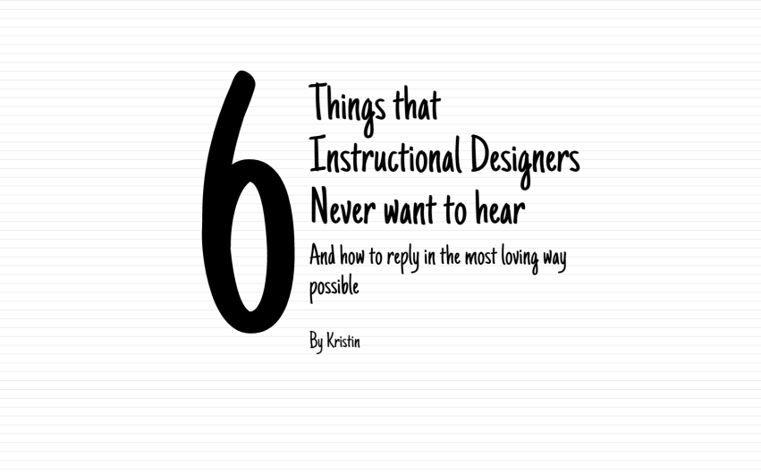

It's taken the better part of a month and a half, but I'm finally shipping my Carmen Sandiego-like game, [Mell Hammer Detective Agency](http://knanthony.com/showcase/MellHammer/story.html). This one was a beastie but I really wanted to finish it and ship it so that I could move forward with a new project.

## The Good

[I began this project by actually playing through an older version of Carmen Sandiego](/blog/throwback-thursday-3-design-lessons-learned-from-where-in-the-world-is-carmen-sandiego/). That was really useful as it helped to solidify ideas about the game mechanics and values. For example, I noticed that the game provided multiple clues to the next location you should explore. I saw that they did not provide explicit instructions on what information you should be looking at. Resources like the dossiers and obtaining a warrant were let up to you to discover, encouraging exploration. I also noticed that the game (at least the version I played) seemed to be made to be used with an encyclopedia. The quiz questions before a rank up mention encyclopedia entries. The interesting part about that is that we have a game that, while, as I discussed, facilitates some memorization through repetition, also encourages looking things up. I wanted to run with that and so I put in an in-game window where players can search for things using Wikipedia. [I also went ahead and storyboarded this game in PowerPoint before beginning](/blog/august-go-design-something-challenge-carmen-sandiego-like/). This was a really great decision, especially as I had a week-long vacation in the middle of development. Having the storyboard and a lookbook really helped jog my memory on where I was headed. Last but not least, [I stole a really neat JavaScript trick from Zsolt Olah](http://rabbitoreg.com/2015/06/27/morning-coffee-javascript-storyline/) to animate the type at the beginning.

## The Bad

Development didn't go quite as smoothly as I planned. For one thing, an essential mechanic of Carmen Sandiego is a race against the clock. Every action you take in the game uses up valuable hours. You only have 7 days to catch the V.I.L.E. agent. I really, really wanted to include this, but I couldn't make it work in Articulate Storyline, or at least not using the internal tools. Articulate does have a test time but it's real time, whereas the clock I needed was in days and hours, in game time. I'm sure there would have been a way to do it using external JavaScript, but I didn't want to delay development time even more. It took a while but I was finally able to figure out two replacement fail conditions: the first is visiting the wrong city more than once and the second is having either no warrant or the wrong warrant for arrest. I would have loved to have included a time element. Another issue I had was trying to create some visual hints without having text directions. On one of the first screens, the interaction I designed was to have to open the envelope and then put the resulting flash drive into the computer. I wanted the envelope to flash after a bit in order to get the player's attention. I also wanted to provide a sort of ghost animation for the flash drive to show what you were supposed to do with it. Both of those are in but they aren't as elegant as I'd imagined. The flashing envelope only happens once and can sometimes interrupt other actions. I suppose a workaround there would have been to create a GIF to play at regular intervals. The flash drive animation is similar. It will play even when you are clicking and dragging. Rethinking it, I suppose the solution there would have been to create a second, ghost version and have that play the animation. The one small annoyance is a known issue where the text with variable references don't embed the font. So there are a couple of places where a standard font will be used because the particular font I was using isn't on the player's machine. Not a big deal, but not ideal, either.

## The Ugly

I spend days fighting with Storyline about getting variables to work together. For the evidence window, I wanted to create a kind of Guess Who mechanic where, each time you input new evidence, you would narrow down the suspects until you were finally left with one. But no matter how many different ways I tried it, I could never get the variables to work together. For example, Willow Danger has black hair, is female, and wears jewelry. I could set her photo to disable if the variables tied to each of these was wrong for her. But, I believe, because of the way variables work in Storyline, they wouldn't work in concert; the seem to work by checking from the top down and if there is anything that meets the criteria, that's what goes. So if I chose male, Willow would disable; but if I then chose jewelry, Willow would enable again, despite the fact that the sex was still set to male. I tried everything I knew how to do. Again, I'm sure creating some external JavaScript would have helped here but with this project being WAY over my allotted dev time, I wanted to ship it quickly. So in the end, I changed evidence so that all 4 pieces have to be collected before it will compute a match. That is definitely not ideal.

## Could've Been Better

I recently looked at all of the Articulate Guru Award winners and it reminded me of something I've been tossing back and forth for a bit. Personally, I don't really need sound in most of my games. I normally play mobile games with no sound at all, even My Singing Monsters! However, there are certainly games, like the beautiful Silent Age, which use sound effects really well. So while I don't normally go in for putting in sound effects, I also know that they can do a great deal to create an engaging atmosphere. Perhaps the one thing I've been struggling with is that I've seen my work up until now as mostly elearning and less as a game. Whereas sound design in games is an essential part, I hadn't thought about it so much in elearning. But that may be a mistake. As I branch out in my reading and creation away from elearning and elearning tools, I want to make a point to play more with having the appropriate sound design for engagement. As this TED talk discusses, it's time to think about designing for more senses than just sight.

`youtube: N6wjC0sxD2o`

I'm definitely interested to see how and whether I can treat some of these issues by both learning more about game design and development and by using tools designed for game development. Perhaps the extra flexibility would be useful.

## See the Demo

<figure>
  
  <figcaption>Click the image to view the demo!</figcaption>
</figure>

## Credits

### Text

Wikipedia

### Music

Covert Affair by Kevin MacLeod

### Images

*   [Relic photo by Elizabeth Harper](http://atlasobscura.herokuapp.com/places/the-relics-of-st-genevieve-at-st-etienne-du-mont)
*   [Paris Hotel image](http://igotravel.info/hotel/wonderful-boutique-hotels-paris-for-couples-17996.html)
*   [Paris Bank image HK Central night by Kaupaickehran](https://commons.wikimedia.org/wiki/File:HK_Central_night_%E6%96%B0%E4%B8%96%E7%95%8C%E5%A4%A7%E5%BB%88_New_World_Tower_shop_Standard_Chartered_Bank_interior_world_map_Sept-2010.JPG)
*   [Versailles image by JoannaLouise](https://commons.wikimedia.org/wiki/File:Versailles_cour.JPG)
*   [Kathmandu image by Sundar](https://commons.wikimedia.org/wiki/File:Kathmandu_Darbar0938.JPG)
*   [Gai Jatra by S Pakhrin](https://commons.wikimedia.org/wiki/File:Gai_Jatra_Kathmandu_Nepal_(5116049257).jpg)
*   [Basantapur Kathmandu Nepal by S Pakhrin](https://commons.wikimedia.org/wiki/File:Basantapur_Kathmandu_Nepal_(8529599208).jpg)
*   [Yin Yang Restaurant in Thamel, Kathmandu, Nepal by 松岡明芳:](https://commons.wikimedia.org/wiki/File:2015-03-09_Yin_Yang_Restaurant_in_Thamel,_Kathmandu,_Nepal_%E5%A4%96%E8%A6%B3_DSCF4664.JPG)
*   [Sydney Opera House by Diliff](https://commons.wikimedia.org/wiki/File:Sydney_Opera_House_-_Dec_2008.jpg)
*   [Sydney International Airport Terminal by J Bar](https://commons.wikimedia.org/wiki/File:InternationalTerminalRail4.JPG)
*   [Oatlands Golf Course by J Bar](https://commons.wikimedia.org/wiki/File:Oatlands_Golf_Course_2.JPG)
*   [Chinatown Night Markets, Sydney by avlxyz](https://commons.wikimedia.org/wiki/File:Chinatown_Night_Market,_Sydney.jpg)
