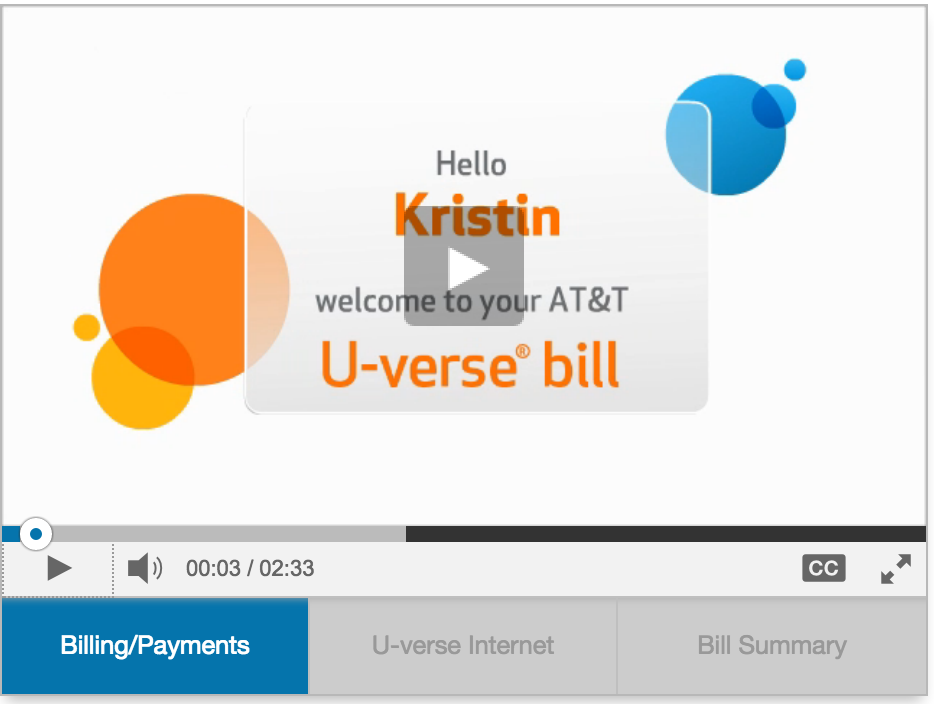

When I moved for my new job, I decided to cut the cord and only purchase an internet connection. But, of course, being online as much as I am, I wanted the fastest I could get. Originally, I was going to go with Google Fiber, but they aren't yet available in my area. So I had to go with AT&T.

## A Job-Aid Created Just for Me

Set up was a bit of a pain because, you know, I'm at work and they need someone at home on the day of the installation. But I got through that with a visit from my mum (hi, mum!) and things have been going smoothly. Then I got an email from them with information about my first month's bill. This wasn't just a "pay up" sort of notification. AT&T had actually created a personalized video that walked me through the charges on my first month's bill.

<figure>
  
</figure>

When you first get services set up, things can often be a bit confusing because there are all of these surcharges and one-time fees. My previous ISP, Suddenlink, sent bills with no charge explanations at all (which is why I ended up cutting them back to just internet, as well). But this video from AT&T anticipated the sticker shock and sent a short, well-made video that explained all of  my individual charges. Now this wasn't the same as a more general bill walkthrough (like the one Jellyvision used to have on their work page). This one had _my charges_ on it. It was about me. Undoubtedly, this has been templatized, but as a developer, I appreciate the fact that they went that extra step to explain my particular bill situation.

## Steal this Idea

So how might you use this idea? If you do any sort of client-facing training, whether that's how to use the LMS or how to use the software or other product your organization has developed, think about the impact that a follow up email with a personalized job-aid could have. How might you create a reusable template that you could send out to new users? What questions or concerns can you address, right off the bat? Try creating a resource that provides an initial customer service experience for your organization, before folks have to email or get on the phone with you. This is a proactive approach that has anticipated a common problem (sticker shock, confusion over the first bill) and pre-empted it, providing a positive initial experience. In fact, I was just discussing this idea at work, where we are facing an issue of not having enough staff to meet demand for training around basic instructional design principles and our LMS. I suggested that we needed to create an initial resource for campus groups looking to learn more about both of these issues, to provide that first experience. For folks who are just looking for some basic facts and how-tos, the resource would give them exactly what they need, on demand. For others who have more questions, they could come in and see us. This approach is sustainable and scalable, helping us to meet the needs of the hundreds of faculty members we serve. In the light of this, I could also see us going that extra mile, particularly after a workshop or consultation, and sending a personalized job aid, tailored for that particular person's course idea. Do any of you do anything like this currently? Have you received a really good piece of instructional design lately?
