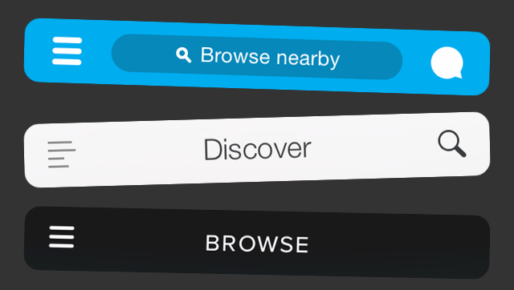
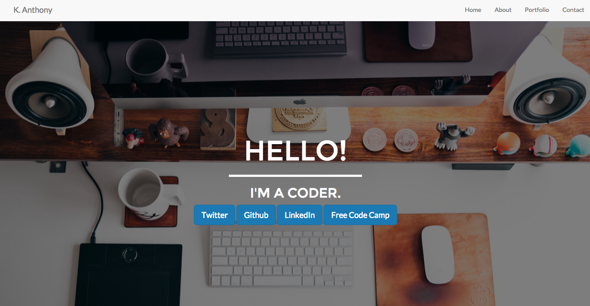

Last week, I spent the entire work on my first ever Free Code Camp zipline, Build a Personal Portfolio Webpage! I was super excited to move that much closer to my front-end development certificate. Like most things, it isn't perfect but I'm quite happy with how it turned out. I'd used Bootstrap before, so I was pretty familiar with the basics of the framework, but I still had to do quite a lot of work to get the site looking the way I wanted it to. I'd say the biggest change from when I first encountered Bootstrap is that my personal aesthetic has changes (hopefully for the better!), so I wanted to build a site that looked really good. I also took the opportunity to integrate a little UI animation, indulging in my obsession with Codrops tutorials to integrate a subtle hover effect on my portfolio images. However, the biggest design decision I made was not to use the sidebar menu that is native to the Bootstrap responsive template.

## Why Not the Hamburger?

<figure>
  
  <figcaption>Hamburgers everywhere...</figcaption>
</figure>

The debate on whether or not to use the hamburger menu, (those three little lines you often see at the top of an app or responsive website) has been going on for a couple of years. One the one hand, there are a lot of people who use this pattern because it is now widely recognized as being where the menu is. It also allows you to preserve screen real estate by not having to make space for menu items and disrupt the experience you are trying to present. On the other side of the debate, you have folks who point out the problems with the hamburger. Most notably, many write that the root problem is a lack of care for information architecture. Your site/app/thing should be designed such that the topics and features that people want to use are easy to discover and use, out there for everyone to see. Not hidden in a hidden menu. While I get both sides of the practice, it makes sense to me that I should think more deeply about information architecture and try and keep things as discoverable as possible. With that in mind, I set out to keep Bootstrap's responsiveness, while creating a different responsive navbar.

### Recommended Reading

*   [Why and How to Avoid Hamburger Menus ](https://lmjabreu.com/post/why-and-how-to-avoid-hamburger-menus/)
*   [The Hamburger Menu Debate](http://www.theatlantic.com/product/archive/2014/08/the-hamburger-menu-debate/379145/)
*   [Kill the Hamburger Menu Before the Hamburger Button Kills You](http://techcrunch.com/2014/05/24/before-the-hamburger-button-kills-you/)
*   [How to Solve the Hamburger Icon Problem](http://www.webdesignerdepot.com/2014/06/how-to-solve-the-hamburger-icon-problem/)
*   [The Hamburger Menu Doesn't Work](http://deep.design/the-hamburger-menu/)

## Solution?

The nice thing about many of the articles I read is that they do propose solutions. An easy one to implement was to take my links and turn them into icons. This helps the menu to remain discoverable, but also maintains the space and proportions of the larger design and doesn't take up more screen real estate. Changing the text to icons was accomplished fairly simply with two navbars, one hidden, and a media query to change which navbar would display.

### HTML

```html
<nav class="navbar navbar-default navbar-fixed-top">
  <div class="container">
    <div class="navbar-header">
      <a class="navbar-brand" href="#heading">K. Anthony</a>
    </div>
    <div id="navigation">
      <ul class="nav navbar-nav navbar-right">
        <li>
          <a href="#heading">Home</a>
        </li>
        <li>
          <a href="#portfolio">Portfolio</a>
        </li>
        <li>
          <a href="#about-me">About</a>
        </li>
        <li>
          <a href="#contact">Contact</a>
        </li>
      </ul>
    </div><!-- end #navigation-->
  </div>
</nav>

<!-- Used new id and class to avoid hamburger menu -->
<nav id="mobile-nav" class="navbar navbar-default navbar-fixed-top">
  <div class="container nav-mobile">
    <div class="navbar-header">
      <a class="navbar-brand" href="#heading">K. Anthony</a>
    </div>
    <div>
      <ul class="nav navbar-nav navbar-right">
        <li>
          <a href="#heading"><i class="fa fa-home"></i></a>
        </li>
        <li>
          <a href="#portfolio"><i class="fa fa-file-photo-o"></i></a>
        </li>
        <li>
          <a href="#about-me"><i class="fa fa-book"></i></a>
        </li>
        <li>
          <a href="#contact"><i class="fa fa-envelope"></i></a>
        </li>
      </ul>
    </div><!-- #mobile-nav -->
  </div>
</nav>
```

### CSS

```css
@media only screen and (max-width : 768px) {
/*Once 767 width reached, hide normal nav and display icon nav*/
  #navigation {
    display: none;
  }

  .navbar-header {
    display: inline
  }
```

## The Dreaded Problem

Everything was going swimmingly. EXCEPT, whatever I did, I couldn't seem to stop my menu from either going vertical OR moving to a second line when it was squished below 767 px. After trying all of the display properties I could think of, I finally broke down and asked on [stack overflow.](http://stackoverflow.com/questions/33293222/make-responsive-bootstrap-navbar-without-hamburger-menu) Of course it was solve with a tiny, little, microscopic addition of floats to both the navbar-header and the navbar-right classes (in the media query). The float elements helped both elements stay in their proper location, even as the screen responds.

```css
/*Using floats on header and right classes help them stay in the right place on screen resize*/
  .navbar-header {
    display: inline-block;
    float: left;
  }

  .navbar-right{
    float: right;
  }
```

### Final

Have a look-see at the final project!

<figure>
  <a href="http://codepen.io/anthkris/full/xwpPrE/" target="blank">
    
  </a>
</figure>
