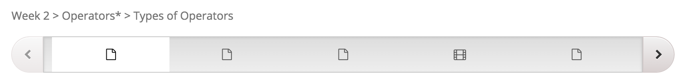
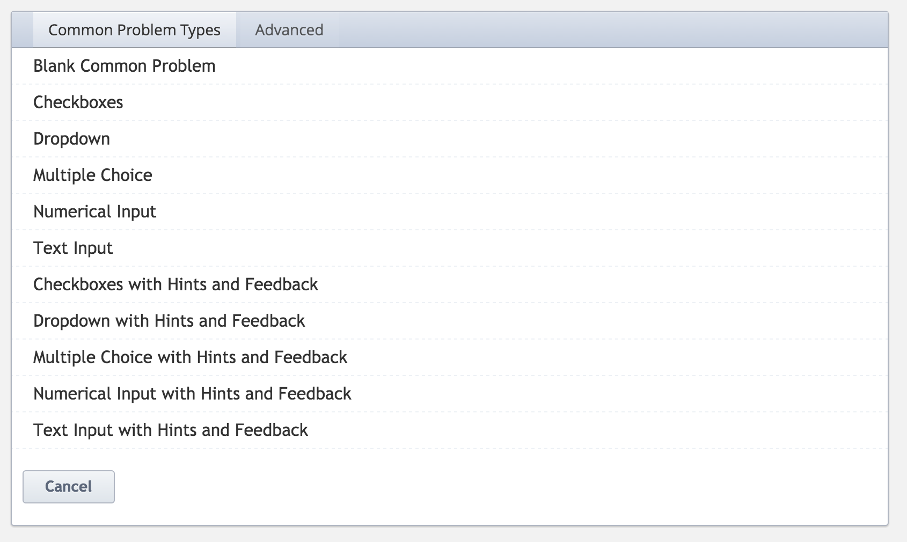
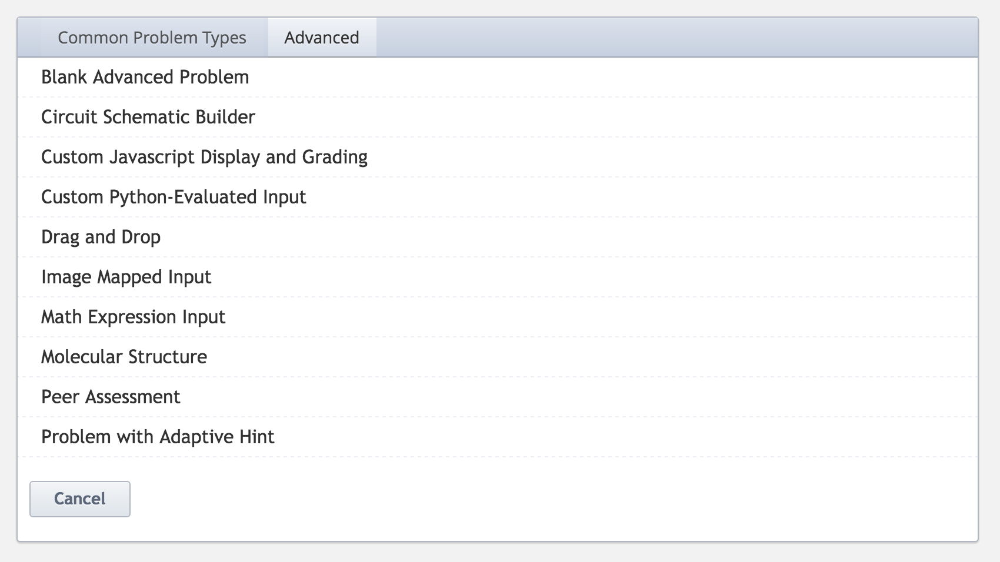

So far in the very few months I've been at my new job, I've been introduced to several new tools. The second LMS of the year is now EdX Edge, the smaller sibling to EdX.org, meant for courses that aren't quite at that massively open level. For OOCs, if you will. I've been very impressed.

## Structure

The basic structure of EdX is:

*   Sections
*   Subsections
*   Units

That in an of itself isn't odd, but what is a bit strange is that you can only put in real content at the unit level.

<figure>
  
  <figcaption>Units themselves are also strange in that each unit is made up of one or more components (which can be text, video, iframes, and more).</figcaption>
</figure>

<figure>
  
  <figcaption>You put as many units as you like into a subsection and they are presented as pages horizontally to students.</figcaption>
</figure>

That takes a little thinking to work out the best way to organize your course content so that it makes sense to students, but that's not a deal breaker.

## Content

EdX isn't super configurable in terms of how it looks (typical of many LMSs, and of MOOCs, in particular) but I have been super impressed by the content options. EdX has an absolute crap ton of awesome question types built in, along with the ability to build your own graded questions using JavaScript and Python.

<figure>
  
  <figcaption>EdX Basic Question Types</figcaption>
</figure>

<figure>
  
  <figcaption>EdX Advanced Question Types</figcaption>
</figure>

Beyond that smorgasbord of assessment options, EdX also allows you to add CSS and JavaScript to a text component. That makes it super easy to go above and beyond the EdX capabilities (which are strong to begin with) with even more stuff. All that and it's easy to do. Chalk a few up for EdX!

## Documentation

Another really impressive thing about EdX is the documentation (see it here: [Read the Docs](http://edx.readthedocs.org/projects/edx-partner-course-staff/en/latest/front_matter/index.html)). I mean, Moodle has great documentation, too, but I think that the way that the EdX documentation is organized makes it much easier to find the answer to what you need. Discussion forums are also a good source of information, but thus far, all I've really needed was the documentation. I also really appreciate the information peppered throughout about accessibility. The docs do a great job of warning you when an activity is not accessible and suggests how to deal with the issue. There are also wonderful courses to showcase the capabilities of the platform and to show how to build a course.

## Final Score

Pretty dang awesome. Of the LMSs I've had a chance to work with so far, I think EdX is definitely very high on the list. The documentation is wonderful with clear information about accessibility. The built in assessment and content options are amazing and better than anything almost anything else I've seen. Add to that the ability to create materials in JavaScript and Python and you've got a pretty powerful package. The trick now is to get away from video, video, video, and towards a course filled with activity. Since the bumpy start at my kickoff meeting, things have been going so much smoother and I'm feeling much more confident about the future awesomeness of my current project.
