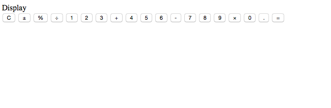
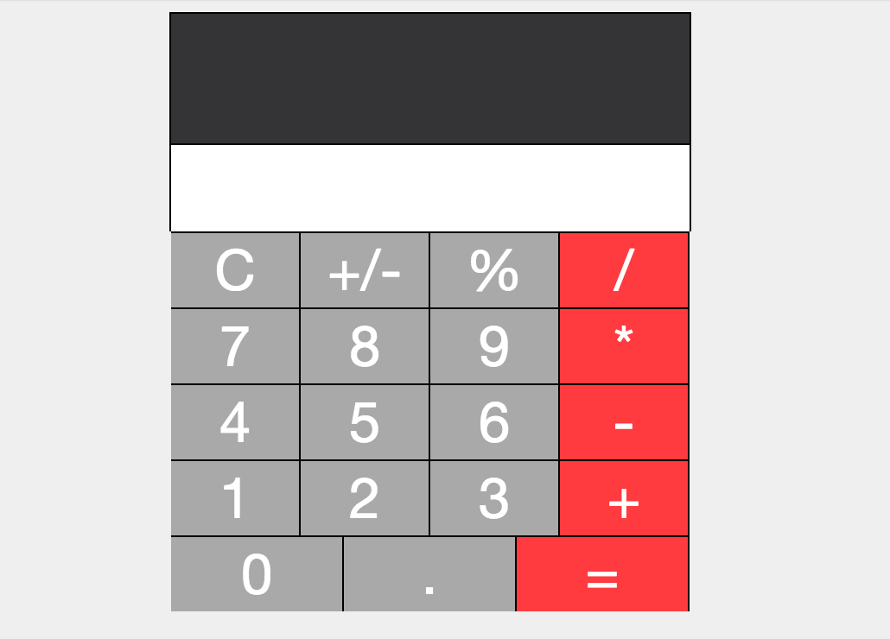
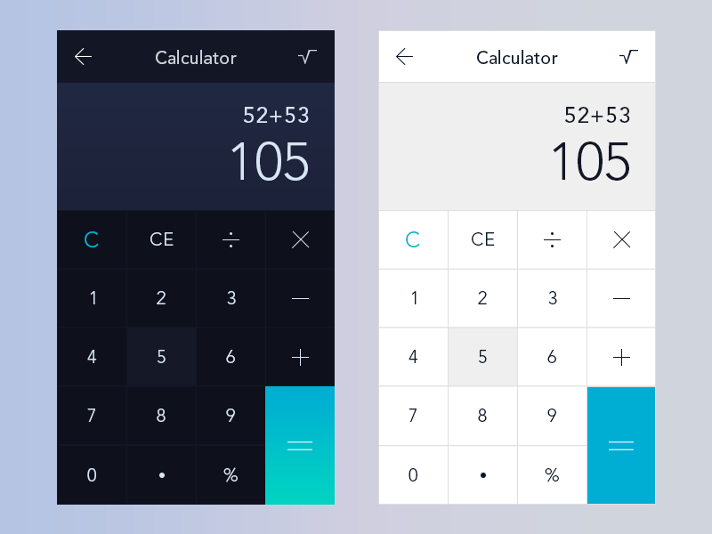
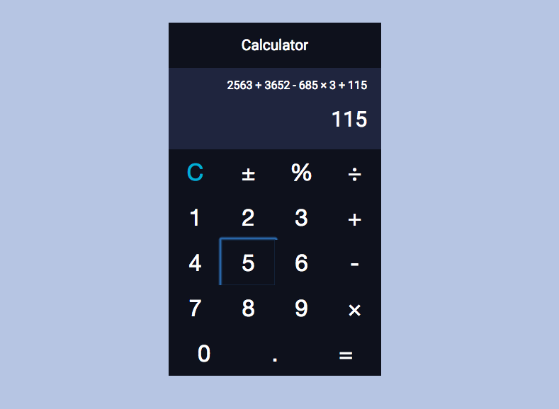
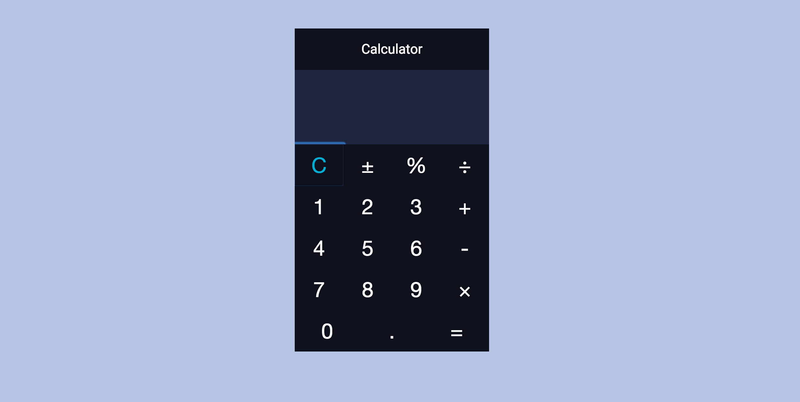

WOOT!!! After about 20 hours worth of work (and several weeks worth of having to put it off), I am excited to say that my February design challenge: a JavaScript calculator is finally done! I used jQuery and the BigNumber JS library to make it all happen. If you've read any of my previous FCC project write ups, you already know it wasn't all roses and wedding cake. Let me give a quick summary of some of the major issues I grappled with.

## A Caveat and Idea For Next Time

I tried so hard to be conscientious during this process of showing my work, so I took screenshots at various design stages, but even though I only completed the project in the last 2 days, I found this post really, surprisingly hard to write as the remembrance of problems solved faded away quickly. I've tried my best to recall my pathway and forks in the road in a coherent fashion, but feel free to ask me questions if any of this doesn't make sense.

## Sticking Points

### Saving the Total

<figure>
  
  <figcaption>A reasonable facsimile of my original prototype. Ugly, huh?</figcaption>
</figure>

This project took shape WAAAAAY more quickly than I thought it would. By the time I sat down to code, I'd thought through how the calculator should work. So I was able to get a super ugly basic prototype working within a couple of hours (I'm super proud of myself. Can you tell?). But as I was working with the basic display and buttons I'd created, I noticed that the result of the calculations wasn't being saved properly. I began, as you might expect, with a total variable. At certain times (such as when the equal button was clicked), I needed to clear this total variable, but at the same time, I needed to be able to use that total in subsequent operations. But I couldn't get it to function properly. What was happening was that the total couldn't handle more than one operation. If I tried to perform 3+6+7+8, I was running into issues. After another hour or two, I tried out the idea of using an array instead. So I traded out my number variable for pushing in numbers to the array. This seemed to be a better design decision, as I could use the array structure with a for loop that returned a + b. The problem with that, however, was that, with the structure constantly pushing in new numbers, I wasn't able to perform the operations such that they ONLY happened with the total of the previous operation and the newly pushed number. For example, a+b was, as you would expect, adding up all of the numbers in the array. What I needed was an array that stored the total of the last operation, ready for a new number so that it could perform the next operation. After another about another half-hour, I finally remembered the reduce method, so I switched out my a+ b for loop for numArray.reduce(prev, next). This, along with some refactoring of my operations functions (I split them out so that each operation had its own function) and the equal function (I began to use it to call the separated operation functions) allowed me to finally get to a place where I could perform any number of operations appropriately, including clicking equal and still being able to apply operations to the total.

## Getting Text Out of Paragraph Tags

The basics of the functions worked out, I started to do some styling. I added a history feature so that a user could keep tabs on what operations were happening.

<figure>
  
  <figcaption>Second iteration</figcaption>
</figure>

Things were going well and I wanted to add some space between the text in each display box and the edge. So I redefined my display functions to concatenate the number strings with opening and closing paragraph tags.   That was simple enough, but then I found that I couldn't grab the text out of the paragraph tags to turn into numbers to use. This seems like it should have been a simple task, but even when I created a variable to store the div and paragraph:

```javascript
$displayP = $(".display p");
```

trying to set the html for that would not work:

```javascript
$displayP.html()
```

In hindsight, maybe this didn't work because I was dynamically add paragraph tags? At any rate, I reworked it to use:

```javascript
$display = $(".display")
```
```javascript
$display.children().html();
```

That allowed me to put in some padding and even eventually implement a function to size the font if a ridiculous amount of numbers were input.

## Performing Operations with Equal

Another thing that popped up after I had "fixed" my total problem was that hitting equal and again and again would repeat the last operation. My code had the operation stored in a variable and that variable was used in my equal function in a series of if/else statements to tell which code block to run. What had been happening was that, if I put in a series of operations:

```
450 + 20 / 2
```

my code would skip out on the addition function (because it wouldn't run without the second number in the array) and only perform the division function. So I tried calling the equal function with every operation, but that resulted in my array being cleared and every new operation starting from 0. I struggled a bit with this one because I really had to get my head around how to  allow equal to perform the last operation while also calling equal for the intermediate operations. Two things helped me get over this hump:

*   Firstly, I moved the operations functions outside of the equal function and made them each separate (as I wrote earlier).
*   The second thing is that I refactored the functions so that they wouldn't call equal at all; instead, equal would call them. That meant that I wasn't clearing my array before I could use what was in it.

```javascript
//Equal calls the last operation performed
function equal() {
 console.log(operation);
 if (operation === "plus") {
 add();
 } else if (operation === "minus") {
 subtract();
 } else if (operation === "multiply") {
 multiply();
 } else if (operation === "divide") {
 divide();
 } else if (operation === "percent") {
 percent();
 }
 operation = "";
 numArray = [];
}
```

## Getting Rid of NaN

My last big issue (that I know of!) was that, if you clicked on an operator before having put any text it, my code returned NaN. This happened because I grab my numbers from the text on the screen and, I begin the clear state with an empty array and no text on the screen. I did it this way because, my script is set up to check how long the number array is and perform the operation only if there is more than 1 number in the array (so that reduce works appropriately). I tried several times to work around this by adding in another check for whether or not my numArray was empty, but because the equal function clears the numArray, that wouldn't work. Adding a 0 to the initial numArray initialization didn't work for the same reason. I toyed with the idea of adding an initial 0 to the display div, but I couldn't quite get that to work either. In the end, I had to check instead whether or not the text I was grabbing from (remember $display.children.htmL()?) was undefined and, if so, adding a 0 to the numArray.

```javascript
if ($display.children().html() !== undefined) {
 var bigNum = new BigNumber($display.children().html());
 numArray.push(bigNum.toNumber());
 } else {
 numArray.push(0);
 }
```

### BigNumber JS

What's with the BigNumber? Well, as I wrote at the beginning, I implemented the [BigNumber library](https://github.com/MikeMcl/bignumber.js/) in this code. I've never forgotten, [from previous experimentations](http://www.knanthony.com/blog/look-ma-im-learnin-freecodecamp-exact-change-bonfire/), the trouble you can get into with floating point numbers in JavaScript. So going in, I knew I wanted some way to try and control any issues that might arise with performing calculation with decimal numbers. I've used BigNumber to round off decimal points and to shorten extremely long numbers with exponent notation.

## New Design

Not an issue exactly, but I found that I HATED the visual design of my second iteration. So I looked through Dribbble and the calculators that had been designed for the 100-day Daily UI Challenge and took my inspiration from this:

<figure>
  
  <figcaption>[Dribbble shot by Shabbir Manpurwala](https://dribbble.com/shots/2496666--4-Daily-UI-Calculator)</figcaption>
</figure>

<figure>
  
  <figcaption>My Attempt</figcaption>
</figure>

## Possible Remaining Issues

One thing that I do know is that BigNumber wants to throw an error whenever there are more than 15 major numbers in any given number. I turned errors off, but I'm sure that big calculations could be an issue. I also implemented a font sizing function to try and deal with issues of large amounts of numbers being put in, however, I haven't tested it with every possible case, so numbers may possibly still spill out.

## Give it a Spin

With all that out of the way, feel free to give it a test drive and let me know what you think!

<figure>
  <a href="http://codepen.io/anthkris/full/vLdgev/" target="blank">
    
  </a>
  <figcaption>FCC Calculator in CodePen</figcaption>
</figure>
