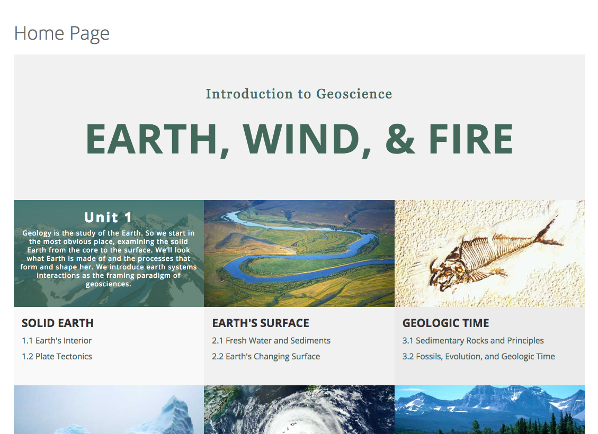
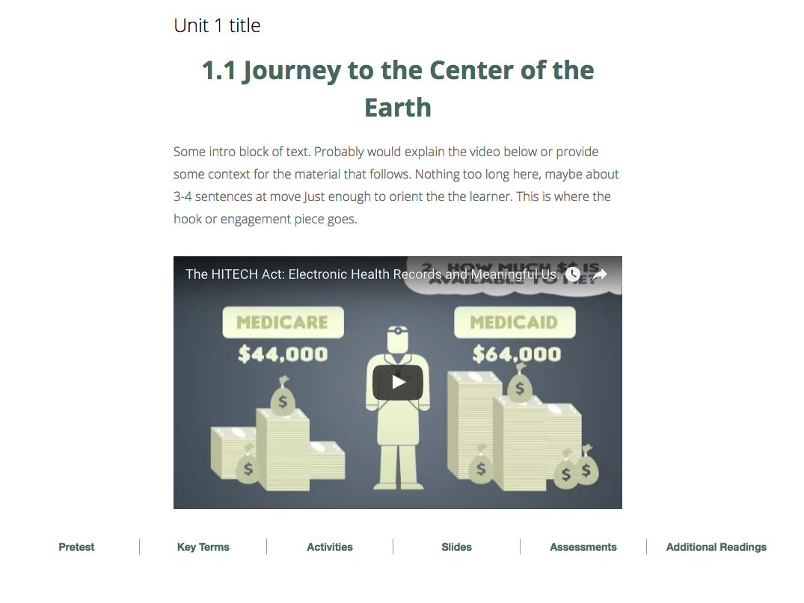
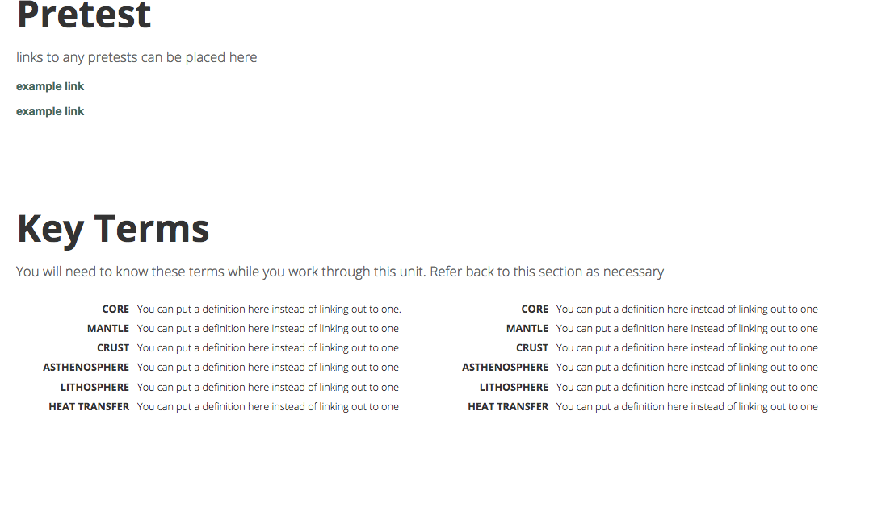
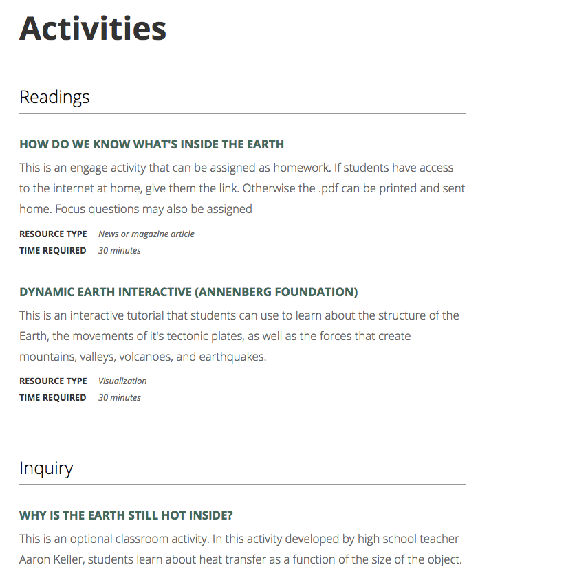

Before I left my previous position in higher ed, I wanted to make sure that I did everything possible to leave them on as solid a footing as possible. And one of the things my former-new boss asked me about was my insight into the different learning management systems I interacted with. Naturally, I took the opportunity to make a blog post! Here's my insight into the differences between EdX (Edge) and Canvas LMS.

# 5 Things to Know About EdX vs Canvas

## 1\. JavaScript and CSS

Whenever you are looking to push your learning management system to do something new, something different, something more, generally you are leaning on code to do that. Both EdX and Canvas will allow you to use JavaScript and CSS, but the way they approach this is vastly different. Canvas requires you to put JavaScript and CSS at the sub-account level. Essentially that means that you will be creating styles and functionality that will be called across a suite of courses in a particular sub-account. On the one hand, this makes a lot of sense; it's highly likely that you may use a sub account to create a suite of related courses that will look similar and need similar functionality. The problem I continued to run up against is that prototyping and editing things was a big production because I had to continually get out of the thing I was trying to edit, change some files reupload and wait for that to take effect. It made trying things really, really difficult. The other thing is that, even inside of the HTML editor in Canvas, it only allows a very, very small subset of HTML tags, which makes CSS only solutions to things like image carousels non-starters. You have to go to JavaScript to get stuff done. EdX on the other hand is very friendly to the tinkerer. You can add CSS and JavaScript to a particular component inside of a unit, or define these things for a unit and reuse them within that unit (in EdX, a unit is like a page). The problem there is that you have to continue redefining things because EdX doesn't (to my knowledge using Edge) have any way to upload reusable files at the course level. However, EdX does allow you to try and test things in a much faster, less restrictive way.

**Winner:** EdX by a Nose

The ideal solution would be to allow JavaScript and CSS at the course level and at a higher account-type level for reusability and sustainability.

## 2\. Built-In Functionality

Man, this port from Moodle to Canvas really showed a lot of things that were missing from Canvas. Polls, branching, rich media in certain places... all things that we wrestled with trying to get Canvas to do. In the end, we made it work via JavaScript and a whole host of third-party tools. EdX, on the other hand, impressed me with the number of out-of-the box activities that they've made available to creators. Out of the box, you can create interactions for users to zoom in to images, drag and drop questions, image maps, even tools to help you create programming-related questions. However, when you think about it, this may just be a question of organization. Canvas can do quite a lot and EdX doesn't have branching either. But in EdX, every unit you create could be anything. You didn't have to go create some special kind of page to get access to a component where you could allow zoom in or drag and drop. It was all right before you, all the time.

**Winner:** Draw (mostly)

Both EdX Edge and Canvas have stuff that they can't do, like any off-the-shelf solution, but EdX puts more of its tools at your disposal more often.

## 3\. Sharing Content

EdX works content sharing (and content randomization) into component they call content libraries. These libraries are exterior to any particular course and allow you to create any type of component you could create within a unit and then use it in any number of courses. I really like this idea because it means that I only have to update a question or a piece of content once (though you do have to go back in to the units that reference that content library and update their reference). Canvas on the other hand, works off of the idea of importing content from one course to another. The nice thing here is that because we don't screw with the original, there's an element of safety. But it also means that if a critical update is made, it must either be made manually in each copied place or re-imported. The import process itself is very easy but that's still something to think about.

**Winner:** Draw

These two platforms work off of different ideas here and there are definite pros and cons to each, but I don't think either is a clear better choice.

## 4\. Content Randomization

In experimenting with EdX, one thing that turned off our client in this case was that to randomize the questions we had created in the libraries, you had to have each question separate (makes sense). But that also meant that (in our case) there was a set of check and show answer buttons for each question, which they weren't in love with. It is possible to create more of a quiz-like template where you put all of your questions into one, essentially and so you only have one set of buttons. But at that point, you then lose the randomization. The other thing that we discovered was that EdX does not continue to serve a user different sets of questions. Say for example, you created a practice library with 100 questions with your intent being that a student could come in, take 10 questions at a time, quiz themselves and then, at the click of a button get 10 new questions from the library. Well, that's a non-starter in EdX. Once it's served a student 10 questions from your content library, those are the only 10 questions they'll see. A work-around is to create several units with 10 randomized questions each. The way Canvas works, as I understand it, is that I can create several question banks and then bring random questions from each of those banks together in one quiz. I'm not sure if you can somehow get a new set of questions on reset. I believe a Canvas quiz has a UI advantage here, because questions can be randomized but all in one quiz with one set of buttons. Interleaving (or mixing up questions on related but different skills) was also a consideration. In EdX, I could create a couple of randomized content blocks within a unit that drew from different content libraries. So the questions could be in the same quiz but they wouldn't really be mixed up unless I did that manually. For example, there could be a block of questions from one content library followed by a block of questions from another, OR I could create a content library with questions from the interleaved concepts in it together. So doable, but not exactly slick.  I'm not sure if, in Canvas, you can mix the questions together to easily or if you would have to use the same sort of workarounds.

**Winner:** ???

I don't have enough experience using Canvas here to make a judgement

## 5. Creating Custom Courses

I've said it before, uniqueness is not a goal. However, we also know that aesthetic design can impact learning and how people feel a course works. Canvas, for all the trouble I've had working in it, I've seen some really neat and interesting ideas of customizing the experience inside the course using home pages and unit pages. See some pics below from a design created by my colleague, Ryan.

So you can try a lot of things within the Canvas structure to create a custom experience through your course content. And make it look pretty good, as well. Of course, the downfall is that you need to know HTML and CSS, at a minimum. There is at least one really awesome looking toolset that seeks to make even this kind of customization into a WYSIWYG experience to further empower faculty, but I never got a chance to play with it: [CIDI Labs Design Tools (formerly known as Kennethware)](http://www.cidilabs.com/#!design-tools/lfqt7) EdX Edge is much less able in this regard, I think. They use a specific look, you don't have as much control over creating a custom experience throughout the course content. Their section, subsection, unit path seems to be the only way. It may be entirely possible to push this further, I just haven't seen it done.

**Winner:** Canvas"If you are looking to create a custom user experience, Canvas is the way to go.",

# My Overall Pick

It was really revealing writing this because, despite the evidence of pros and cons to each platform, my overall pick has been EdX Edge. I think that, generally, the plethora of built-in content options along with the ability to access those content options from anywhere, in any unit you build, and the ease of tinkering the JavaScript and CSS made it a much easier platform to work with and test in. On the whole, I just enjoyed working in Edge a bit more. But certainly, as I pointed out, both platforms will have their cons, neither of them is completely feature complete, and they both can be pushed beyond their normal use cases with a little effort on your part.
