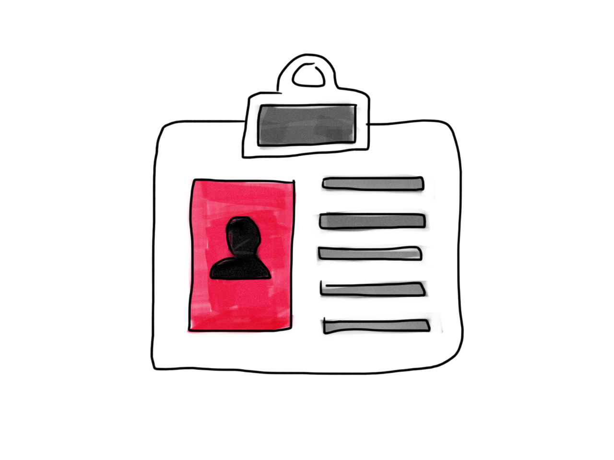
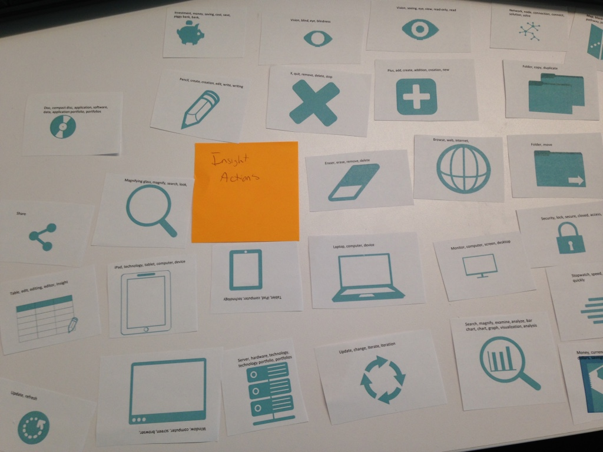

I just started my new job and it's already time to think about performance goals! I have to say that these are probably the best goals I've ever come up with. They involve experimenting with the xAPI (via the design cohort); creating a relationship with another department (one that is more customer-facing, and could provide more insight into what our customers need from us in terms of learning experiences); and creating a visual language for our team. But what does it mean to create a visual language? So far, I've been creating videos exclusively (though, in my most recent project, I'm planning a learning experience in a series with interactions, text and images, and video). But one of the things I've been doing a bit differently is I've had several videos that weren't so much showing tasks in the software as explaining concepts and telling stories about the problems the software and tasks solve for the users. And that meant graphics. Lots of graphics, beyond just screenshots of the software. I chose icons because I needed to be able to use open source/public domain/creative commons 0 assets, and I needed them to be able to have a consistent style (which stock photos are not great at). And so, as many of you do, I ended up spending a good chunk of time for my first several videos gathering and editing icons to help me tell the stories I needed to tell. And I got to thinking, I really need to share these with my colleague. But more than just a collection of random icons, I wanted to try an organize it in such a way that I specified the concepts that each icon had been (or could be) used to visualize. I wanted to help us create a consistent visual language.

## A Visual Language

The idea of a shared visual language is the idea of having a system of communication defined by visual elements. For example, if I gave you this image:

<figure>
  
  <figcaption>An item from my drawing practice Tumblr, Visilang</figcaption>
</figure>

What associations might you have? Perhaps they would include identification, access, security, role, or a number of other things. Well, in our case, I wanted to be able to build on the visual language that is already prevalent in the world, through icons on websites and phones and other technologies, and create a consistent visualization of concepts that matter to the story of our software; concepts such as technical debt, asset portfolios, cost savings, and the like. I had already found/created lots of visual language assets. Now, I needed a way to share them with the rest of my team.

## A System

My first thought was, "wouldn't it be cool if I could build some searchable site of icons that would help you find them using semantic search terms?" Something like The Noun Project but for our team's use? And the answer is, heck yeah that would be cool! But it wasn't really practical. My second thought was to turn to the Noun Project's Lingo, which is meant to be used exactly for the purpose of sharing a visual language across teams. But, [as I've mentioned before](http://www.knanthony.com/blog/dont-sit-on-your-darlings/), when in comes to systems of sharing, it's essential that the system is something that people are already using or want to use. Even if you build, or find a system that seems purpose-built for what you're trying to do and folks do buy in, then it's doomed to fail, no matter how cool it is. On my team, the only system of sharing we really use is Box... So, Box it was. But what could I do to try and make searching and finding the right icon as easy as possible? I found my answer in tagging. I spent a day and put all of my images in a series of PowerPoint slides (I'm using PPT for lots of image-related tasks these days, since I don't have access to Adobe Creative Suite, though I'm supplementing with open source tools [Inkscape](https://inkscape.org/en/) and [GIMP](https://www.gimp.org/downloads/)), and used a text element under each icon to list every association I could think of for each icon. Then, I printed out every icon that I currently had and organized them on my desk, moving and arranging, and rearranging the images until I had some broad categories that I thought made sense. From there, I had some folders that could serve as categories, and tags for each individual image. Bada-bing!

<figure>
  
  <figcaption>Part of my tagging work</figcaption>
</figure>

## Steal this Idea: Share your Assets and Create a Visual Language

At every position I've had, gathering and sharing assets has been an issue. Even in the positions where I've been able to fairly easily get the assets I need, sharing them with other team members and creating a visual language hasn't ever really happened. Why would this be important? First and foremost, it saves time. If you're on a team of people who are creating learning experiences and using assets, even if you aren't necessarily creating experiences about the same things, then sharing assets can really cut down on the time that each individual has to use searching for assets that fit the story they're trying to tell. Secondly, the use of some shared, searchable system is essential. From experience, I can tell you that putting all of you assets, named some variation of 123xyz.jpg from the asset store, into a single folder, or into categorized folders is a good first step, but from there, it's still a matter of browsing this massive and growing folder structure, relying on your memory of the image that you just know has to be in there somewhere, instead of targeted searches. Tagging is one of the simplest ways to answer this (of course, you need to be able to search by tags, which you can do in Box). Put as many semantic tags on each image as you can to describe the concepts that your team might use in telling your various stories. Thirdly, the visual language aspect here means that, across videos, you and your team are creating recognizable visualizations for certain concepts and using more than words to describe the essential things. Furthermore, I've found that the more visual language assets you have, the more movement you're able to have in your video. One of the "rules" that I try and keep to when creating video, is to think of it a bit like TV: don't stay on one "shot" for too long. I think that when we use video, we should have a sense of movement and pace. Staying on the same screenshot, while I have a voice over for 20 or 30 seconds is a non-starter for me. But with the inclusion of various visual language assets, I can continue to build on the story of our software in a way that makes sense, is on brand, and provides the movement necessary to help make an engaging video. Whaddya think? How do you share assets with others in your organization? Do you have a visual language that defines how you visualize certain concepts?
