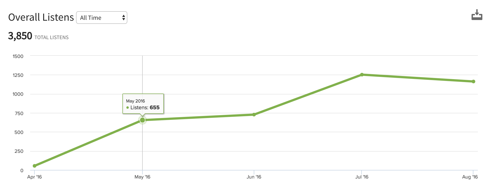
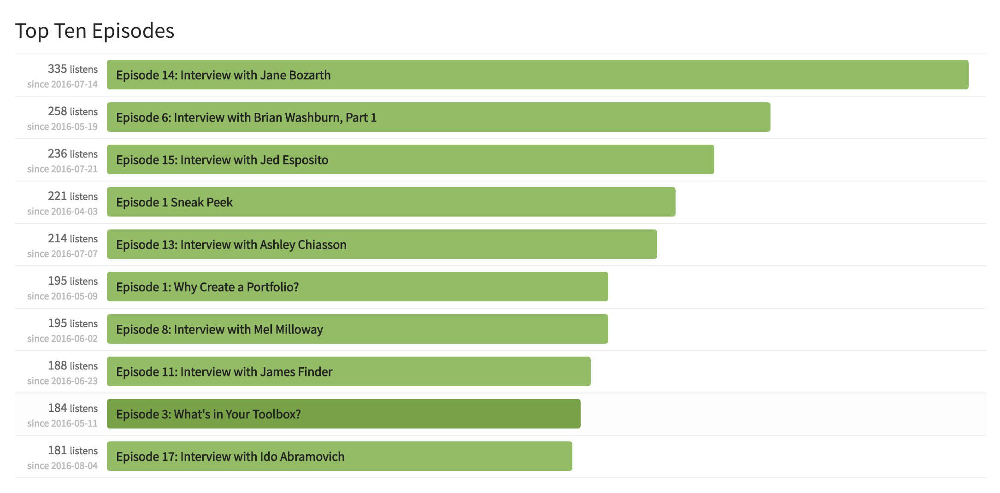
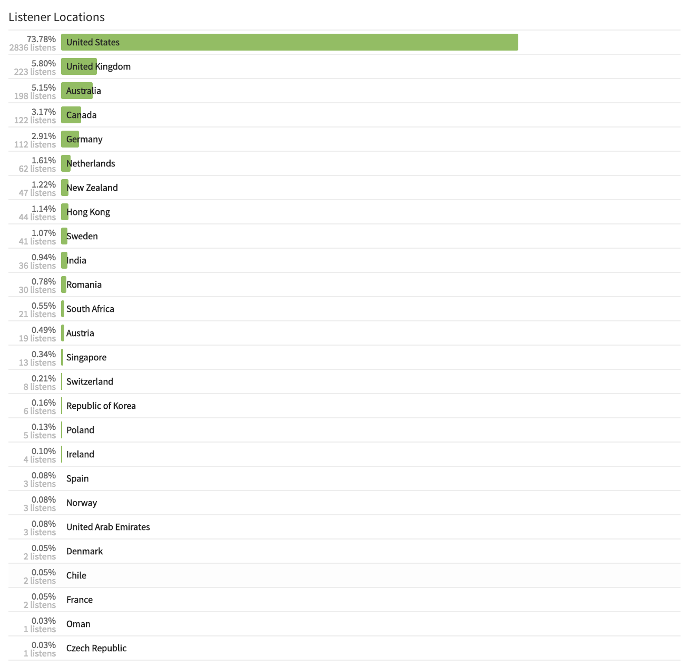
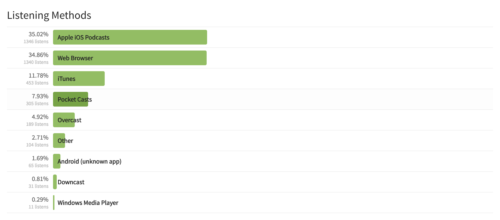

Season 1 of the Dear ID show is all wrapped up and I wanted to take some time to say a heartfelt Thanks to everyone who's listened in! We've been a small but steady audience. And folks have continued to listen in week to week. As I said when I first started this venture, I wanted to know that the show was providing value before I continued on and I think that the stats have shown that people (you!) are getting something from the show. So I've got a Season 2 planned, with at least another 14 to 15 episodes. I'm taking a break to get the queue of episodes ready, and in true Kristin fashion, I wanted to take some time to reflect.

## Running a Show is Work!

You guys know the drill by now. I'm working on several personal projects at home, while holding a full time job (like all of you) and, over time, it's been a little difficult to keep up with the show. Recording the episodes is always a special treat. It has truly been amazing to get to talk to so many awesome people. Thinking up topics has been fairly easy. I've been following advice from the $100MBA show to keep a spreadsheet of topics for the future. I have to make time to think about questions for interviews (especially for Season 2 as each guest's topic will be a bit different) and organize my solo episodes. But on the whole, that's all enjoyable. By far the biggest pain has been the editing. Ours is a humble show, a simple show, but man it still takes a lot of work! And I find myself majorly unmotivated to do it. It's weird because it wasn't a problem for me at first. But in my new job, we do our own voice narration and editing, so that may be the difference. To deal with my editing fatigue, I've just recently started exploring outsourcing that work. And that's taken a lot of the load off. My hope is that I can find someone reliable to keep helping with this task.

## Expenses

I use Simplecast to host the episodes ($12/mo.), and I also have a web domain for the main show site ($107/year). There was some upfront costs for recording equipment, but on the whole, costs have been low. However, outsourcing the editing is raising the monthly cost for the show considerably. So that is something for me to consider over time. I'm not super keen on the idea of having sponsors, but I know that when I listen to a show, I totally get why they have them! There's definitely costs involved, especially when you're a solo outfit and the show isn't tied to your business.

### Some Stats

One of the things I've heard on other podcasts I've listened to is that, when you start a project like a podcast, you should set up some measures of success. I went in to this wanting to elevate instructional designers from all walks and positions and to hear about their stories and their journeys. But I didn't (and don't) have any concrete measurement for what success means for Dear ID. At what point might I decide that Dear ID is not worth continuing? I've thought about it, but I admit I still don't know. But I've been encouraged by the regular listeners, reviews in iTunes, and tweets about the show. Let's take a look at some show stats.

### Overall Listens

We've definitely seen some growth since the beginning! We're getting about a 1,000 listens a month now, which is awesome. I'd love to have more listener interaction, to know if what we're talking about is resonating with folks.

### Episode Popularity

My most popular episode, by far, was the interview with Jane Bozarth! I also noticed that my initial idea of splitting the interviews into smaller, bite-size chunks doesn't seem to have worked. My other popular episode was the first part of my interview with Brian Washburn. Another insight gained is that interviews are definitely more popular than my solo episodes, as you can see. This is super helpful to know, but, as you might expect, interviews are hard to schedule, record, edit. So this is becoming a bit of a challenge. This is really the bulk of my concern for the show right now.

### Audience

My audience is overwhelmingly in the U.S., which is perhaps to be expected, but I do have some international listeners, which is amazing!!! I'm so grateful to be able to reach folks everywhere. Perhaps I can schedule more interviews with folks from other places!

### Listening Methods

Apple podcasts and the web player make up the bulk of the way people listen to the show. I'm really interested in what you guys think about show length. If you're driving or walking the dogs or working out, is an hour too long? Just right?

## Future Plans

Well, I definitely want to do a Season 2, which should hopefully take us to at least 8 months of weekly shows. As I said, I've just been super excited to be able to reach out to so many other IDs and have interesting conversations and share them. The show definitely has a bigger audience than anything else I'm doing at the moment. One thing that I might consider doing to better balance myself is to focus a bit less on weekly blog posts and focus more on the show, perhaps even increasing the frequency. (That sounds a bit nuts to me now, but it seems like it could be worthwhile!) I'm looking forward to Season 3 and beyond!
