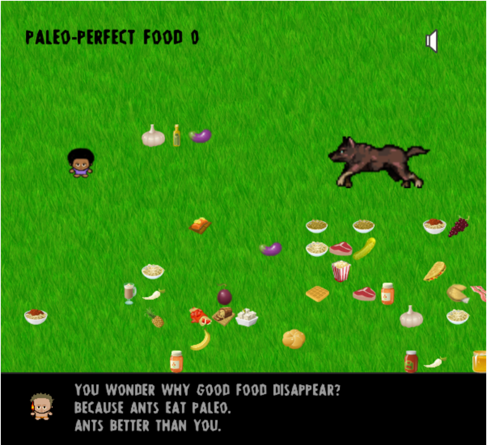

WOOT! I'm getting the hang of this tiny game making thing. On the heels of Espiritus, I noticed that the One Game a Month keynote (theme) for this month was perfection and I soon had an idea: a game about eating Paleo, but the super-duper perfectionist version. With all of the diet dogma that floats around, the perfection theme seemed like a great opportunity to parody and explore "clean" eating.

## Time In Development

I'd say about 40 to 50 hours over 12 days.

## Mechanic

This is a collection game. Your job is to use the arrow keys to only eat the Paleo food. I was really inspired by the [CD Saver](http://www.lexaloffle.com/bbs/?tid=27611) tiny game I discovered on One Game a Month. There is no list of what food is "Paleo," so there will be a lot of trial and error (just like in life!). Thorg, our caveman guide on our clean eating journey will also hurl insults at you the entire time.

## Theme

It seems like part of the danger of thinking about food as "clean" vs. "dirty" or "sinful" vs. "good" is that it promotes a really unhealthy frame of mind. Even though most diet guru sites will tell you not to be too hard on yourself if you "slip up," the very language around food, along with all of the diet talk one is bound to run into everywhere encourages a person to think of themselves as a failure whenever they stray outside of the guidelines. That's what this game is about. Intentionally, you can't really win.

## Issues

I had three big problems in this game:

*   Dialog boxes
*   Spawning Food
*   Wolves

### Dialog Boxes

The major issue I was having with my dialog boxes was that they weren't firing their complete signal. I spent several days on this (probably 3 or 4 out of my entire development time). I'd used the [dialog function I'd found previously in my Espiritus game](/blog/espiritus-a-teeny-tiny-game-made-using-phaser-js/) and it worked perfectly, so it was really, really hard to figure out what was going wrong. After more testing, I finally realized that the problem was that, in the previous game, I only had one timer. However, in this game, I had 3 loops and then this timer. So, the dialog box timer never completed because of the loop timers. Having discovered that, though, I was unable to do anything with the normal Phaser methods to stop the specific timer I was after. My attempts either stopped all timers in the game, or none. After being super frustrated and trying everything I could think of, including fiddling around with some JavaScript (non-Phaser) solutions, I finally stumbled upon the Phaser signal that I needed to fire and was able to force it to dispatch, like so:

```javascript
Paleo.Thorg.prototype.displayNextLetter = function(textObject, message, counter) {
  this.textObject.visible = true;
  this.textObject.text = this.message.substr(0, this.counter);
  this.counter += 1;
  if (this.counter > this.message.length){
    Paleo.Thorg.timerEvent.timer.onComplete.dispatch();
  }
};

Paleo.Thorg.prototype.displayLetterByLetterText = function (textObject, message, onCompleteCallback) {
  Paleo.Thorg.timerEvent = this.game.time.events.repeat(100, message.length, this.displayNextLetter,
{textObject: textObject, message: message, counter: 1});
  Paleo.Thorg.timerEvent.timer.onComplete.addOnce(onCompleteCallback, this, 10);
};
```

Then I had another, smaller issue where, when the game lost focus and was paused, the functions I was using to choose when to show the next text message where not updating, such that, when the game resumed, I might have two messages overlapping. It only took a few hours to come up with this solution. I create a variable in my prefab (the file that houses all of the code surrounding Thorg's dialog) to track whether the text was complete. If not, then I would simply call an update function to reset the calculation on when to show the next dialog. One thing that isn't perfect is that the dialogs can' seem a little slow after a pause. I'm having to wait 15 to 20 seconds between dialogs to be safe, and with a pause in the middle, it can seem unfortunately long.

```javascript
if (this.game.time.now > this.nextEvent) {
  if (Paleo.Thorg.completeText === undefined){
    this.giveInfo();
    this.nextEventCounter++;
    this.updateNextEvent();
  } else if(Paleo.Thorg.completeText) {
    this.giveInfo();
    this.nextEventCounter++;
    this.updateNextEvent();
  } else {
    this.updateNextEvent();
  }
}
```

### Spawning Food

The next big problem I had was spawning food. Because this is a collection game, I needed to be able to spawn both paleo and junk food. I knew I needed to use a pool of objects so I wasn't continuing to create sprites ad infinitum. That was easy enough, and I used the loops mentioned above to spawn the food and the junk and to randomly kill off paleo food. But I still had two problems. Firstly, my food sprites were spawning much too close to each other. I wanted the game to be hard, but not totally impossible. It took much re-reading of forum suggestions, but I was finally able to work out in my mind how to create a grid that I could use to place food in a way that the sprites wouldn't overlap and to track which spaces were filled and which were empty. I placed the grid data in my level.json file:

```javascript
"grid": [
   [
     {"x": 0,"y": 153, "filled": false},
     {"x":29, "y":153, "filled": false},
     {"x":58, "y":153, "filled": false},
     {"x":87, "y":153, "filled": false},
     {"x":116, "y":153, "filled": false},
     {"x":145, "y":153, "filled": false},
     {"x":174, "y":153, "filled": false},
     {...}
   ]
]
```

I then created a function that would check which cells were filled and place food in empty cells only.

```javascript
randomSpawnPosition: function(player){
   var currentCoordinate = [];
   var randomRow = this.levelData.grid[Math.floor(Math.random() * this.levelData.grid.length)];
   var randomCell = randomRow[Math.floor(Math.random() * randomRow.length)];
   if (Phaser.Math.difference(player.x, randomCell.x) < 39 || Phaser.Math.difference(player.y, randomCell.y) < 39) {
     randomCell.filled = true;
   }
   if (randomCell.filled !== true){
     currentCoordinate.push(randomCell.x);
     currentCoordinate.push(randomCell.y);
     randomCell.filled = true;
     return currentCoordinate;
   } else {
     return this.randomSpawnPosition(player);
   }
 }
```

This was working well, except that I was still left with the problem of sprites that might spawn forever. One of the loops I mentioned above, killed off sprites every so often, but not often enough to really prevent a potential issue. So, I wanted to implement a lose condition that would prevent food from piling up forever. And I found the perfect solution: wolves

### Wolves

Or wolf, to be more accurate. Taking inspiration from the scissors in the CD Savers game, I decided that, after a certain number of food sprites had piled up, a wolf that would come through and eat all the food in its way, including the player. There were three things I needed to be able to do. Firstly, I needed the wolf to come through and eat everything in its path. It was easy to get the wolf on the screen, but I needed to stop the wolf's movement when it exited the screen, and, since the wolf was spawned offscreen to begin with, that seemed like it would be a tough nut to crack. So I had to look up how to do that. The solution was surprisingly simple: I was able to just check when the wolf was out of bounds. One surprising sub-issue I had was having to make the switch from checking for collision between the wolf and the food sprite group to checking for overlap. Collision between bodies in Phaser means that the bodies interfere with each others' velocity. This isn't an issue with the player because her movement is based on your keyboard input. But the wolf had a set velocity and colliding with the food stopped him cold. So, overlap did the trick. Not too bad a sticking point, but took a couple of hours between squashing the other bugs to work this out. Secondly, I wanted to spawn the wolf on the same horizontal line as the player. This was easier than the the first step. I passed the player in as a parameter to my spawnWolf function, so that I could use the player's x position as a reset point for the wolf. Thirdly, I needed to reposition the same wolf back at the beginning, once it ran offscreen. I ended up creating a function that fired on the outOfBounds signal. wolfOut stops the wolf from running any more, which allows the spawnWolf function to reposition the wolf.

```javascript
spawnWolf: function(player){
        this.wolf.x = player.position.x + this.game.world.width;
        this.wolf.y = player.position.y;
        this.wolf.play('runYouDown');
        this.wolf.body.velocity.x = -this.levelData.wolfRunningSpeed;
        this.wolfGrowl.play();
        this.wolfCounter++;
        this.wolf.events.onOutOfBounds.add(this.wolfOut, this);
    }
```

## Play the Game

With all that accomplished and a little polish, I feel good enough about the game to release it. Play it below and let me know what you think!

**WARNING:** I didn't add a menu state, so we just launch straight into the game and the music begins immediately! So be prepared! (There is a mute button on the screen).

<figure>
  <a href="https://anthkris.itch.io/paleo" target="blank">
    
    <figcaption>Play the Game!</figcaption>
  </a>
</figure>
