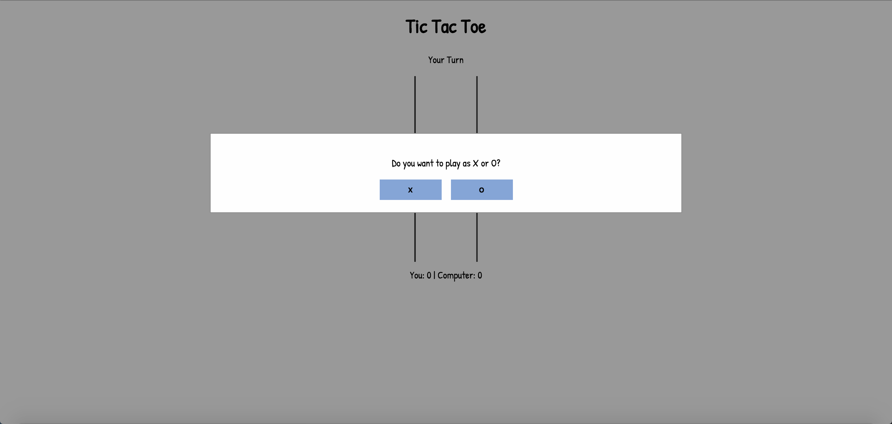

So, I had the opportunity to attend a Girl Develop It workshop on NodeJS and, when sharing my coding journey so far, I talked about my Free Code Camp experience and, afterwards, I looked at my FCC profile and realized that I only had 4 projects left in the Front End Development certificate! What have I been doing with my life? Well, anyway, I've decided that I'd like to finish this up before the end of the year. And in the service of my current game development focus, I decided to take on the two most advanced projects first, both games. And my latest completion was the tic-tac-toe.

## Starting Game Development

Though this is a simple game, I'm proud of it because I went all vanilla JavaScript for this project. No jQuery, no other frameworks. So besides a concern that some bits of my code aren't exactly DRY (don't repeat yourself), the code is otherwise probably a little more verbose than normal. I actually took an idea from my last Phaser game, [Paleo](http://www.knanthony.com/blog/paleo-another-tiny-game-using-phaserjs/), and hit on the idea of using a grid to keep track of whether or not a cell had actually been filled.

```
//Create grid of 9 squares
var grid = [
 {x1:0, y1:0, x2:98, y2:98, filled:false, value: 0},
 {x1:102, y1:0, x2:198, y2:98, filled:false, value: 0},
 {x1:202, y1:0, x2:300, y2:98, filled:false, value: 0},
 {x1:0, y1:102, x2:98, y2:198, filled:false, value: 0},
 {x1:102, y1:102, x2:198, y2:198, filled:false, value: 0},
 {x1:202, y1:102, x2:300, y2:198, filled:false, value: 0},
 {x1:0, y1:202, x2:98, y2:300, filled:false, value: 0},
 {x1:102, y1:202, x2:198, y2:300, filled:false, value: 0},
 {x1:202, y1:202, x2:300, y2:300, filled:false, value: 0}
];
```

And I used a the canvas element to draw the grid. From there, there I iterated on a series of functions to perform all of the various tasks.

## Problems

The computer's AI was probably my biggest issue. You think you know tic tac toe, right? But in trying to program the computer's response to player moves, I had to do more than just have the computer fill in a random cell (which, by the way, was my first iteration). I needed the computer to respond intelligently, and never lose. So I ended up looking up tic tac toe strategy to think more strategically about how to make the appropriate moves. I started with a search and came up with this great Quora answer: [https://www.quora.com/Is-there-a-way-to-never-lose-at-Tic-Tac-Toe](https://www.quora.com/Is-there-a-way-to-never-lose-at-Tic-Tac-Toe) That post helped a ton in helping me to flesh out my initial tries. But things, weren't quite right. The computer would still lose occasionally, making a stupid move. So I kept searching for advice and hit upon this [everything2 post from m_turner](http://everything2.com/title/Tic-Tac-Toe) (5 post down) that does an amazing job of visualizing strategy. And that helped a ton! I highly recommend reading it if you're stuck for ideas on how to make a smart computer player. Creating an end game, terminal state was probably my second biggest problem. The aforementioned everything2 post helped with this as well, by assigning values to each cell, based on whose play it was, I could calculate when there were 3 in a row in any direction as well as who won.

```
//Check for win/lose conditions
function checkBoard() {
 getScores();
 if(row1Val === 3 ||
 row2Val === 3 ||
 row3Val === 3 ||
 col1Val === 3 ||
 col2Val === 3 ||
 col3Val === 3 ||
 diagonalRtLVal === 3 ||
 diagonalLtRVal === 3) {
   score = 3;
   endGame(score);
   return true;
 } else if (row1Val === -3 ||
 row2Val === -3 ||
 row3Val === -3 ||
 col1Val === -3 ||
 col2Val === -3 ||
 col3Val === -3 ||
 diagonalRtLVal === -3 ||
 diagonalLtRVal === -3) {
   //lose
   score = -3;
   endGame(score);
   return true;
 } else {
   //draw
   var draw = grid.every(function(cell){
   return cell.filled === true;
   });
   if (draw){
     score = 0;
     endGame(score);
     return true;
   }
 }
}
```

## Polish

I wanted to keep things simple, but in addition to needing to execute a few more user stories, I also hit upon some example tic-tac-toe games from the Odin Project and decided to polish the game up a bit. To that end, I added:

*   A begin game modal to choose X or O
*   An indicator of whose turn it is
*   A delay on the computer's turn so it doesn't move instantly
*   An indicator of how many games the player and computer have won
*   A end game modal that shows win, lose, or draw

## Play the Game!

Test out the game and let me know if you find any bugs!

<figure>
  <a href="http://codepen.io/anthkris/details/mAAVjq" target="blank">
    
    <figcaption>Play Tic Tac Toe</figcaption>
  </a>
</figure>
