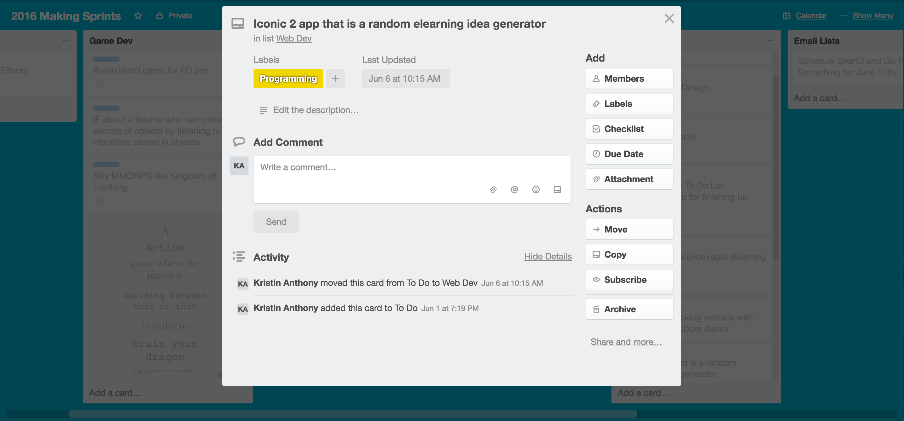
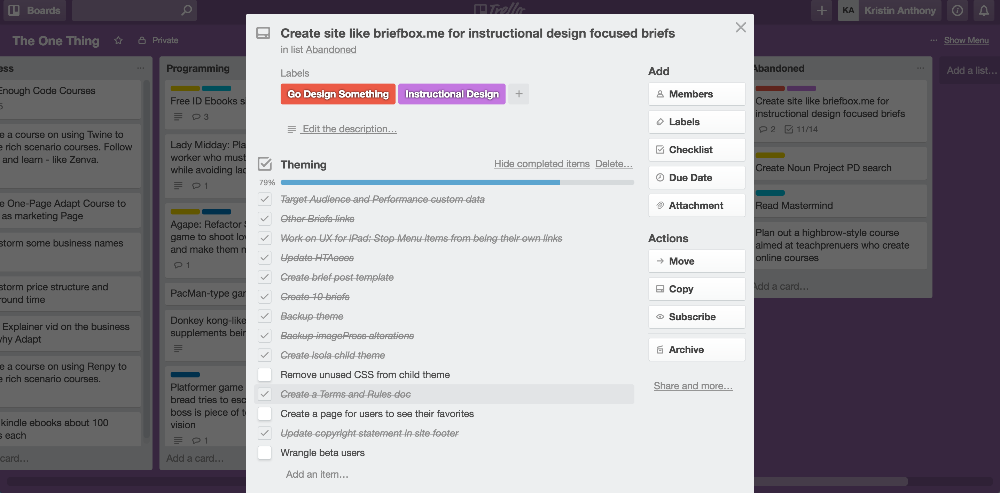

As readers of this blog may know, my Go Design Something idea has a long and storied history. It began life as [AWSMPrompts](http://www.knanthony.com/blog/less-talk-more-practice-instructional-design-communities-of-practice/), way back in February of 2015\. I took some feedback on making the prompts more specific and tried again with Go Design Something.co with much more specific challenges. I tried that from May to December, but I still didn't get much traction. Then, I got super inspired and tried to emulate a great brief site for designers (not IDs) called BriefBox in July of this year. And I got a [cease and desist letter](http://www.knanthony.com/blog/go-design-something-challenges/). So... I wasn't sure what to do. Just this month, I finally finished my Free Code Camp Front End certificate (YAY!!!) and I was looking at my Trello boards of project ideas. And it hit me: I could take an old project idea that has just been sitting there, mix it with my abandoned project idea, and create a mini-project. Something much smaller, much less ambitious, but still in the same vein (remember Start small, Start now).

<figure>
  
  <figcaption>I mixed this...</figcaption>
</figure>

<figure>
  
  <figcaption>... With this!</figcaption>
</figure>

And so, a new incarnation of [GoDesignSomething.co](http://godesignsomething.co/) was born! Using the Bootstrap Framework and Angular JS, I created a project idea generator that I encourage everyone to use! (I think I'll update the copyright to a creative commons license very soon). The new site currently feature 19 short project briefs, each sanitized from real ID projects across the ID spectrum, such as elearning, script writing, video creation, and systems planning/design. Each brief includes:

*   Intended audience
*   Context of the project
*   Expected deliverables (what you should actually make)
*   Links to diverse sources of inspiration

I'd love your input on the site and anything you think would serve you better! I'd also really love to have more sanitized briefs from the community. It's super helpful to have realistic projects for new IDs to get some idea of the real work that IDs do in the world. There's a [handy, dandy Google Form where you can submit a project idea](https://goo.gl/forms/8OjBfa4IOn4Uy7TD2). Let me know what you think!
