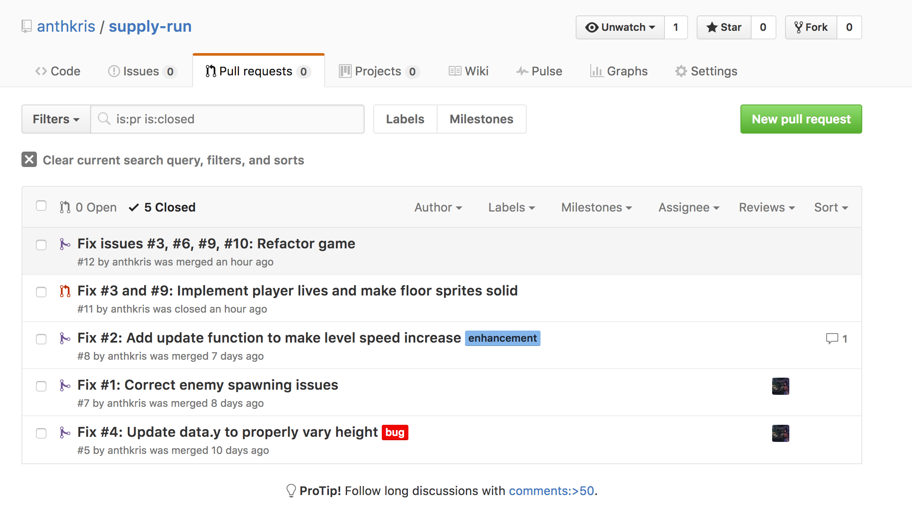
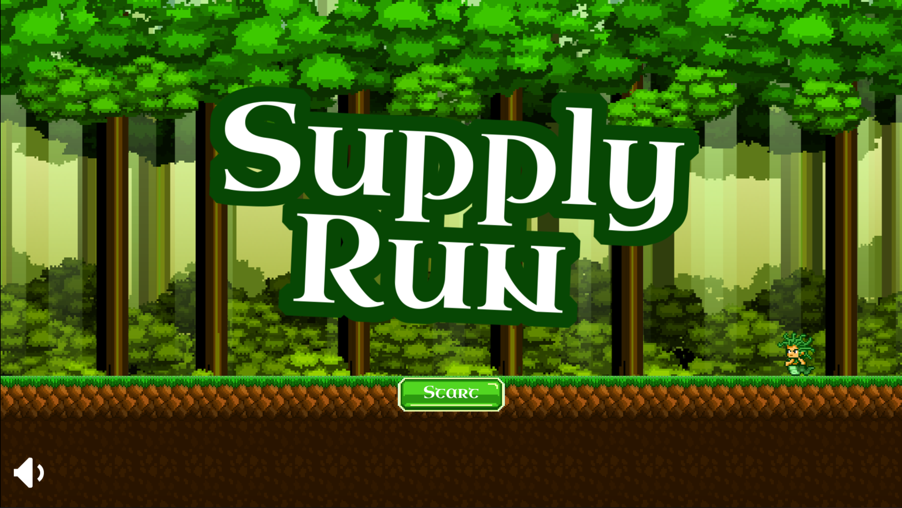

I've been in a terrible rush these past couple of weeks, splitting my time between more [Oppia projects](/blog/what-im-learning-from-my-open-source-contributing-experience/), some side work in instructional design, some algorithm practice, and my January entry to One Game a Month, Supply Run! As I mentioned at the end of season 2 of Dear ID, I wanted to get back on my game development learning track ASAP. I was able to complete another module, this one on creating an endless runner, and, as I try to do regularly, I decided it was a good time to take a break and make my own game, to put what I was learning into practice. This happened to coincide beautifully with the #100DaysOfCode challenge, which I have been enthusiastically following ([you can check my log on Github](https://github.com/anthkris/100-days-of-code/blob/master/log.md))! So it was a good time! I have several game projects in my great big board of ideas, and since I had just completed a module on creating an endless runner, that was the type of game I chose to make. You might have thought that creating a procedurally generated endless runner right after following a tutorial would have been easy work, but .... you'd be wrong. Things started off well but I soon found some glaring problems with my code.

## Problems and Solutions

### A Code Refactor

By far the biggest issue I encountered was the fact that my player would not stay still! The way the game worked originally was that the player was meant to stay in one spot and the rest of the world moved underneath her. But I kept finding that, no matter what, she was moving imperceptibly backwards and forwards over time. I searched and searched and searched and I couldn't figure out the root cause. Finally, after waiting what was probably too long, I asked a question on the HTML5 GameDev forum and was able to get some help. Unfortunately, the help said that, basically, physics systems (the system in the game that mimics real world physics for running, jumping, bouncing, and things like that) aren't precise, and that there was little I could do to help my player to stay in one spot. My options were to try and force it by continuously setting the player's position, or to create a bunch of custom code that would change the physics. Well, I tried to set the player's position, but it introduced another issue where the player would no longer run into the sides of the platforms. She fell straight through! I didn't want that. I also tried creating some custom methods, but that seemed like a ton of work for no reason... I knew there was a third option, but I was dreading it... completely redo my game so that, instead of the world moving, the player moved. I think I succumbed to the sunken cost fallacy for a while there, but in the end, after attending this really amazing women coders meetup, I got confident (and desperate) enough to attempt it. And wouldn't you know, the necessary changes weren't nearly as extensive as I thought! It simply took commenting out a few lines of code. However, I did have a very sticky time figuring out how to let my platforms know when they should generate another one. For example, in the previous methodology, a new platform would generate every time the last tile of the old platform had left the edge of the world. For various reasons, including the fact that I was now following the player with the in-game camera, that wouldn't work anymore. I was finally able to figure out that I could perform a similar check for then the last tile of the previous platform had left the camera view. Seems simple now, doesn't it?

### Setting the Difficulty

Probably the other big thing I had an issue with was trying to make my game speed up over time. My original inspiration was the Half Brick Monster Dash endless runner (though I also looked at other endless runners like [Canabalt](http://adamatomic.com/canabalt/) and [Netflix's Flixarcade entry](https://flixarcade.netflix.io/)). I noticed that they ramped up their difficulty by making you go faster and faster as you ran farther. I wanted to have this feature, but again, search as I might, I couldn't find another endless runner that used that as a form of difficulty. It took quite a few days of talking to myself to figure that one out. This was actually something that the new methodology made easier. My final solution had been to use a looping timer to increase the level speed every few seconds. This was a huge pain in the butt when all of the platforms and enemies and coins and hearts were moving. But after my refactor, I only had to update the player's velocity, which made this go much more smoothly.

## Using Github

I built this game (as I have my other Phaser games) using the Cloud9 IDE and pushing my code regularly to Github. I mention this because I think this is the first time I've used this workflow well(ish). When I was getting overwhelmed with the number of problems I was trying to fix and features I was trying to add, I started submitting issues to my Github repository and creating branches to fix and to add. This really did a lot in the way of helping me to focus on one problem at a time and get it fixed.

<figure>
    
    <figcaption>Using issues, branches, and pull requests helped me focus on fixing one problem at a time.</figcaption>
</figure>

Using issues, branches, and pull requests helped me focus on fixing one problem at a time.[/image] I know Github may seem a bit technical for ID work, but I really do recommend it. I think it would be a great tool for IDs to use in their side projects. It's wonderful for helping you to keep track of problems, features to add, and work you've done. They've even added a kanban board feature so you don't have to also use other tools, like Trello (though I do still use Trello). Plus, it's free!

## Play the Game

There are still a few minor ticks with bits of the game, but overall, I was able to add all the features I wanted and fix all the major problems. I think it's ready for playtesting! Check it out and let me know what you think! If you've got a suggestion, maybe submit an issue? [https://github.com/anthkris/supply-run/issues](https://github.com/anthkris/supply-run/issues)

<figure>
  <a href="https://anthkris.itch.io/supply-run" target="blank">
    
    <figcaption>Play the Game!</figcaption>
  </a>
</figure>
