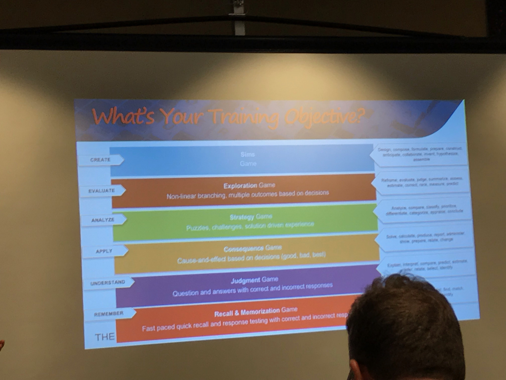
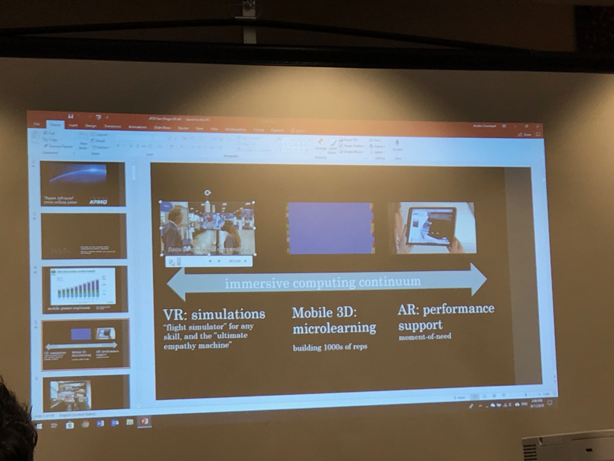

I'm at my second conference ever! eLBX/Learning Dev Camp. Today made me think a lot, so I'd figured it would be a good time to practice what I preach and think out loud.

## Morning Sessions

The morning sessions were comprised of a variety of industry speakers (and improv and a mentalist!). We heard tips about creating effective training, thinking like game designers and thinking about the science behind elearning. One of the things that struck me was that we had a speaker talk a lot about diversity and inclusion and others did, as well, but I could count the people of color present on two hands and none of them were on stage this morning. I sort of expected it, but it was one of those things that made me stop and reflect. My two favorites were definitely Karl Kapp's presentation (where he immersed us in a visual novel, scenario-based game which was cool because it showed something simple but effective) and Micheal Allen (it was great to hear him reiterate robust-evidence-based principles for designing effective learning experiences, especially since his book and Allen Interactions webinars were some of the first resources I ever used to help me develop my craft). I took tons of notes. I've been thinking a lot lately about my freelancing business and better positioning myself for the type of work that I want to do. Hearing again about what makes learning experiences effective just seemed to drive further home the fact that a lot of the work I'm doing now is purely development and I haven't been able to ask the deep sorts of questions around goals and outcomes and measurement that would allow me to feel more fulfilled and give my clients my best work. One of the things Dr. Allen said that resonated with me was:

 > The most costly/unaffordable training is training that doesn't work.
 >
 > -- Michael Allen

I really want to take that to heart in the work that I say yes to in the future.

## Afternoon Sessions

The afternoon sessions were organized into tracks and I stayed in the instructional technology focused ones. Mike Hruska presented on design thinking and offered a variety of tools to use to get to the bottom of performance issues and needs. One of the things that was really interesting was that (and perhaps since this conference is development focused) there was a lot of acknowledgement that creating elearning and other learning experiences was about creating products, which is [something I've blogged about before](/blog/instructional-designer-as-product-designer/). So there was a lot of talk about taking from the arenas of product design and user experience design. The resources Mike presented really resonated with me because I think that they can help me to be more purposeful about the kind of work I want to be doing and provide a lot of different options to help clients ask the right question. I think especially because [so much of what I do is in the professional development to sell space](/blog/towards-a-model-for-professional-development/), which no instructional design process framework really fits well, its great to have these other tools in my toolkit to ask more questions and create more conversations. I also saw two sessions about using games, one for more 2D games and one for AR/VR. One of things that really struck me about the 2D games one was that the company was selling and marketing games (think match 3"like Candy Crush - and platformers - like Super Mario Bros) in which questions were interwoven into the content. I has always been under the impression that games like that, where the content and the gameplay were essentially separate were not really effective. The presenter suggested using these as a learning opportunity for the organization to simply find out what the players knew and didn't know (as a pretest or a post test). I'm still not quite sure how I feel about this, but it's opened my mind to the possibilities. However, something an audience member asked was about using these styles of games (which were called "addictive" more than once) to train hourly workers even off the clock, because they would want to play the game. And at that, I started thinking about ethics. Dr. Allen had mentioned in his earlier talk about the Serious Elearning Manifesto as a set of principles that he felt IDs should adhere to. And another speaker talked about Thomas Paine as the instructional designer of the American revolution (an interesting concept). If we do indeed have the power to provide life-changing experiences, shouldn't we also be required to be ethical? Is it ethical to use games to sneak in worker training when they aren't being paid for it and might already be living on minimum wage?

<figure>
    
    <figcaption>Different levels of game design. An interesting framework for thinking about integrating games or gamification</figcaption>
</figure>

The VR/AR session was equally thought-provoking. The presenter did a pretty great job of presenting on some of the good use cases for these technologies, but one question that I asked and still didn't feel was answered was when to prioritize the development time and cost of VR/AR as opposed to making something more simple like a 2D game or a text-based game? I could definitely see the applications he was proposing (they were really cool) but I wondered about a framework for deciding when they would be most effective. The presenter also talked about how VR, in particular, was really the work of a team that included 3D model designers and Unity programmers, so instructional designers probably shouldn't be worried about trying to add 3D unity development to their skillset (it's on my list, anyway). But that made me consider whether we would ditch the current versions of authoring tools in the forseeable future and return to a time when instructional designers needed to collaborate with a team of developers. Or will the democratization of tools be rapid enough that IDs will be expected to exchange their Storyline-esque tools for something like a Unity for non-programmers? Will there be a point at which the authoring tools that are normal today and the kind of experiences they create will be traded in for all VR/AR courses?

<figure>
    
    <figcaption>I was interested in AR because it seems more accessible. Interesting framework for thinking about it.</figcaption>
</figure>

The presenter also emphasized the fact that VR experiences have been shown to be effective at changing your brain (he talked alot about their uses for empathy games by allowing a player to experience the world of someone not like them and the use cases for that for diversity and inclusion training). And that made me think about VR experiences where women players were groped by men in VR games (see here: [https://www.rt.com/viral/359668-virtual-reality-groping-game-show/](https://www.rt.com/viral/359668-virtual-reality-groping-game-show/) and here: [https://medium.com/athena-talks/my-first-virtual-reality-sexual-assault-2330410b62ee](https://medium.com/athena-talks/my-first-virtual-reality-sexual-assault-2330410b62ee)) and the ethics involved in creating these kinds of experiences.",

## In Summary

All in all, I walked away from today very thoughtful, first about my business and where I want to be headed as a freelancer and secondly about instructional design in general, where it might be headed and how our skillsets might or might not need to adapt. I wouldn't call myself excited or inspired, but definitely thoughtful.
