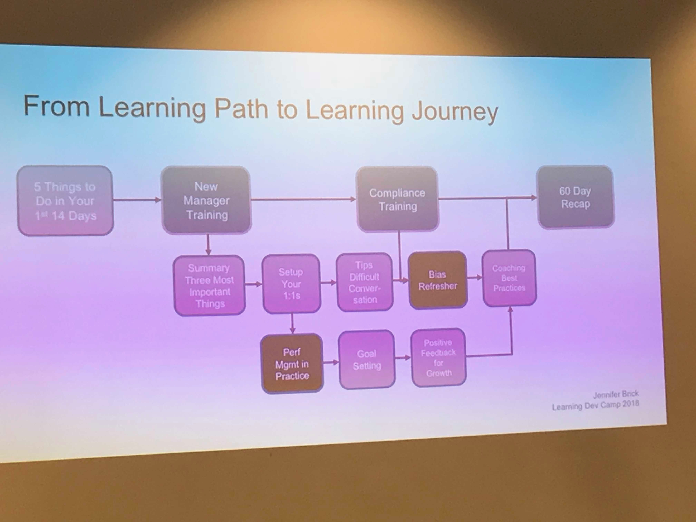
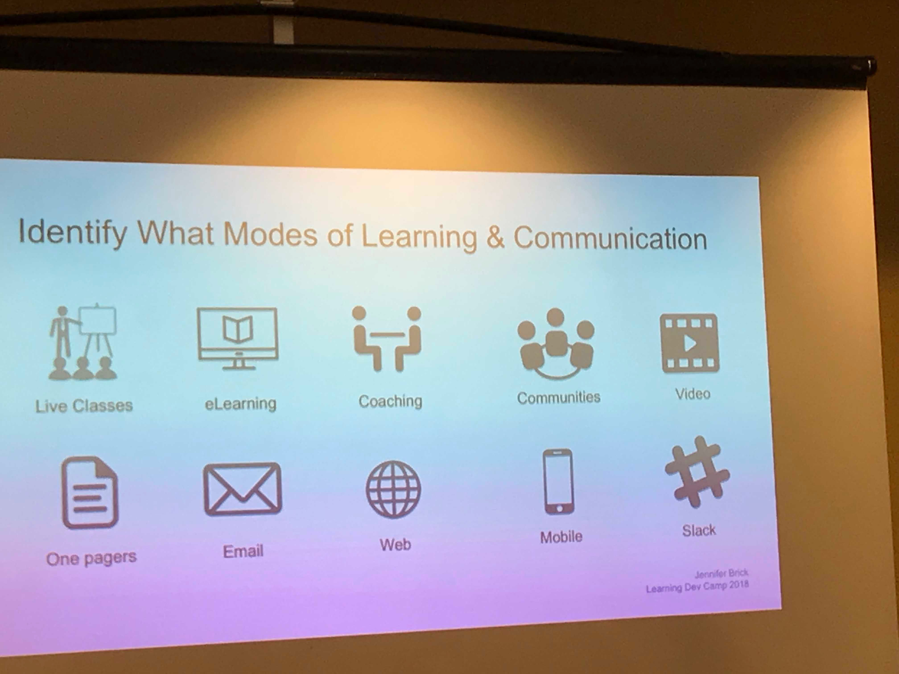

Yesterday, I [released a post about my eLBX experience](/blog/weeknotes-elbx-my-day-in-review/) and today, I'm continuing my conferencing out loud by reflecting on my experience at Learning Dev Camp Day 1.

## Morning Sessions

I spent the morning in two sessions. One about the first year experience of one instructional designer and the second about learning journeys.

### Experiences of a First Year ID

Anna Leach ([@AnnaRoseLeach](https://twitter.com/AnnaRoseLeach?lang=en)) shared resources that she felt would have been helpful to know about as a newbie ID. I met Anna after she listened to Dear ID and it was great to meet her in person. As you all may know, I'm always interested in the newbie experience so I like to keep an ear out for what they are saying. Interestingly, a few themes came out in Anna's presentation:

*   Newbies don't know who to reach out to
*   Newbies need ideas for and help creating real projects
*   Newbies need constructive feedback

I've tried to tackle several of these issues before, especially with [Hack ID](https://hackid.github.io/) and [Go Design Something](http://godesignsomething.co/). And there are other programs, such as [Designers for Learning](https://designersforlearning.org/) and [ID2ID](http://www.id2id.org/) that are seeking to provide real life projects and mentorship opportunities. In general, I think most newbies find that if they reach out to experienced IDs, even cold on Twitter, that many of them respond and help freely. But it still seems like we aren't doing a great job of getting programs and resources out in front of newbies. One of the things that this session reminded me of is that **I'd love to see is mentorship between newbie IDs and more experienced IDs (perhaps at a local level) to make tiny little projects together**.

### Learner Journeys

<figure>
    
    <figcaption>Exemplar learning journey built from a more linear learning path</figcaption>
</figure>

My second morning session was about designing learning journeys. This was probably my favorite session of the day. I try to read a lot in the UX/product design discipline, so I'd heard of customer journeys previously, but this session provided an really good framework for making learner journeys. In case you hadn't heard of them, here's a description: The goal of a customer journey is to acquire, onboard, engage and retain users throughout their lifecycle by creating fluid, personalized, proactive and automated pathways for them. What do they need to know at this stage of their lifecycle to keep them engaged? Learning journeys are like that but for learners.

<figure>
    
    <figcaption>As you create a learning journey, consider all the tools in your toolbox</figcaption>
</figure>

The benefits of planning out Learner Journeys for or with your stakeholders are that it:

*   Promotes progressive learning/nudges
*   Fosters a culture of learning
*   Tells the learner what to expect in terms of continuous learning
*   Guides the learner through to mastery
*   Enhances the learner experience

I loved this session because it gave me a framework to talking with clients about how to engage lots of different tools in their toolbox around creating learning experiences that are not one-and-done events. I've been trying to do that, but I've been shot down before by clients who wanted everything in a single course. Being able to talk about the benefits more clearly and having a framework, I think, will be a huge help for me in making a stronger case for not cramming everything in a course.

## Afternoon Sessions

### Getting Started with AR

I spent most of my afternoon in a session about AR. Debbie Richards provided a ton of resources around looking at AR experience examples, considering the process for pitching an AR pilot experience in an organization, and finally, we got hands on with a tool to create an experience. As you might imagine, she recommended starting small and piloting AR, then looking at data and seeing if engagement increased or whatever other metrics the team wanted to look at. The Zappar tool was recommended as a good option for rapid prototyping AR experiences and it has some basic metrics to start. I'd like to get hands on with the developer version of the tool and see what I can do with it, so it's on my list for later. I also learned about a book written by another presenter at the conference, Myra Roldan, called [Augmented](https://www.amazon.com/Augmented-Augment-Learning-Reality-Rollins-ebook/dp/B0742JCC57/ref=sr_1_3?ie=UTF8&qid=1528847705&sr=8-3&keywords=Augmented), which I'll probably also purchase. The idea that, at some point, the ID should probably step aside and get help from professionals was still present in this session. When it comes to AR and VR, one of the things that was reinforced was that, at least at some quality threshold beyond giving a user videos or job aids when they hover over (which can be a good, simple use case) these are experiences that need professionals to build, especially when any sort of 3D models or hands-free use case is necessary. The other thing that I think was reinforced for me in the session was that AR is a great option for just-in-time training (e.g. I use my phone to get an AR experience when I need to understand how to use the coffee maker) and enhance one experience in a learner journey (such as making AR stops a part of an employee onboarding initiative). I think it would be important to make these experiences feel like more than just gimmicks and ensure that they are actually a useful part of a learning experience.

### But How do you Know They're Learning?

My last session of the day was about using assessment as a learning strategy and backwards design. During my time in higher ed, I was able to make the [connection between backwards design(typically referred to in higher ed) and action mapping (a lot of the same ideas but in corporate)](/blog/another-look-at-atomic-learning-experience-design/). This session added a little to that by talking about creating a rubric for competency-based programs in order to help nail down what the business (or the higher ed department?) want to measure. Probably the best thing about this session was that the examples included higher ed examples as well as corporate examples, and also that the presenter mentioned outcomes other than performance, such as attitudes and behaviors (which aren't necessarily skill-based?) that we should think about how to measure. I work with several institutions of higher ed interested in changing how teachers teach. While I think performance is a part of that, I haven't been able to get them to articulate the metrics of success for such programs, so being able to maybe pull back in this backwards design framework, might be a useful tool. It was certainly an interesting idea to think about creating an assessment rubric for everything as a tool, again especially with my higher ed clients which might be better at speaking language that they are used to.

## In Summary

I had some good sessions today. I'm getting some great resources. One of the things that the keynote speaker mentioned that I'd like to start doing is taking sabbaticals to be able to think more clearly about what I want to be my one priority. I've been thinking a lot this year about focus and my issues with focus. I'd like to be able to become more sustainable and doing more of the things I'd like to be doing for work. I'm thinking about what else I need to be saying no to. Lots of questions so far; not a ton of answers yet.
