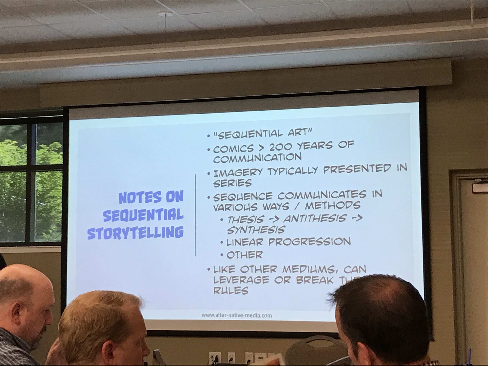
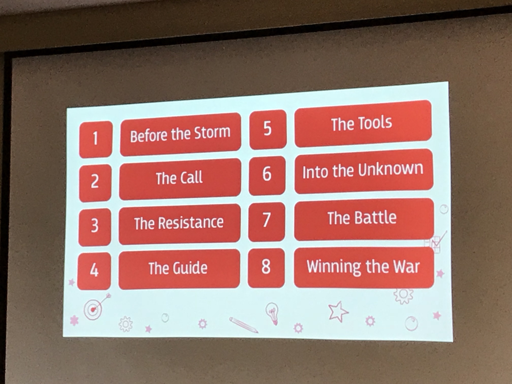
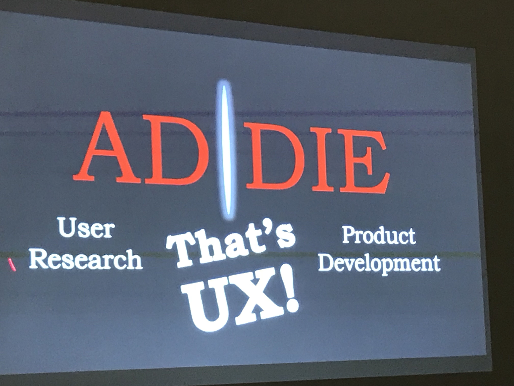

I didn't get a chance to write up my experience with the last couple of days of learning dev camp. So today, let's talk today...

## Day 2

The second day was probably by favorite. I started with a 7:30 (way too early in the morning), with a informal conversation about consulting businesses with Ray Jimenez and other business owners (or hopefuls). This was useful, because one of the things I've been trying to think about is how to focus my career as a freelancer. Mostly, what I learned was to stay away from the noise in our industry and to focus on deep relationships. Like I mentioned last, time, one of the main things I took away from several sessions was that I need to dedicate some time to work on my resources and my business plan and revamp my portfolio. After that, it was on to morning sessions.

### Morning Sessions

I spent most of my morning in a session on getting started with VR with [Myra Roldon](http://LinkedIn.com/in/myraroldan). It was amazing! Honestly, probably my favorite session. As you may have read in my previous write ups was that I was left with a ton of questions, especially around when to use VR (and to a lesser extent AR). Myra offered an amazing framework for this, specifically, D.R.E.D which stands for:

*   **Dangerous:** Those tasks which would be super dangerous to drop a learner into without some initial training
*   **Rare:** Experiences that most people would not be able to have
*   **Expensive:** Experiences that would cost a great deal of money
*   **Difficult:** Experiences that require a lot of logistical pieces that are difficult to accomplish

We focused on some great free tools for prototyping (or just plain creating) some simpler WebVR experiences. Myra livecast the entire session, so check it out! (don't mind me getting up to plug in my rapidly dying laptop)
`youtube: 1lagZpgoiyw`

### Afternoon Sessions

My first session of the afternoon was on reflecting on the way comic books use visual communication tools and how we might use those techniques with Michael Sheyahshe. For the most part, having read a lot on UX and visual design and other design competencies, I had heard several of the considerations, but the ones that stuck out to me were:

*   **Panels:** The use of panels not only for having visual boundaries, but for indicating time and dynamic movement. It made me think about layout in a different way
*   **Reader UX:** Digital comic viewers like Comixology have created a user experience such that the reader can enjoy the whole page OR experience a guided panel-to-panel experience that allows them to reveal each panel individually. I liked both the idea of giving the reader a choice on how to experience and the idea of the guided reveal as a way to help tell the story.
*   **Infinite Canvas:** The thing that most captured my imagination was the idea about putting some things off screen and considering an infinite canvas as opposed to being limited to the screen size. I'm not quite sure what I would do with that during design, but I'm intrigued about what that might mean.

<figure>
    
    <figcaption>Comic book visual communication</figcaption>
</figure>

My second session was also with Ray Jimenez and focused on deep diving with learners. The one thing that stuck to me was the idea that:
 > Engagement is having a problem to solve.
 >
 > -- Ray Jimenez

So often when I hear about engagement, it's in terms of gamification or prettier courses or game-based courses or something like that. I'm not against game-based learning or good visual design, but engagement doesn't have to come from trying to make something fun. When I need to learn something new because I've got a problem to solve, whether or not I'm having fun, I'm super motivated and engaged. I know I love development work, but thinking about this in terms of how I can help to advocate for helping the learner solve problems that they actually come up against, no matter what the mode (thinking back to the learning journeys session) is really the key. So this was really powerful.

## Day 3

Today was a half day. I spent the morning in Jason Bickle's session around pragmatic instructional design. In his DECLARE method, I saw a lot of what I've done previously with clients by asking them to help me plan out, in spreadsheet form, the content for the course and the correct medium, and the necessary assets. This was really more of a form of project and asset management for efficiency, and it was interesting to hear about how Jason has used his method to make development work work better.

<figure>
    
    <figcaption>8 stages of the conflict journey</figcaption>
</figure>

Then in Katie Stroud's session, she overlayed the hero's journey to thinking about how do we design around the conflict journey for change management for a user. I think really insightful steps were thinking about:

*   **3 Resistance:** Are we trying to deploy training before learners have reached the stage of conflict where they recognize that there is a problem to solve? If so, we may be causing conflict.
*   **6 Moving into the Unknown:** What is going to get in the way of learners being able to implement the changes and how do we design around that?

My last presenter session was from Joseph Suarez (!!!) where he told stories about his experience as an instructional designer and extrapolated some important lessons learned. I've read quite a lot around UX (user experience) and Joe shared a really impactful story around how observing his learners with training he designed really blew a whole in his thinking about how he advocated for design. While companies will often prioritize UX in other areas, I think they don't expect it from us, but those tools and methodologies are essential for the work that we do, as well. As I've said before, I think there's a TON we can learn from that discipline.

<figure>
    
    <figcaption>The strangeness of elearning courses comes from not bridging the gap.</figcaption>
</figure>

## My Experience

On the whole, my experience with Learning Dev Camp has been pretty good. My first day or two were a bit spotty. I had a lot of questions (which is probably a good thing) but I wasn't feeling inspired or excited or any of those things that other people say they feel when they come away from conferences. I still wouldn't say I was either of those things, but I've heard a lot of good sessions and I'm coming away with a need to take some time to reflect on the way I work and my processes.
